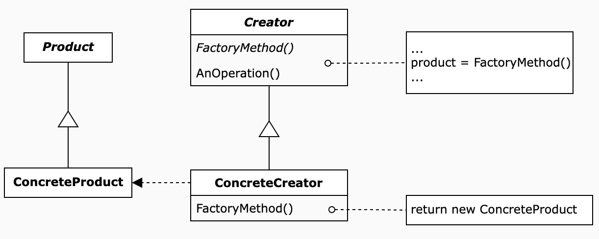
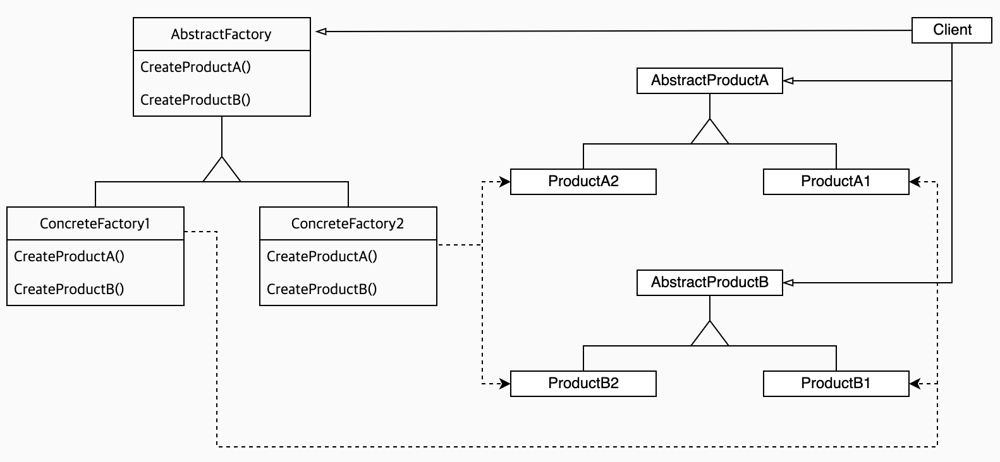

## 팩토리 패턴
### new 연산자 = 구상 클래스 인스턴스
- new 연산자를 사용하면 인터페이스가 아닌 특정 구현을 사용하는 것
- 나중에 코드를 수정해야할 가능성이 커지고 유연성이 떨어진다.
- 여러 구상클래스가 존재한다면 실행 시 주어진 조건에 따라 결정되게 만들 수 있다.
```java
Duck duck;
if(picnic) duck = new MallardDuck();
else if(hunting) duck = new DecoyDuck();
...
```
- 하지만 나중에 변경 또는 확장할 때 코드를 다시 확인하고 추가 또는 제거를 해줘야한다. :arrow_right: 오류 가능성 up
### new에는 어떤 문제가 있는걸까?
- new는 자바의 뼈대를 이루는 연산이므로 안쓸 수 없다. 진짜 문제는 **변화**이다.
- 인터페이스에 맞춰 코딩하면 여러 변화에 대응할 수 있다.
    - 특정 인터페이스만 구현하면 어떤 클래스든 사용할 수 있기 때문 :arrow_right: **다형성**
- 반대로 구상클래스를 많이 사용하면 __변경에 닫혀 있는 코드__
    - 새로운 구상 형식을 써서 확장할 때는 다시 열 수 있게 만들어야한다. :arrow_right: 바뀌는 부분을 찾아 분리하자.
---
### SimpleFactory
- 간단한 팩토리는 디자인 패턴이라기 보다는 프로그래밍에 자주쓰이는 **관용구**에 가깝다.


#### 예시코드
- PizzaStore에서는 다양한 종류의 Pizza를 주문할 수 있다.
- Pizza의 종류는 여러가지가 있으며 종류는 계속 바뀐다.
> 계속 변경되는 객체 생성부분을 캡슐화하여, 객체 생성 팩토리를 만들자.
```java
public class PizzaStore {

  SimplePizzaFactory factory;

  public PizzaStore(SimplePizzaFactory factory) {
    this.factory = factory;
  }

  Pizza orderPizza(String type){
    // new 연산자 대신, 팩토리 객체의 create메서드 사용. 
    // 더이상 구상 클래스의 인스턴스를 만들지 않아도됨.
    Pizza pizza = factory.createPizza(type);

    pizza.prepare();
    pizza.bake();
    pizza.cut();
    pizza.box();

    return pizza;
  }
}
```
```java
public class SimplePizzaFactory {

  public Pizza createPizza(String type) {
    Pizza pizza = null;
    if (type.equals("chess")) {
      pizza = new CheesePizza();
    } else if (type.equals("pepperoni")) {
      pizza = new PepperoniPizza();
    } else if (type.equals("clam")) {
      pizza = new ClamPizza();
    } else if (type.equals("veggie")) {
      pizza = new VeggiePizza();
    }
    return pizza;
  }
}
```
---
### Factory Method Pattern
- 객체를 생성할 때 필요한 인터페이스를 만든다. 
- 어떤 클래스의 인스턴스를 만들지는 서브클래스에서 결정한다.
- 팩토리 메서드 패턴을 사용하면 클래스 인스턴스 만드는 일을 서브클래스에게 맡기게 된다.
  - 사용하는 서브클래스에 따라 생산되는 객체 인스턴스가 결정됨으로써 객체 생성을 캡슐화한다.
  - 즉, 생산자클래스가 실제 생산될 제품을 전혀 모르는 상태로 만들어진다.
  


> 실제 구상 클래스 인스턴스를 만드는 일은 ConcreteCreator가 책임진다. 실제 제품을 만드는 방법을 알고 있는 클래스는 ConcreteCreator뿐이다.
- 생산자(Creator) 클래스 : PizzaStore
- 제품(Product) 클래스 : Pizza


#### 병렬 클래스 계층 구조
- 생산자 클래스와 거기에 대응되는 제품 클래스는 병렬 계층구조로 볼 수 있다.
- 클래스 다이어그램을 보면, 둘다 추상클래스로 시작해 그 클래스를 확장하는 구상클래스들을 가지고 있다.
  - 구체적인 구현은 구상클래스들이 책임지고 있다.

#### 예시코드
```java
public abstract class PizzaStore {

  final Pizza orderPizza(String type){
    Pizza pizza;

    pizza = createPizza(type);

    pizza.prepare();
    pizza.bake();
    pizza.cut();
    pizza.box();

    return pizza;
  }
  // 팩토리 메서드를 추상메서드로 선언하여 서브클래스가 객체 생성을 책임지도록한다.
  protected abstract Pizza createPizza(String type);
}
``` 
> 팩토리 메서드 패턴을 사용하면 클라이언트(`orderPizza(String type)`)에서 실제로 생성되는 구상객체가 무엇인지 알 수 없다.
```java
public class NYStylePizzaStore extends PizzaStore{

  @Override
  protected Pizza createPizza(String type) {

    Pizza pizza = null;
    if (type.equals("cheese")) {
      pizza = new NYStyleCheesPizza();
    } else if (type.equals("pepperoni")) {
      pizza = new NYStylePepperoniPizza();
    } else if (type.equals("clam")) {
      pizza = new NYStyleClamPizza();
    } else if (type.equals("veggie")) {
      pizza = new NYStyleVeggiePizza();
    }

    return pizza;
  }
}
```
```java
PizzaStore pizzaStore = new NYStylePizzaStore();
Pizza pizza = pizzaStore.orderPizza("cheese");
```
---
### SimpleFactory vs Factory Method Pattern
- 이 둘은 상당 부분 비슷하다.
- 하지만 SimpleFactory의 경우 일회용 처방에 불과한 반면 Factory Method Pattern은 여러번 재사용이 가능한 프레임워크를 만들 수 있다.
- 만약 다른 제품을 추가하거나 제품 구성을 변경하더라도 Creator 클래스가 ConcreteProduct와 느슨하게 결합되어 있기 때문에 Creator는 건드릴 필요가 없다.
  - Creator <- ConcreteCreator -> ConcreteProduct
---
### 의존성 뒤집기 원칙(Dependency Inversion Principle)
- 구상 클래스에 의존하지 않고 **추상화** 된것에 의존하게 만든다.
- 고수준 구성 요소가 저수준 구성 요소를 의존하면 안된다.
- PizzaStore(고수준) -> Pizza구상클래스(저수준)에 DIP를 적용하면?
  - PizzaStore -> Pizza추상클래스 <- Pizza구상클래스
  > 고수준모듈, 저수준모듈 둘 다 하나의 **추상클래스**에 의존한다.
- Pizza라는 클래스로 추상화했으니, 구상 클래스를 없애는 팩토리를 사용해보자.

#### 의존성 뒤집기 원칙을 지키는 방법
1. 변수에 구상 클래스의 레퍼런스를 저장하지 않기.
  - new 연산자를 사용하지 않고 팩토리 메서드를 쓰자.
2. 구상 클래스에서 유도된 클래스를 만들지 않기.
  - 인터페이스나 추상 클래스로부터 클래스를 만들자.
  > ConcreteCreator로부터 클래스 만들지 말라는 말일까?..(질문하기)
3. 추상 클래스에 이미 구현되어 있는 메서드를 오버라이드 하지 않기.
  - 추상 클래스에 구현되어 있는 메서드를 오버라이드 하면 제대로 추상화 되지 않는다.
  - 구현 메서드는 _모든 서브 클래스에서 공유할 수 있는 것_ 만 정의하자.
---
### Abstract Factory Pattern
- 구상클래스에 의존하지 않고도 서로 연관되거나 의존적인 객체로 이루어진 제품군을 생산하는 인터페이스를 제공한다.
  - 구상 클래스는 서브클래스에서 만든다.
- 추상 팩토리 패턴을 사용하면 추상 인터페이스로 제품을 공급받을 수 있다.
- 클라이언트는 실제로 어떤 제품이 생산되는지 전혀 알 필요가 없다.
- 클라이언트와 팩토리에서 생산되는 제품을 분리할 수 있다.



> - Abstract Factory: Concrete Factory의 인터페이스. (`PizzaIngredientFactory`) 
> - Concrete Factory: 특정 종류의 제품을 생성하기 위해 Abstract Factory 인터페이스를 구현한다. (`NYPizzaIngredientFactory`)
> - Abstract Product: Abstract Factory가 생성하는 제품이 구현하고 있는 인터페이스. (`Dough`, `Sauce` 등)
> - Concrete Product: 팩토리가 실제로 생성하는 제품. (`ThinCrustDough`, `MarinaraSauce` 등)
> - Client: 인터페이스만을 이용해서 제품을 생산한다. (`CheesPizza`)


#### 예시코드
```java
public class NYPizzaStore extends PizzaStore {

  @Override
  protected Pizza createPizza(String item) {
    Pizza pizza = null;
    PizzaIngredientFactory ingredientFactory = new NYPizzaIngredientFactory();

    if(item.equals("cheese")){
      pizza = new ChessPizza(ingredientFactory);
      pizza.setName("뉴욕 스타일 치즈 피자");
    }else if(item.equals("veggie")){
      pizza = new VeggiePizza(ingredientFactory);
      pizza.setName("뉴욕 스타일 야채 피자");
    }else if(item.equals("clam")){
      pizza = new ClamPizza(ingredientFactory);
      pizza.setName("뉴욕 스타일 조개 피자");
    }else if(item.equals("pepperoni")){
      pizza = new PepperoniPizza(ingredientFactory);
      pizza.setName("뉴욕 스타일 페퍼로니 피자");
    }

    return pizza;
  }
}
```
> PizzaIngredientFactory를 각 Pizza구현클래스에 주입하는 방식으로, 피자 종류에 맞는 재료를 생산하도록 구축했다.
```java
public abstract class Pizza {

  protected String name;
  protected Dough dough;
  protected Sauce sauce;
  protected Cheese cheese;

  public abstract void prepare();

  public void setName(String name) {
    this.name = name;
  }
  ...
}

public class ChessPizza extends Pizza {

  PizzaIngredientFactory ingredientFactory;

  public ChessPizza(
          PizzaIngredientFactory ingredientFactory) {
    this.ingredientFactory = ingredientFactory;
  }

  @Override
  public void prepare() {
    System.out.println("준비 중: "+name);
    dough = ingredientFactory.createDough();
    sauce = ingredientFactory.createSauce();
    cheese = ingredientFactory.createCheese();
  }
}
```
> PizzaIngredientFactory 인터페이스를 사용하여 Client(피자)코드와 제품(재료)를 생산하는 팩토리를 분리하였다.
> 만약 다른 제품(재료)이 필요하면 다른 팩토리를 사용하면된다. (ChicagoIngredientFactory 주입)
```java
public interface PizzaIngredientFactory {

  public Dough createDough();
  public Sauce createSauce();
  public Cheese createCheese();
  ...

}

public class NYPizzaIngredientFactory implements PizzaIngredientFactory {

  @Override
  public Dough createDough() {
    System.out.println("Thin도우를 돌리는 중...");
    return new ThinCrustDough();
  }

  @Override
  public Sauce createSauce() {
    System.out.println("Marinara소스를 뿌리는 중...");
    return new MarinaraSauce();
  }

  @Override
  public Cheese createCheese() {
    System.out.println("Reggiano치즈를 올리는 중...");
    return new ReggianoCheese();
  }

  ...
}
```