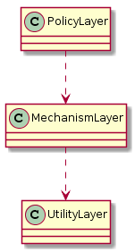

## 의존 관계 역전 원칙(DIP)
- 상위 수준의 모듈은 하위 수준의 모듈에 의존해서는 안된다. 둘 모두 추상화에 의존해야 한다.
- 추상화는 구체적인 사항에 의존해서는 안 된다. 구체적인 사항은 추상화에 의존해야 한다.

#### 역전
- 잘 설계된 객체 지향 프로그램의 의존성 구조는 전통적인 절차적 방법에 의해 일반적으로 만들어진 의존성 구조가 **역전**된 것이다.

#### 상위 수준 모듈이 하위 수준 모듈에 의존한다면?
- 상위 수준의 모듈 : 어플리케이션의 중요한 정책의사결정 및 업무 모델을 포함하고 있는 것. (어플리케이션의 본질)
- 하위 수준 모듈의 변경은 상위 수준 모듈에 직접적인 영향을 미칠 수 있다.
- 영향을 미치게 된다면 상위 수준의 모듈이 변경되기 할 수도 있다.
> 이는 말도 안되는 상황이다. 하위 수준의 구체적 모듈에 영향을 주어야하는 것은 정책을 결정하는 상위 수준의 모듈이다.

#### 우리가 재사용하기 원하는 것은 상위 수준의 모듈이다.
- 상위 수준의 모듈이 하위 수준의 모듈에 독립적이라면 이 상위 수준의 모듈은 아주 간단히 재사용 할 수 있다.

### 레이어 나누기
- 부치(Booch) : 잘 구조화된 모든 객체 지향 아키텍처는 레이어를 분명하게 정의했다. 여기서 각 레이어는 잘 정의되고 제어되는 인터페이스를 통해 일관된 서비스의 집합을 제공한다.

#### 미숙한 레이어

- 의존성이 이행적(transitive)이다.
- 상위레이어는 하위레이어의 모든 변화에 민감하다.

#### 역전된 레이어

- 상위레이어는 필요로 하는 서비스에 대한 추상 인터페이스를 선언하고 하위레이어는 이 추상 인터페이스로부터 구체화된다.
- 결과적으로 상위레이어는 하위레이어에 의존하지 않는다.
- 반대로 하위레이어는 상위레이어의 추상 인터페이스에 의존한다.

#### 역전이란?
- 의존성의 방향을 역전시킨다. 
- 즉 상위모듈이 하위모듈을 의존하는 대신, 하위모듈이 상위모듈(상위모듈 추상 인터페이스)을 의존하게 만드는 것.

### 소유권의 역전
- 역전은 의존성 뿐만 아니라, **인터페이스 소유권**에 대한 것도 의미한다.
- 즉, DIP가 적용된 경우 상위수준모듈(클라이언트)안에 선언되어 호출되는 **인터페이스**는 하위수준모듈(서버)이 소유하는 것이 아닌, **상위수준모듈(클라이언트)이 소유하는 것이다.**
    - 하위수준모듈(서버)는 인터페이스에 파생해 나온 것이다.
- 할리우드(Hollywood) 원칙
    - `먼저 연락하지마세요. 저희가 연락 드리겠습니다.(Don't call us. we will call you)`
    - 하위수준모듈에서 상위수준모듈을 직접 호출할 수 없게 하고, 상위수준모듈이 하위수준모듈을 직접 호출하는 것은 허용한다.
    
**이렇게 의존성을 역전 시킴으로써, 우리는 좀 더 유연하고, 튼튼하고, 이동이 쉬운 구조를 만들어 냈다.**

### 추상화에 의존하자

#### 강력한 DIP의 해석 : 프로그램의 모든 관계는 구체클래스가 아닌, 어떤 **추상 클래스**나 **인터페이스**에서 맺어져야 한다.
- 어떤 변수도 구체 클래스에 대한 포인터나 참조값을 가져선 안된다.
- 어떤 클래스도 구체 클래스에서 파생되어서는 안 된다.
- 어떤 메서드도 그 기반 클래스에서 구현된 메서드를 오버라이드 해서는 안된다.

