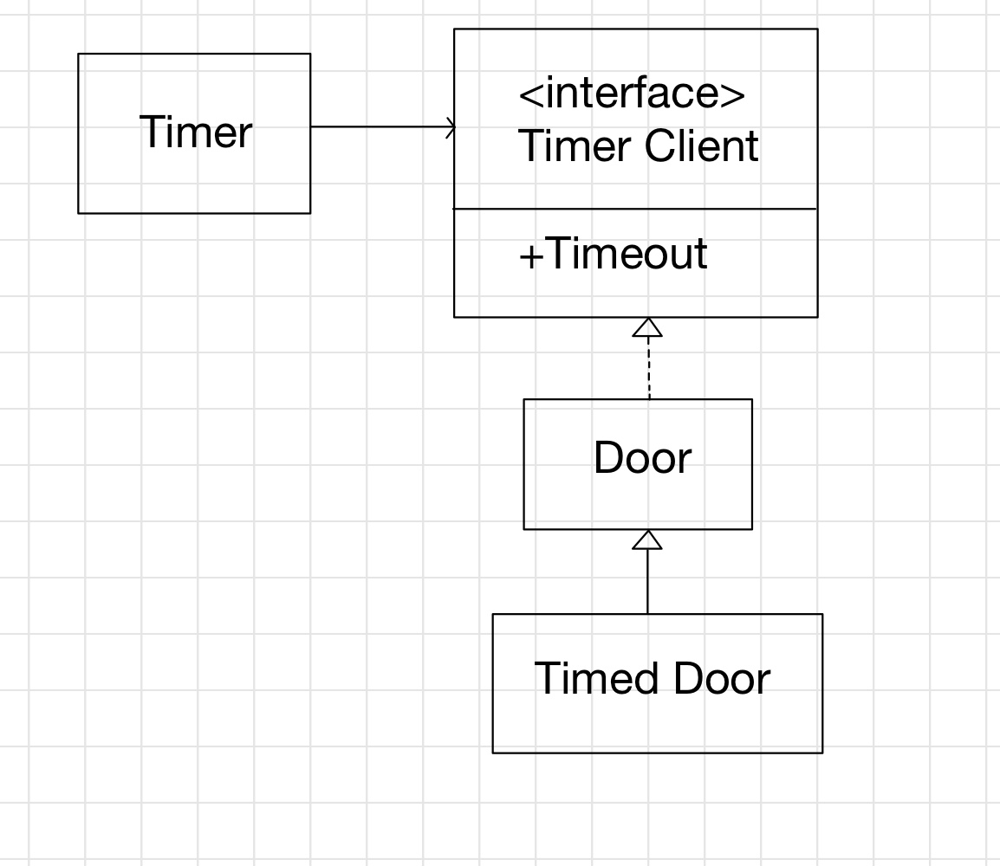

## 인터페이스 분리 원칙(ISP)
- ISP는 `비대한` 인터페이스의 단점을 해결한다.
- 비대한 인터페이스는 응집력을 낮춘다.
- 이 비대한 인터페이스를 구현하는 클래스가 있다고 가정하자.
    - 어떤 클라이언트는 인터페이스의 일부 메서드 그룹만 사용하고, 어떤 클라이언트는 다른 메서드 그룹만 사용한다면?
    - 이는 절대 **단일 클래스로 여겨지면 안된다.**

### 인터페이스 오염



- Timed Door(Door의 변형클래스)를 만들기 위해 Door는 사용하지도 않는 Timeout메서드를 구현해야한다.
    - 기반 클래스는 Timeout메서드 구현을 퇴화시켜야할 것이고 이는 **잠재적 LSP 위반**이다.
    - 이러한 구조는 한 파생 클래스가 새로운 메서드를 필요로 할 때마다 기반 클래스 및 다른 파생 클래스에 추가되어야한다. 
    - 이는 더욱 인터페이스를 비대하게 만든다.
- **불필요한 복잡성**과 **불필요한 중복성**의 악취를 풍긴다.

### 클라이언트 분리는 인터페이스 분리를 의미한다.

- Door와 TimerClient는 완전 다른 클라이언트가 사용하는 인터페이스다.
  - Timer는 TimerClient를 사용하고, 문을 조작하는 클래스가 Door를 사용한다.
- 클라이언트가 분리되어 있기 때문에, 인터페이스도 분리되어야한다.
  - **클라이언트가 자신이 사용하는 인터페이스에 영향을 끼치기 때문이다.**

#### 클라이언트가 인터페이스에 미치는 반대 작용
- 클라이언트의 요구사항 변경으로 인해 인터페이스 변경을 일으키는 경우가 자주 있다.
- 만약 TimerClient의 TimeOut메서드에 Timer식별을 위한 id인자가 추가된다면?
- TimeClient의 사용자에게 영향을 미칠 뿐 아니라 Door와 Door의 모든 클라이언트가 수정에 영향을 받는다.
    - TimeOut을 사용하지 않는 Door파생클래스 및 파생클래스 클라이언트에게도..(영향 범위가 넓다.)
- 프로그램의 한 부분 변경이 전혀 관계 없는 부분에도 영향을 줄 때, 이 변경에 드는 비용과 부작용의 위험성은 급격히 증가한다. 

### 인터페이스 분리 원칙(ISP)
#### 클라이언트가 자신이 사용하지 않는 메서드에 의존하도록 강제되어서는 안된다.
- 어떤 클라이언트가 자신은 사용하지 않지만 다른 클라이언트가 사용하는 메서드를 포함하는 클래스에 의존할 때, **그 클라이언트는 다른 클라이언트가 그 클레스에 가하는 변경에 영향을 받게 된다.**
- 우리는 가능하면 이런 결합을 막고싶다. 따라서 **인터페이스를 분리하기를 원한다.**

#### 다중 상속을 통한 분리
- 일반적으로 많이 사용되는 해결책이다.
- TimedDoor는 Door를 상속받고 TimeClient를 구현한다.
- Timer클라이언트와 Door클라이언트 모두 TimedDoor를 사용할 수 있지만 실제로 TimedDoor를 의존하지 않는다.


### 복합체와 단일체
```java
interface DepositUI{}
interface TransferUI{}
interface WithdrawalUI{}
interface UI extends DepositUI, TransferUI, WithdrawalUI{}
``` 
```java
void g(DepositUI dui, TransferUI tui);
```
```java
void g(UI ui);
```
- 위와같은 형태를 보면 당연 후자의 형태로 쓰고 싶을 것이다.
  - 전자의 형태는 같은 객체를 참조하게 된다면? `g(ui, ui);` 좀 이상해보인다.
- 하지만 대게 단일 형태보다 **복합 형태가 바람직하다.**
  - 단일 형태는 g메서드가 UI의 상속하는 모든 인터페이스를 의존하도록 만든다.
      - WithdrawalUI가 바뀔 때 g와 g의 모든 클라이언트가 영향을 받을 수 있다.
  - 또한 항상 같은 객체를 참조할 것이라 단정할 수 없으며 나중에 인터페이스 객체는 분리될 수 있다.

#### 클라이언트 그룹 만들기
- 클라이언트는 이들이 호출하는 서비스 메서드에 의해 그룹으로 묶일 수 있으며 개발자는 **각 그룹에 대해 분리된 인터페이스**를 만들 수 있다.
- 이를 통해 각 서비스가 구현해야하는 인터페이스의 수를 줄일 수 있으며, 서비스가 각 클라이언트 타입에 의존하게 되는 일을 방지할 수 있다.
> 때로 서로 다른 클라이언트 그룹이 호출하는 메서드가 겹칠 때가 있는데, 겹치는 부분이 작으면 이 그룹들의 인터페이스는 분리된 상태로 남아야한다.

#### 인터페이스 변경
- 객체 지향 어플리케이션을 유지보수할 때 기존 클래스와 인터페이스가 종종 변경된다.
- 이런 변경은 시스템의 아주 큰 부분에서 재컴파일과 재배포가 필요해진다.
- 이 충격을 완화하려면, 기존 인터페이스를 변경하기보다 **새로운 인터페이스를 추가하면 된다.**

### 결론
- **비대한 클래스는 클라이언트들 간에 기이하고 해가 되는 결합도를 유발한다.**
  - 한 클라이언트가 이 비대한 클래스에 변경을 가하면 모든 나머지 클래스가 영향을 받는다.
- 클라이언트는 자신이 실제로 사용하는 메서드만 의존해야한다.
- 따라서 **비대한 클래스는 클라이언트(그룹) 고유의(client-specific)인터페이스 여러 개로 분해해야 한다.**
  - 이를 통해 비대한 클래스는 모든 인터페이스를 구현할 수 있게 된다.
- 이렇게 하면 호출하는 않는 메서드에 대한 클라이언트 의존성을 끊고, 클라이언트가 서로에 대해 독립적이 되게 만들 수 있다.