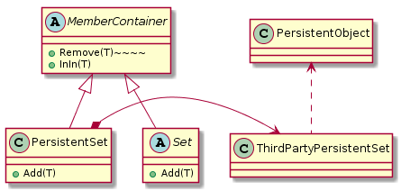

## 리스코프 치환 원칙(LSP)
- OCP가 내포하는 1차적 메커니즘은 **추상화**와 **다형성**이며 이를 지원하는 주요 매커니즘 중 하나가 **상속**이다.
    - 상속을 사용하면 기반 클래스에 있는 추상메서드를 구현하는 파생클래스를 만들 수 있다.
- 이런 상속을 규율하는 설계 법칙이 바로 리스코프 치환 원칙(LSP: Liskov Substitution Principle)이다.
    - LSP를 지키지 않으면 OCP 또한 위반하게 된다.

### 서브타입(subtype)은 그것의 기반 타입(base type)으로 치환 가능해야 한다.
- 이 원칙은 바버라 리스코프가 처음으로 작성했다.
```text
타입 S의 각 객체 o1과 타입 T의 각 객체 o2가 있을 때, T로 프로그램 P를 정의했음에도 불구하고, 
o1이 o2로 치환될 때 P의 행위가 변하지 않으면, S는 P의 서브타입이다.
```
- 이를 위반한 결과를 생각해보면 더 분명해진다.
- 함수 f가 인자로 B의 참조값을 갖는다고 생각해보자. B의 파생클래스 D가 B를 가장해 f에게 넘겨져 f가 잘못된 동작을 하게 만든다면?
    - 명백하게 D는 f에 대해 취약하며 이는 LSP를 위반한다.
    - 또한 f는 B의 모든 파생클래스에 닫혀 있지 않기 때문에 OCP를 위반한다. 
- LSP위반은 대게 심각하게 OCP를 위반하는 런타임 타입 정보(Run-Time Type Information)의 사용으로 이어진다.
    - ex) 객체의 형을 결정하는데 명시적인 if/else구문 사용
    ```java
      void f(B b){
        if(b instanceof D){
          // 예외동작
        }
        else{
          // 원래동작
        }    
      }   
    ```
    - f는 B의 모든 가능한 파생클래스를 알아야하고, 새로운 파생 클래스가 생길 때마다 변경이 필요한지 확인해야한다.
- **LSP 위반은 잠재적인 OCP 위반이다.**

### 문제


- PersistentSet의 Add를 호출하면, ThirdPartyPersistentSet은 이를 위임하여 처리한다.
- 하지만 여기서 Add 메서드의 인자에 PersistentObject에서 파생된 것이 아닌 객체를 전달한다면 어떻게 될까?
  - Set 인터페이스는 이런 제약을 가지고 있지 않기 때문에 충분히 일어날 수 있는 일이다.
  - 클라이언트 입장에서는 Set이 PersistentSet인지 아닌지 알 수 있는 방법이 없다.

### LSP를 따르는 해결책



- PersistentSet은 Set을 치환할 수 없다. (IS-A 관계가 아니다.)
- 계층 구조를 분리하지만, 공통적으로 갖고 있는 요소는 존재하기 때문에 공통 요소를 추출한 추상인터페이스 아래 Set과 PersistentSet을 형제관계로 묶는다.
- 결론적으로 LSP가 깨지는 메서드는 서브클래스로 분리하고 문제가 없는 메서드는 기반 클래스로 분리한다.

### 휴리스틱과 규정
#### LSP 위반의 단서를 보여주는 간단한 휴리스틱(heuristic)
1. 기반 클래스에서 어떻게든 기능성을 제거한 파생 클래스
2. 기반 클래스보다 덜한 동작을 하는 파생 클래스
- 이는 보통 **기반 클래스와 치환이 불가능**하므로 LSP를 위반한다.

#### 파생클래스에서의 퇴화 함수
```java
public class Base{
  public void f() {
    // 구현 코드
  }
}

public class Derived extends Base{
  public void f(){} 
}
```
- Derived에서 f가 쓸모없다 생각하여 이렇게 작성했겠지만, 사용자는 f를 호출하면 안된다는 사실을 모른다. ➡️ LSP 위반
- 파생 클래스에 퇴화 함수가 존재한다고 해서 무조건 LSP위반을 나타낸다고 할 수 없지만, 위반 여부를 살펴볼 가치는 있다.

#### 파생 클래스에서의 예외 발생
- 기반 클래스가 발생 시키지 않은 예외를 파생 클래스의 메서드에 추가하는 것이다.
- 기반 클래스 사용자가 예외를 기대하지 않는다면, 파생클래스의 메서드에 예외를 추가했을 때 치환가능하지 않다.
- 사용자의 기대가 변하던지, 아니면 파생클래스가 그 예외를 발생시키지 않아야 한다.

### 결론
- LSP는 OCP를 가능하게 해주는 주요 요인 중 하나다.
- LSP는 기반 타입으로 표현된 모듈을 수정 없이도 확장 가능하게 만드는, 서브타입의 치환 가능성을 말한다.