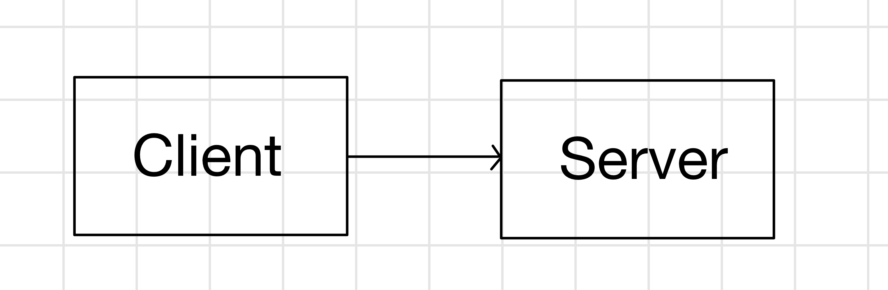
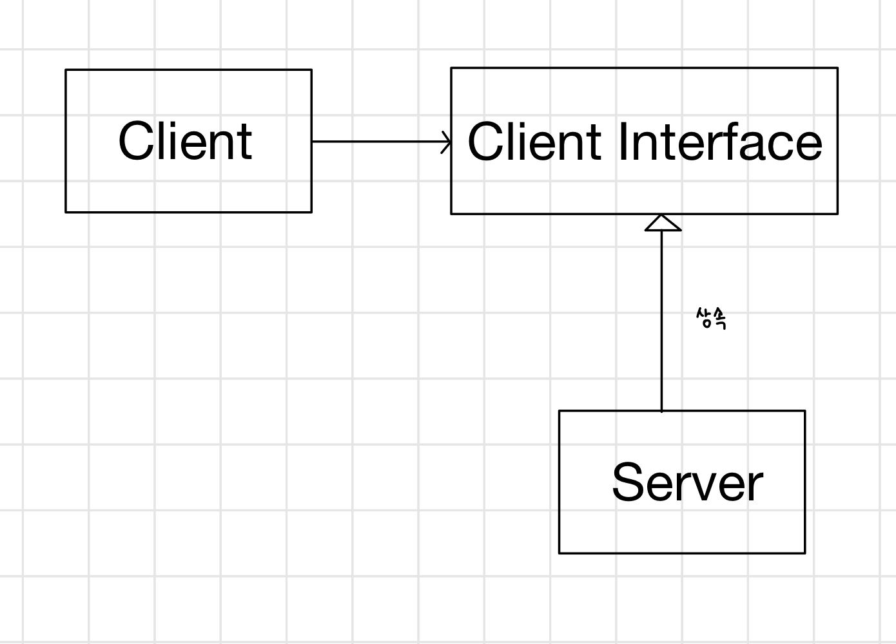
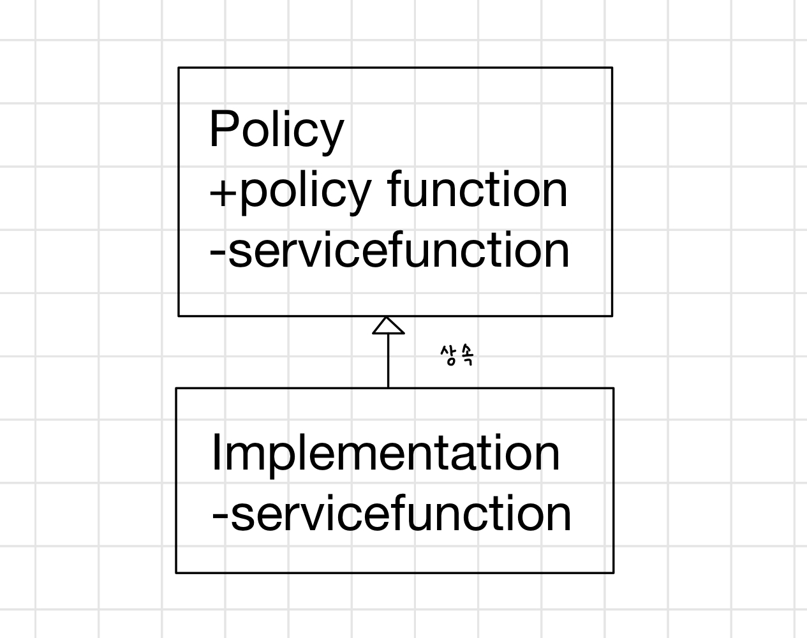

## 개방 폐쇄 원칙(OCP)
- 소프트웨어 개체(클래스, 모듈, 함수 등)는 확장에 대해 열려 있어야 하고, 수정에 대해서는 닫혀 있어야 한다.
- 프로그램 **한 군데를 변경한 것**이 의존적 모듈에서 **단계적인 변경**을 불러일으킬 때, 경직성 악취를 풍긴다.
- OCP가 잘 적용된다면, 제대로 동작하고 있던 **원래 코드를 변경하는 것**이 아닌, **새로운 코드를 덧붙이는 변경**을 할 수 있게된다.

### 상세 설명
개방 폐쇄 원칙을 따르는 모듈은 두가지 속성을 갖는다.
1. 확장에 대해 열려 있다.
- 모듈의 행위가 확장 될 수 있음을 의미한다.
- 요구사항이 변경될 때, 변경에 맞는 **새로운 행위를 추가해 모듈을 확장**할 수 있다.

2. 수정에 대해 닫혀 있다.
- 어떤 모듈의 행위를 확장하는 것이 그 모듈의 **소스 코드의 변경을 초래하지 않는다.**

이 두 속성이 반대의 입장으로 보인다. 어떻게 코드를 변경하지 않고 행위를 바꿀 수 있을까?

### 해결책은 추상화다.
- 추상화 : 추상 기반 클래스이자, 모든 가능한 파생 클래스를 대표하는 가능한 행위의 제한되지 않은 묶음이다.
- 모듈은 추상화를 조작할 수 있다. 
    - 모듈은 **고정된 추상화**에 의존하기 때문에 수정에 대해 닫혀 있을 수 있다.
    - 모듈의 행위는 추상화의 **새 파생 클래스(자식 클래스)** 를 만듦으로써 확장이 가능하다.
#### 개방 폐쇄 원칙에 어긋난 예
- Client와 Server는 모두 구체적이다.
- Client는 Server클래스를 사용한다.
- 만약 Client가 다른 Server를 사용하려면, Client가 새로운 Server클래스를 지정하도록 변경해야한다.
    
    

#### 개방 폐쇄 원칙을 지킨 예
1. 전략 패턴
- ClientInterface클래스는 추상 메서드를 포함한 추상 클래스다.
- Client클래스는 이 추상화된 **ClientInterface클래스**를 사용하지만
- Client클래스의 객체는 ClientInterface의 파생클래스인 **Server클래스**의 객체를 사용할 것이다.
- 만약 Client 객체가 다른 Server클래스를 사용하고 싶다면 새 파생 클래스를 생성하면된다.
    - Client클래스는 변경되지 않는다.
    
    
    
- Client에 명시된 메서드는 ClientInterface의 새로운 서브타입을 생성함으로써 확장되고 수정될 수 있다.
    - 그런데 왜 AbstractServer 대신 ClientInterface일까?
    - **추상 클래스는 자신을 구현하는 클래스보다도 클라이언트에 더 밀접하게 관련이 있기 때문이다.**

2. 템플릿 메소드 패턴
- Policy 클래스는 Clinet 클래스와 같다.
- 추상 인터페이스가 Policy클래스의 한 부분이 되었다. ➡️ 순수 가상 함수(C++), 추상 메서드(Java)의 형태로
    - 이런 추상메서드는 Policy의 서브타입에서 구현된다.
- 따라서 Policy 내부에 명시된 행위는 Policy 클래스의 새로운 파생 클래스를 생성하여 확장되거나 수정될 수 있다.
    
    
    
    > 책은 `servicefunction`을 -(`private`)라고 표기했지만 잘못표기한거같다.

### 예상과 '자연스러운' 구조
- 모든 상황에서 자연스러운 모델은 없다.
- 폐쇄는 완벽할 수 없기 때문에, **전략적**이어야한다.
    - 설계자의 경험으로 얻은 통찰력으로 일어날 가능성이 가장 높은 변경에 대해서 OCP를 적용해야한다.
    - 당연히 이는 쉽지 않다. 분명 많은 잘못된 추측을 하게 될것이다.
    - 또한 적절한 추상화를 만들기 위해선 개발 시간과 노력이 들 뿐 아니라, 소프트웨어 설계 복잡성을 높이기도 한다.
- 따라서 처음엔 코드가 변경되지 않을 것이라 생각하고 코드를 작성한 후, 실제 변경이 일어나면 이 변경으로부터 보호하는 추상화를 구현한다.
    - 첫번 째 총알은 그냥 맞고, 그 총알에 대해서는 확실히 보호하자.
- 이 방식대로 하기로 결정했다면, 개발 과정에서 너무 멀어지기 전 어떤 종류의 변경이 일어날 것인지 최대한 빠르게 맞자.
    - 테스트를 먼저 작성한다. 테스트 가능한 변경은 나중에 놀라게하지 않는다.
    - 아주 짧은 주기로(주보다는 일 단위로) 개발한다.
    - 가장 중요한 기능 요소를 먼저 개발하고, 빠르게 자주 릴리즈한다. 가능한 자주 고객과 사용자에게 보여준다.

### 결론
- OCP는 객체 지향 설계의 심장이다.
  - 이 원칙을 따르면 최상의 효용을 낳는다(유연성, 재사용성, 유지보수성)
  - 하지만 객체 지향 언어를 사용하는 것만으로 이원칙을 따른다고 할 수 없다.
  - 또한 애플리케이션의 모든 부분에 마구 추상화를 적용하는 것도 좋은 생각이 아니다.
- 프로그램 에서 자주 변경되는 부분에만 추상화를 적용하기 위한 개발자의 헌신이 필요하다.
- **어설픈 추상화를 피하는 일은 추상화 자체 만큼이나 중요하다.**
