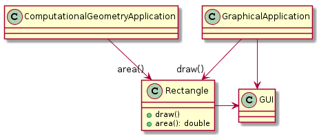
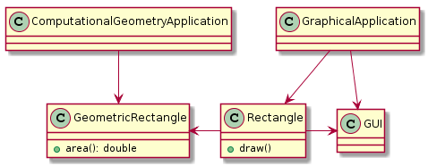

## 단일 책임 원칙(SRP)
응집도 : 모듈 요소 간의 기능적 연관

> 이 책에서는 모듈이나 클래스의 변경을 야기하는 응집력에 대해 이야기함. 

### 한 클래스는 단 한가지의 변경 이유만을 가져야 한다.
#### 각 책임을 왜 별도의 클래스로 분리해야할까?
- 각 책임이 **변경의 축(변경의 이유)** 이기 때문이다.
- 요구사항이 변경될 때, 클래스 안에서의 책임 변경을 통해 명백해진다.

#### 한 클래스가 하나 이상의 책임을 맡는다면?
- 책임들이 결합되어, 한 책임에 대한 변경이 다른 책임을 충족시키는 능력을 저하시킬 수 있다.
- 이런 종류의 결합은 변경 시 예상치 못한 방식으로 잘못 동작하는 취약한 설계를 유발한다.

- 이 예제의 경우 Rectangle은 하나 이상의 책임을 가지고 있다.
  
  

- GeometricRectangle클래스를 새로 만들어 수학적으로 계산해야하는 책임을 분리하자.

  

### 책임이란 무엇인가?
- SRP 맥락에서 책임은 **변경을 위한 이유**로 정의한다.
- 만약 클래스를 변경하기 위한 한 가지 이상의 이유를 생각할 수 있다면 그 클래스는 한가지 이상의 책임을 맡고 있는 것.

#### 변경의 축은 변경이 실제로 일어날 때만 변경의 축이다.
- 하지만 아무 증상이 없는데 이 문제에 SRP나 다른 원칙을 적용하는 것은 현명하지 않다.
- 두 가지 책임으로 인해 변경을 유발하지 않는데 분리한다면? 오히려 **불필요한 복잡성**을 유발한다.
