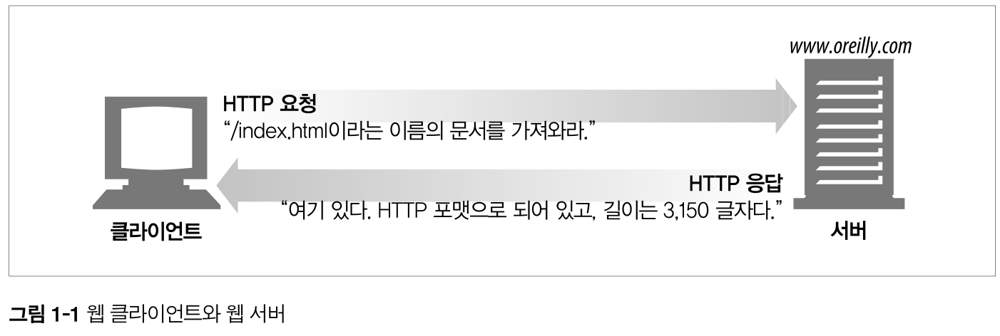
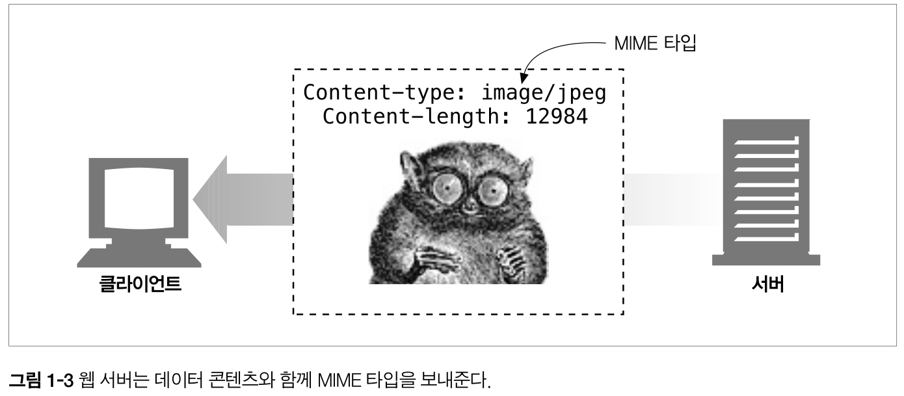
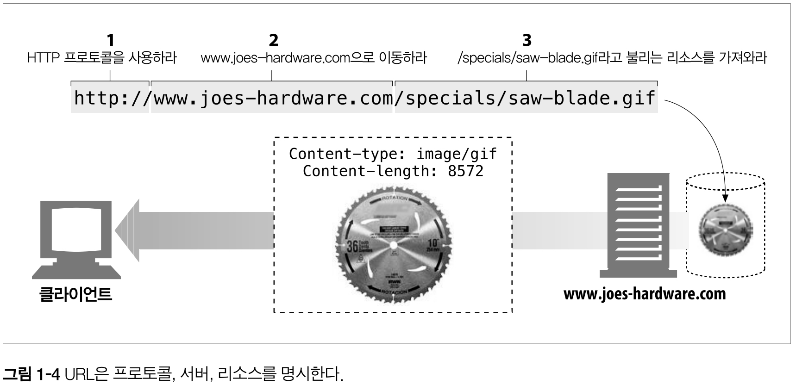
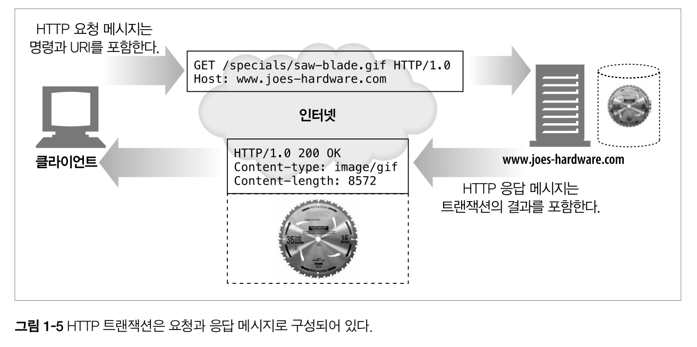
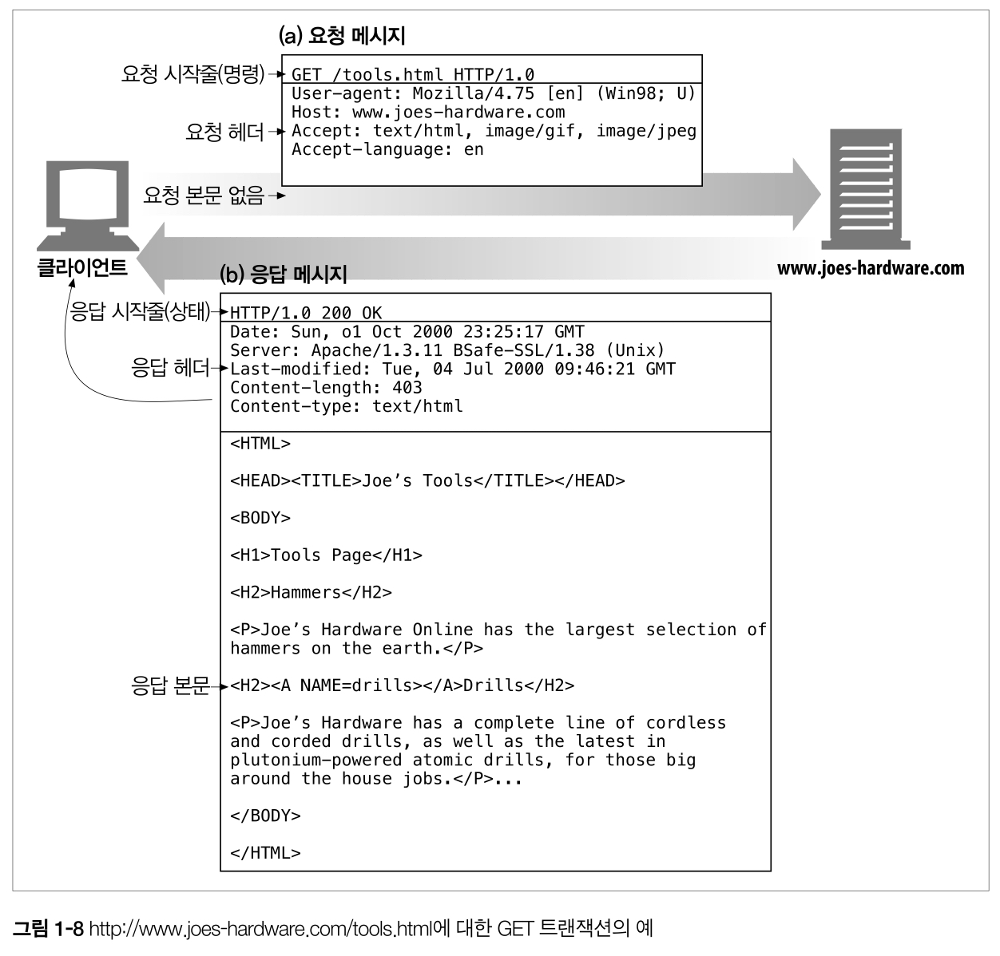

## 1. HTTP 개관
### 1.1 HTTP: 인터넷의 멀티미디어 배달부
- HTTP는 전 세계의 웹 서버로부터 대량의 정보를 빠르고, 간편하고, 정확하게 PC의 웹브라우저로 옮겨준다.
- HTTP는 신뢰성 있는 전송 프로토콜을 사용하기 때문에, 전송 중 손상되거지 꼬이지 않음을 보장한다.
- 개발자는 인터넷의 결함이나 약점에 대한 걱정 없이 어플리케이션 고유의 기능을 구현하는데 집중할 수 있다.

### 1.2 웹 클라이언트와 서버
- 웹서버는 HTTP 프로토콜로 의사소통하기 때문에 HTTP 서버라고 부른다.
- **클라이언트**는 서버에게 HTTP요청을 보내고 **서버**는 HTTP응답을 돌려준다.
  

> http://www.oreily.com/index.html 페이지를 열어볼 경우

### 1.3 리소스
- 웹서버는 웹리소스를 관리하고 제공한다.
- 가장 단순한 웹리소스는 웹서버 파일 시스템의 **정적 파일**이다.
    - 정적 파일 : 텍스트파일, HTML파일, 워드파일, JPEG이미지, AVI동영상, 그 외 모든 종류의 파일
- 요청에 따라 **콘텐츠를 생산하는 프로그램**이 될 수 있다.
    - 동적 콘텐츠 리소스 : 사용자, 요청 정보, 시간에 따라 다른 콘텐츠를 생산함.
    - ex) 라이브 영상 시청, 주식 거래, 부동산 DB 검색, 쇼핑몰 구입 등

> 어떤 종류의 콘텐츠 소스도 리소스가 될 수 있다.

#### 1.3.1 미디어 타입
- 웹 서버는 모든 HTTP 객체 데이터에 **MIME 타입**이라는 **데이터 포맷 라벨**을 붙인다.
    - MIME(Multipurpose Internet Mail Extensions, 다목적 인터넷 메일 확장)
    - 서로 다른 전자 메일시스템 사이에서 메시지가 오갈 때 겪는 문제점을 해결하기 위해 설계됨.
    > 이메일에서 잘 동작해 HTTP도 멀티미디어 콘텐츠를 기술하고 라벨을 붙이기 위해 채택함.
- 웹 브라우저는 서버로부터 응답받을 때, 다룰 수 있는 객체인지 MIME 타입을 통해 확인한다.
    - 대부분의 웹브라우저는 잘 알려진 수백가지 객체 타입을 다룰 수 있다. (이미지, HTML, 오디오 등)
    > 특별한 포맷 파일의 경우 외부플러그인 SW를 실행하기도 함.
      

- MIME 타입 : `주 타입(primary object type) / 부 타입(specific subtype)` 으로 이루어진 문자열 라벨이다.
    - HTML 문서 `text/html`
    - plain ASCII 텍스트 문서 `test/plain`
    - JPEG 이미지 `image/jpeg`
    - GIF 이미지 `image/gif`
    - 애플 퀵타임 동영상 `video/quicktime`
    - 파워포인트 프레젠테이션 `application/vnd.ms-powerpoint`

#### 1.3.2 URI
- 서버 리소스는 각자 **이름(URI)** 을 갖고 있기 때문에 클라이언트는 관심있는 리소스를 지정할 수 있다.
- URI(Uniform Resource Identifier) : 리소스를 고유하게 식별하고 위치를 지정할 수 있는 인터넷 주소

- HTTP는 주어진 URI로 객체를 찾아온다.
    - URI에는 **URL**과 **URN**이 있다.

#### 1.3.3 URL
- URL(Uniform Resource Locator) : 특정 서버의 한 리소스에 대한 구체적 위치
- URL은 세부분으로 이루어진 표준 포맷을 따른다.
    1. 스킴(scheme) : 리소스에 접근하기 위해 사용되는 프로토콜 `http://`
    2. 서버의 인터넷 주소 `www.joes-hardware.com`
    3. 서버의 리소스 위치 `/specials/saw-blade.gif`
    
> 오늘날 대부분의 URI는 URL이다.

#### 1.3.4 URN
- URN(Uniform Resource Name) : 리소스 위치에 영향 받지 않는 유일무이한 이름
- 리소스 이름이 변하지 않는 한, 여러 종류의 프로토콜로 접근해도 문제가 없다.
    - ex) 인터넷 표준 문서 RFC 2141 `urn:ietf:rfc:2141`
- 아직 실험중이고 널리 채택되지 않음.
    - 효율적인 동작을 위해 리소스 위치 분석에 대한 인프라 지원이 필요함.
    - 전망은 밝다고 한다..
    

### 1.4 트랜잭션
- HTTP 트랜잭션 = 요청 명령(클라이언트 ➡️ 서버) + 응답 결과(서버 ➡️ 클라이언트)
    - HTTP 트랜잭션은 HTTP 메세지를 이용해서 이루어짐
      

#### 1.4.1 메서드
- HTTP 메서드는 여러 가지 종류의 요청 명령을 지원한다.
- 모든 HTTP 요청 메시지는 한개의 메서드를 갖는다.
- 메서드는 서버에게 어떤 동작이 취해야하는지 말해준다.
 
  |HTTP 메서드|설명|
  |---------|---|
  |GET|서버에서 클라이언트로 지정한 리소스를 보내라.|
  |PUT|클라이언트에서 서버로 보낸 데이터를 지정한 이름의 리소스로 저장하라.|
  |DELETE|지정한 리소스를 서버에서 삭제하라.|
  |POST|클라이언트 데이터를 서버 게이트웨이 애플리케이션으로 보내라.|
  |HEAD|지정한 리소스에 대한 응답에서, HTTP 헤더 부분만 보내라.|

#### 1.4.2 상태코드
- 모든 HTTP 응답 메시지는 상태코드와 함께 반환된다.
- 상태코드는 요청이 성공했는지 아니면 추가조치가 필요한지 알려주는 세자리 숫자다.
  
  |HTTP 상태코드|설명|
  |---------|---|
  |200|좋다. 문서가 바르게 반환되었다.|
  |302|다시 보내라. 다른 곳에 가서 리소스를 가져가라.|
  |404|없음. 리소스를 찾을 수 없다.|
  
- HTTP는 각 상태코드에 `사유구절(reason phrase)`도 함께 보낸다.
    - `200 OK` `200 Success`
    > 사유구절은 단지 설명만을 위힌 것일 뿐, 실제 응답 처리는 상태코드를 사용함.

#### 1.4.3 웹페이지는 여러 객체로 이루어질 수 있다
- 어플리케이션은 하나의 작업을 수행하기 위해 **여러 HTTP 트랜잭션**을 수행한다.
- 예를 들어 아래와 같은 리소스를 가져오기위해 대량의 HTTP 트랜잭션이 수행될 수 있다. 
    - 페이지 레이아웃 HTML, 첨부된 이미지, 그래픽 조각, 자바 애플릿 등
    - 이 리소스들은 **다른 서버**에 위치할 수 도 있다.
- 웹페이지는 보통 하나의 리소스가아닌 **리소스의 모음**이다.

### 1.5 메시지
- HTTP 메시지는 단순한 줄 단위 문자열이다.
    - 이진 형식이 아닌, **일반 텍스트**이다.
- HTTP 메시지 = 요청 메시지(클라이언트 ➡️ 서버), 응답 메시지(서버 ➡️ 클라이언트)
    > 이외 다른 HTTP 메시지는 없다.
- HTTP 메시지는 세부분으로 이루어진다.
    - 시작줄 : 요청이라면 무엇을 해야하는지, 응답이라면 무슨일이 일어났는지 나타냄.
    - 헤더 : 0개 이상의 헤더필드를 갖는다. `이름:값`의 형태로 구성됨. 헤더는 **빈 줄**로 끝난다.
    - 본문 : 빈 줄 다음 본문이 필요에 따라 올 수 있다.
        - 요청이라면 웹서버로 데이터를 실어 보내거나, 응답이라면 클라이언트로 데이터를 반환한다.
        - 시작줄, 헤더와 달리 이진 데이터(이미지, 비디오, 오디오, sw)를 포함할 수 있다.

#### 1.5.1 간단한 메시지의 예
- 간단한 HTTP 트랜잭션 예

    

- 요청
    - 시작줄에 `GET`메서드, 요청 리소스는 `/tools.html`, `HTTP1.0버전`으로 요청을 보낸다.
- 응답
    - 시작줄에 `HTTP1.0버전`, 성공 상태코드 `200`, 사유 구절 `OK`, 헤더, 요청한 문서가 담긴 본문을 담아 응답을 반환한다.
    - 이때 헤더의 `Content-length`는 응답 본문길이, `Content-type`은 문서의 **MIME타입**이다.

