## 1. HTTP 개관
### 1.1 HTTP: 인터넷의 멀티미디어 배달부
- HTTP는 전 세계의 웹 서버로부터 대량의 정보를 빠르고, 간편하고, 정확하게 PC의 웹브라우저로 옮겨준다.
- HTTP는 신뢰성 있는 전송 프로토콜(TCP)을 사용하기 때문에, 전송 중 손상되거나 꼬이지 않음을 보장한다.
- 개발자는 인터넷의 결함이나 약점에 대한 걱정 없이 어플리케이션 고유의 기능을 구현하는데 집중할 수 있다.

### 1.2 웹 클라이언트와 서버
- 웹서버는 HTTP 프로토콜로 의사소통하기 때문에 HTTP 서버라고 부른다.
- **클라이언트**는 서버에게 HTTP요청을 보내고 **서버**는 HTTP응답을 돌려준다.
  
    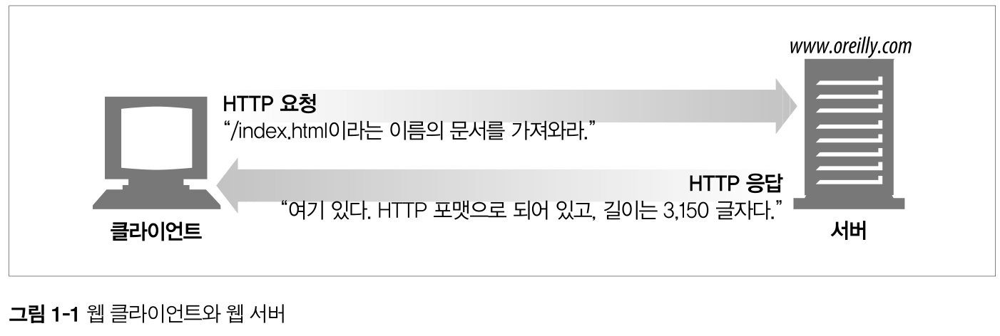

    > http://www.oreily.com/index.html 페이지를 열어볼 경우

### 1.3 리소스
- 웹서버는 웹리소스를 관리하고 제공한다.
- 가장 단순한 웹리소스는 웹서버 파일 시스템의 **정적 파일**이다.
    - 정적 파일 : 텍스트파일, HTML파일, 워드파일, JPEG이미지, AVI동영상, 그 외 모든 종류의 파일
- 요청에 따라 **콘텐츠를 생산하는 프로그램**이 될 수 있다.
    - 동적 콘텐츠 리소스 : 사용자, 요청 정보, 시간에 따라 다른 콘텐츠를 생산함.
    - ex) 라이브 영상 시청, 주식 거래, 부동산 DB 검색, 쇼핑몰 구입 등

    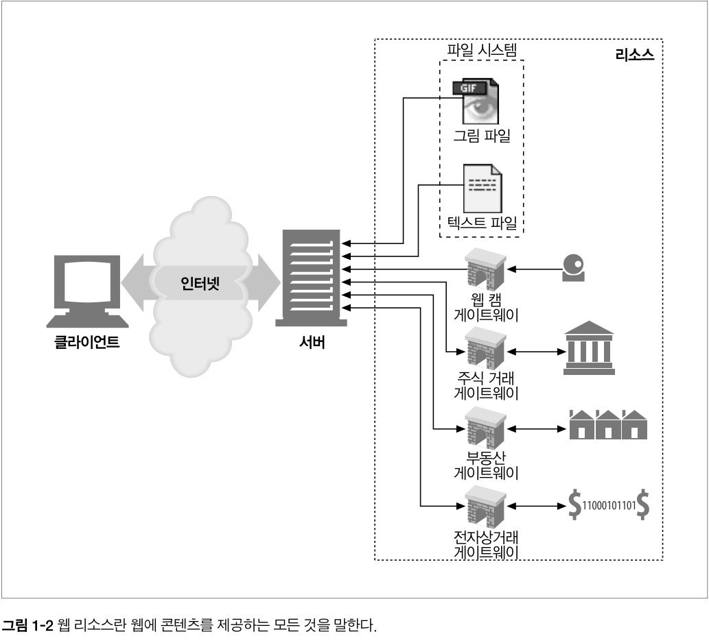

    > 어떤 종류의 콘텐츠 소스도 리소스가 될 수 있다.

#### 1.3.1 미디어 타입
- 웹 서버는 모든 HTTP 객체 데이터에 **MIME 타입**이라는 **데이터 포맷 라벨**을 붙인다.
    - MIME(Multipurpose Internet Mail Extensions, 다목적 인터넷 메일 확장)
    - 서로 다른 전자 메일시스템 사이에서 메시지가 오갈 때 겪는 문제점을 해결하기 위해 설계됨.
    > 이메일에서 잘 동작해 HTTP도 멀티미디어 콘텐츠를 기술하고 라벨을 붙이기 위해 채택함.
- 웹 브라우저는 서버로부터 응답받을 때, 다룰 수 있는 객체인지 MIME 타입을 통해 확인한다.
    - 대부분의 웹브라우저는 잘 알려진 수백가지 객체 타입을 다룰 수 있다. (이미지, HTML, 오디오 등)
    > 특별한 포맷 파일의 경우 외부플러그인 SW를 실행하기도 함.
      
    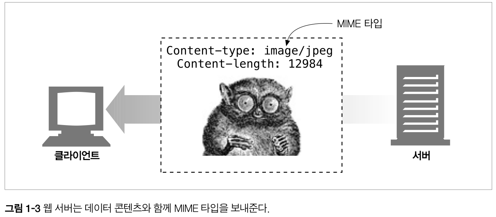

- MIME 타입 : `주 타입(primary object type) / 부 타입(specific subtype)` 으로 이루어진 문자열 라벨이다.
    - HTML 문서 `text/html`
    - plain ASCII 텍스트 문서 `text/plain`
    - JPEG 이미지 `image/jpeg`
    - GIF 이미지 `image/gif`
    - 애플 퀵타임 동영상 `video/quicktime`
    - 파워포인트 프레젠테이션 `application/vnd.ms-powerpoint`

#### 1.3.2 URI
- 서버 리소스는 각자 **이름(URI)** 을 갖고 있기 때문에 클라이언트는 관심있는 리소스를 지정하여 반환받을 수 있다.
- URI(Uniform Resource Identifier) : 리소스를 고유하게 식별하고 위치를 지정할 수 있는 인터넷 주소

    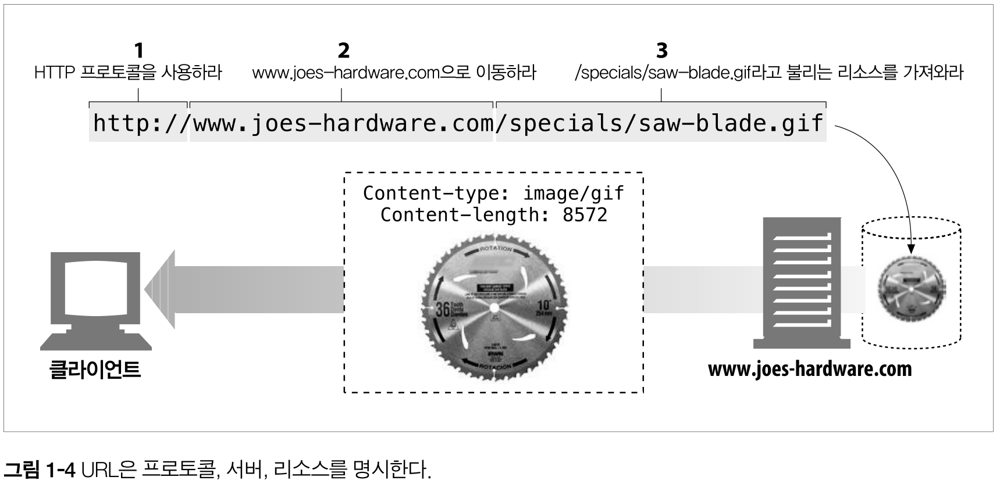

- URI에는 **URL**과 **URN**이 있다.

#### 1.3.3 URL
- URL(Uniform Resource Locator) : 특정 서버의 한 리소스에 대한 구체적 위치
- URL은 세부분으로 이루어진 표준 포맷을 따른다.
    1. 스킴(scheme) : 리소스에 접근하기 위해 사용되는 프로토콜 `http://`
    2. 서버의 인터넷 주소 `www.joes-hardware.com`
    3. 서버의 리소스 위치 `/specials/saw-blade.gif`
    
> 오늘날 대부분의 URI는 **URL**이다.

#### 1.3.4 URN
- URN(Uniform Resource Name) : 리소스 위치에 영향 받지 않는 유일무이한 이름
- 리소스 이름이 변하지 않는 한, 여러 종류의 프로토콜로 접근해도 문제가 없다.
    - ex) 인터넷 표준 문서 RFC 2141 `urn:ietf:rfc:2141`
- 아직 실험중이고 널리 채택되지 않음.
    - 효율적인 동작을 위해 리소스 위치 분석에 대한 인프라 지원이 필요함.
    - 전망은 밝다고 한다..
    

### 1.4 트랜잭션
- HTTP 트랜잭션 = 요청 명령(클라이언트 ➡️ 서버) + 응답 결과(서버 ➡️ 클라이언트)
    - HTTP 트랜잭션은 HTTP 메세지를 이용해서 이루어짐
      
    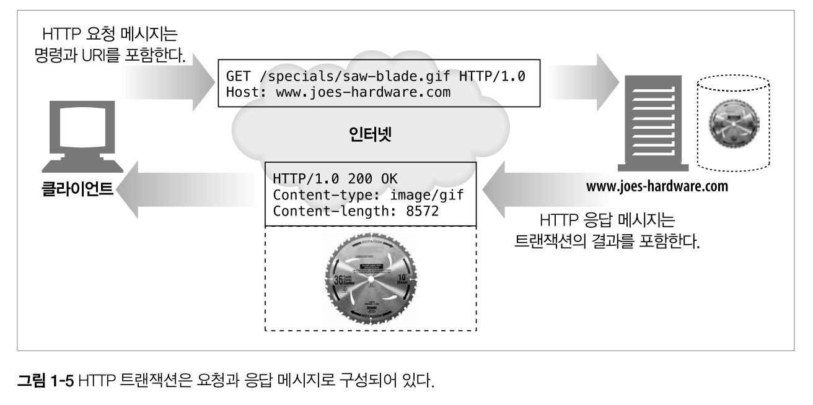

#### 1.4.1 메서드 (3장)
- HTTP 메서드는 여러 가지 종류의 요청 명령을 지원한다.
- 모든 HTTP 요청 메시지는 한개의 메서드를 갖는다.
- 메서드는 서버에게 어떤 동작이 취해야하는지 말해준다.
 
  |HTTP 메서드|설명|
  |---------|---|
  |GET|서버에서 클라이언트로 지정한 리소스를 보내라.|
  |PUT|클라이언트에서 서버로 보낸 데이터를 지정한 이름의 리소스로 저장하라.|
  |DELETE|지정한 리소스를 서버에서 삭제하라.|
  |POST|클라이언트 데이터를 서버 게이트웨이 애플리케이션으로 보내라.|
  |HEAD|지정한 리소스에 대한 응답에서, HTTP 헤더 부분만 보내라.|

#### 1.4.2 상태코드 (3장)
- 모든 HTTP 응답 메시지는 상태코드와 함께 반환된다.
- 상태코드는 요청이 성공했는지 아니면 추가조치가 필요한지 알려주는 세자리 숫자다.
  
  |HTTP 상태코드|설명|
  |---------|---|
  |200|좋다. 문서가 바르게 반환되었다.|
  |302|다시 보내라. 다른 곳에 가서 리소스를 가져가라.|
  |404|없음. 리소스를 찾을 수 없다.|
  
- HTTP는 각 상태코드에 `사유구절(reason phrase)`도 함께 보낸다.
    - `200 OK` `200 Success`
    > 사유구절은 단지 설명만을 위힌 것일 뿐, 실제 응답 처리는 상태코드를 사용함.

#### 1.4.3 웹페이지는 여러 객체로 이루어질 수 있다
- 어플리케이션은 하나의 작업을 수행하기 위해 **여러 HTTP 트랜잭션**을 수행한다.
- 예를 들어 아래와 같은 리소스를 가져오기위해 대량의 HTTP 트랜잭션이 수행될 수 있다. 
    - 페이지 레이아웃 HTML, 첨부된 이미지, 그래픽 조각, 자바 애플릿 등
    - 이 리소스들은 **다른 서버**에 위치할 수 도 있다.
- 웹페이지는 보통 하나의 리소스가아닌 **리소스의 모음**이다.

### 1.5 메시지
- HTTP 메시지는 단순한 줄 단위 문자열이다.
    - 이진 형식이 아닌, **일반 텍스트**이다.
- HTTP 메시지 = 요청 메시지(클라이언트 ➡️ 서버), 응답 메시지(서버 ➡️ 클라이언트)
    > 이외 다른 HTTP 메시지는 없다.
- HTTP 메시지는 세부분으로 이루어진다.
    - 시작줄 : 요청이라면 무엇을 해야하는지, 응답이라면 무슨일이 일어났는지 나타냄.
    - 헤더 : 0개 이상의 헤더필드를 갖는다. `이름:값`의 형태로 구성됨. 헤더는 **빈 줄**로 끝난다.
    - 본문 : 빈 줄 다음 본문이 필요에 따라 올 수 있다.
        - 요청이라면 웹서버로 데이터를 실어 보내거나, 응답이라면 클라이언트로 데이터를 반환한다.
        - 시작줄, 헤더와 달리 이진 데이터(이미지, 비디오, 오디오, sw)를 포함할 수 있다.

#### 1.5.1 간단한 메시지의 예
- 간단한 HTTP 트랜잭션 예

    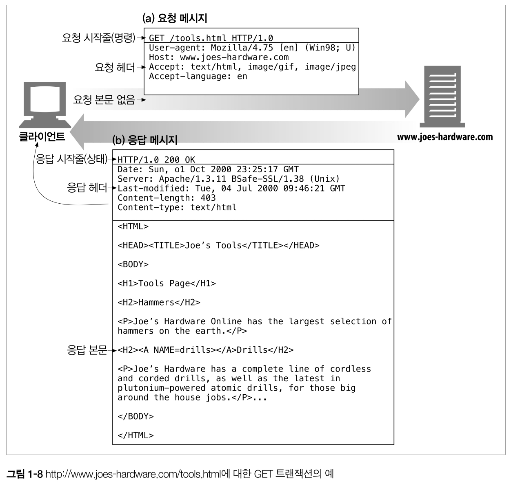

- 요청
    - 시작줄에 `GET`메서드, 요청 리소스는 `/tools.html`, `HTTP1.0버전`으로 요청을 보낸다.
- 응답
    - 시작줄에 `HTTP1.0버전`, 성공 상태코드 `200`, 사유 구절 `OK`, 헤더, 요청한 문서가 담긴 본문을 담아 응답을 반환한다.
    - 이때 헤더의 `Content-length`는 응답 본문길이, `Content-type`은 응답 문서의 **MIME타입**이다.

### 1.6 TCP 커넥션
#### 1.6.1 TCP/IP
- HTTP는 응용 계층 프로토콜로, 네트워크 통신 세부사항에 신경쓰지 않는다.
- 대중적이고 신뢰성 있는 인터넷 전송 프로토콜인 TCP/IP에게 맡긴다.
    - TCP/IP는 TCP와 IP가 층을 이루는, 패킷 교환 네트워크 프로토콜의 집합이다.
- TCP(Transmission Control Protocol) 커넥션이 맺어지면 어떤 종류의 컴퓨터나 네트워크든 서로 신뢰성 있는 의사소통을 하게 해준다.
    - 오류 없는 데이터 전송(데이터가 손실되거나 손상되는일은 없다)
    - 순서에 맞는 전달(데이터는 언제나 보낸 순서대로 도착한다)
    - 조각나지 않은 데이터 스트림(언제든 어떤 크기로든 보낼 수 있다)
- HTTP 네트워크 프로토콜 스택
  
  |프로토콜|계층|
  |---------|---|
  |HTTP|응용 계층|
  |TCP|전송 계층|
  |IP|네트워크 계층|
  |네트워크를 위한 링크 인터페이스|데이터 링크 계층|
  |물리적인 네트워크 하드웨어|물리 계층|

#### 1.6.2 접속, IP 주소 그리고 포트번호
- 메시지를 전송할 수 있게 되기 전, **인터넷 프로토콜(Internet Protocol, IP)** 과 **포트번호**를 사용해 클라이언트와 서버 사이에 **TCP/IP 커넥션**을 맺어야 한다.
    - IP주소와 포트번호는 URL을 통해 알 수 있다.
    - `http://www.netscape.com/index.html`
    - DNS(Donmain Name Service)를 통해 `http://www.netscape.com`(호스트 명)을 IP로 변환하고
    - HTTP 통신의 well known port인 80이라고 가정하면된다.
- HTTP 통신 순서
    1. 웹브라우저는 서버의 URL에서 호스트 명을 추출한다.
    2. 웹브라우저는 서버의 호스트 명을 IP로 변환한다.
    3. 웹브라우저는 URL에서 포트번호(있다면)를 추출한다.
    4. 웹브라우저는 웹서버와 TCP커넥션을 맺는다.
    5. 웹브라우저는 서버에 HTTP 요청을 보낸다.
    6. 서버는 웹브라우저에 HTTP 응답을 돌려준다.
    7. 커넥션이 닫히면, 웹브라우저는 문서를 보여준다.

#### 1.6.3 텔넷(Telnet)을 이용한 실제 예제
- 텔넷 유틸리티는 키보드를 **목적지 TCP 포트**로 연결해주고, **출력 TCP 포트**를 화면으로 연결해준다.
    - 텔넷은 **원격 터미널 세션**을 위해 흔히 사용되지만, HTTP 서버를 포함한 TCP 서버 연결에 사용될 수도 있다.
- 텔넷으로 웹서버와 TCP 커넥션을 연결해서 HTTP 요청을 보내보자.
  
  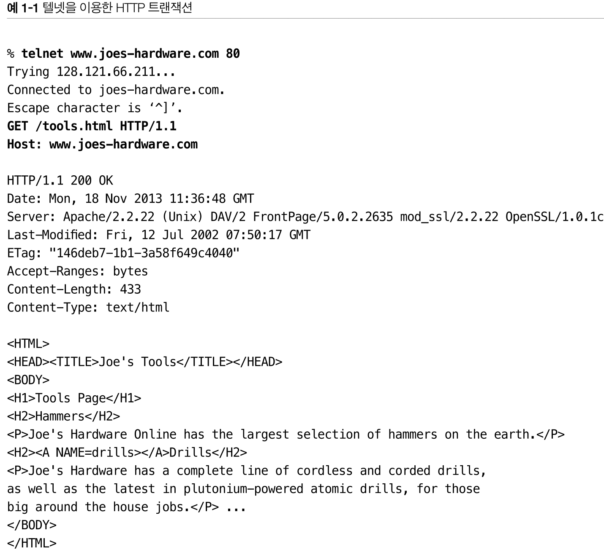

1. 텔넷은 호스트명을 찾아, 80번 포트로 대기중인 `www.joes-hardware.com` 웹 서버에 연결한다.
2. 커넥션이 수립되면 시작줄 `GET /tools.html HTTP/1.1`을 입력하고 헤더에 Host `www.joes-hardware.com`를 넣어 요청을 보낸다.
3. 응답은 응답 시작줄, 헤더, html문서를 포함은 본문을 반환한다.

> 텔넷은 HTTP 클라이언트 흉내는 내지만 변변치 않다. 보다 유연한 도구로 nc(netcat)을 사용해라.

### 1.7 프로토콜 버전
- HTTP/0.9
    - 1991년의 HTTP 프로토 타입.
    - 오직 GET 메서드만 지원하며, MIME 타입, HTTP 헤더, 버전 번호는 지원하지 않는다.
    - 금방 HTTP/1.0으로 대체되었다.
- HTTP/1.0
    - 처음으로 널리 쓰이기 시작한 HTTP버전.
    - 버전 번호, HTTP 헤더, 추가 메서드, 멀티미디어 객체 처리를 추가했다.
    - 시각적으로 편리한 웹페이지와 상호작용하는 폼을 실현하여 월드 와이드 웹(www)을 대세로 만들었다.
- HTTP/1.0+
    - 1990대 중반, www의 급격한 발전으로 여러 기능이 공식적이지 않지만 사실상 표준으로 추가되었다.
    - 오래 지속되는 **keep-alive** 커넥션, 가상 호스팅 지원, 프락시 연결 지원 등
    - 이 규격 외 확장된 버전을 흔히들 HTTP/1.0+라고 부른다.
- HTTP/1.1
    - HTTP 설계의 구조적 결함 교정, 두드러진 성능 최적화, 잘못된 기능 제거에 집중한 버전이다.
    - 복잡해진 웹 어플리케이션과 배포를 지원한다.
    - 현재 HTTP 버전이다.
- HTTP/2.0
    - HTTP/1.1 성능 문제를 개선하기 위해 설계가 진행중인 프로토콜

### 1.8 웹의 구성요소

HTTP를 사용하는 다양한 웹 어플리케이션
    
#### 1.8.1 프락시 (6장)
- 프락시는 클라이언트와 서버 사이에 위치하여, 클라이언트의 모든 HTTP 요청을 받아 서버에 전달한다.
    - 사용자를 대신해서 서버에 접근한다.
- 프락시는 주로 **보안**을 위해 사용되며, 웹 트래픽 흐름 속 신뢰할 만한 **HTTP 중개자** 역할을 한다.
- 프락시는 **요청과 응답을 필터링**한다.
    - ex) 초등학교 성인 콘텐츠 차단, 회사 파일 다운로드 시 바이러스 검출 등

    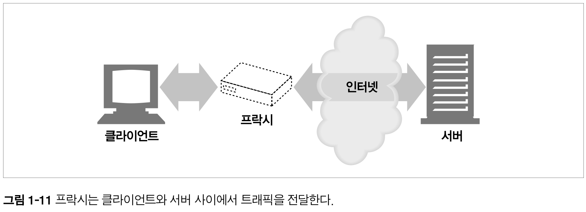

#### 1.8.2 캐시 (7장)
- 캐시 프락시는 자주 찾는 문서의 사본을 저장해두는 특별한 종류의 HTTP 프락시 서버다.
    - 클라이언트는 멀리 떨어진 웹 서버보다 근처의 캐시에서 빠르게 문서를 다운받을 수 있다.
- HTTP는 캐시의 효율적인 동작, 캐시된 콘텐츠의 최신버전 유지 및 보안을 위해 많은 기능을 정의한다.
    
    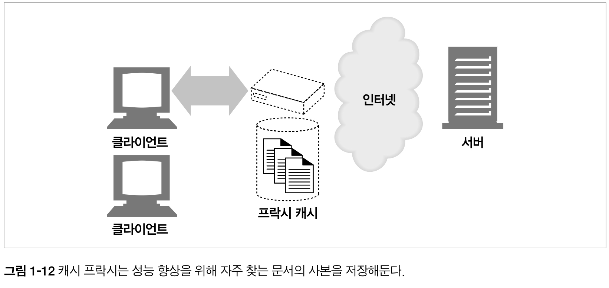

#### 1.8.3 게이트웨이 (8장)
- 게이트웨이는 다른 서버들의 중개자로 동작하는 특별한 서버다.
    - 주로 HTTP 트래픽을 다른 프로토콜로 변환하기 위해 사용된다.
- 게이트웨이는 진짜 서버인 것 처럼 요청을 다루기 때문에, 클라이언트가 알아채지 못한다. 

    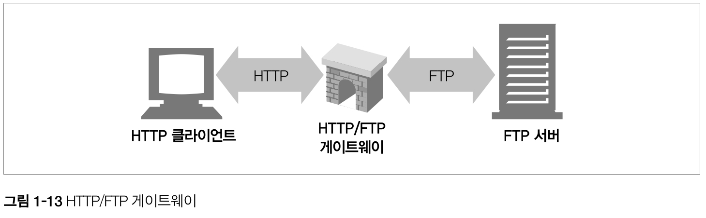

    > HTTP/FTP 게이트웨이는 HTTP요청을 받고 FTP프로토콜을 이용해 문서를 가져온다.

#### 1.8.4 터널 (8장)
- 터널은 두 커넥션 사이에서 데이터를 열어보지 않고 그대로 전달해주는 HTTP 어플리케이션이다.
- 주로 비 HTTP 데이터를 HTTP 연결을 통해 **그대로 전송**해주기 위해 사용된다.
    - ex) HTTP/SSL터널 : 암호화된 SSL 트래픽을 HTTP 커넥션으로 전송하여 웹 트래픽만 허용하는 사내 방화벽을 통과시킴.

    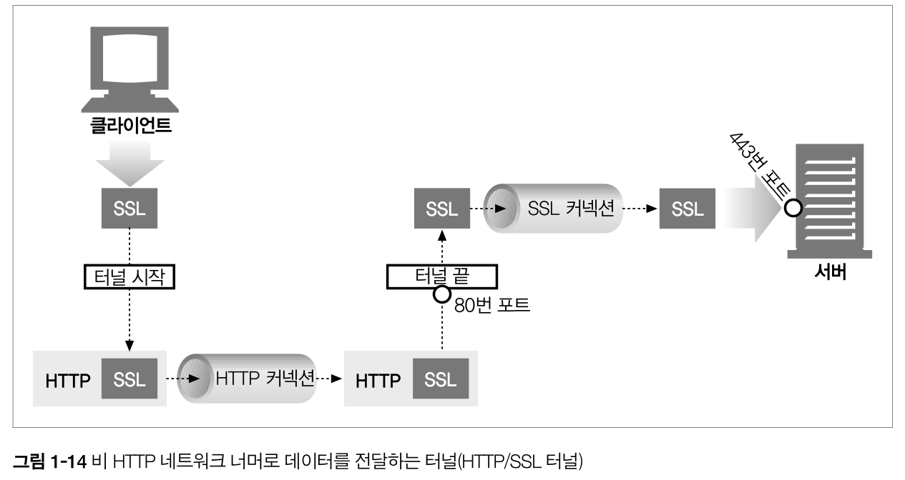

