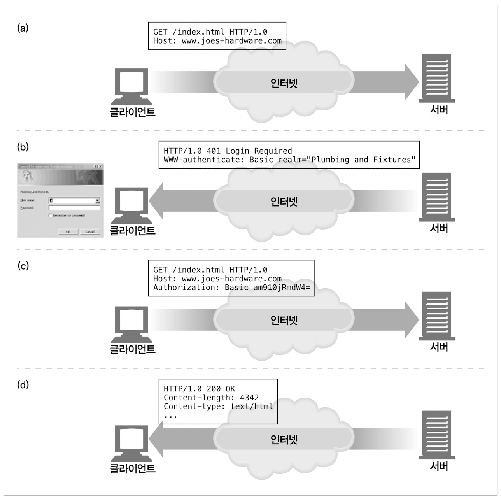

### 11.1 개별 접촉
HTTP는 익명으로 사용하며 무상태(Stateless)이며, 요청과 응답으로 통신하는 프로토콜이다.
서버는 요청을 보낸 사용자를 식별하거나, 연속적인 요청을 추적하기 위해 *약간의 정보*를 이용할 수 있다.

- 개별 인사 : 온라인 상점은 개인에게 특화된 환영 메시지나 페이지 내용을 만든다.
- 사용자 맞춤 추천 : 온라인 상점은 고객이 선호할 것이라 예상되는 제품들을 추천할 수 있다.
- 저장된 사용자 정보 : 온라인 상점은 복잡한 주소와 신용카드 정보 등 한번 식별하고나면 더 편리하게 해줄 수 있는 정보를 DB에 저장할 수 있다.
- 세션 추척 : HTTP 트랜잭션은 상태가없지만, 사이트와 상호작용할 수 있게끔 사용자의 상태를 남긴다. (ex 장바구니)
    - 이를 위해, 각 사용자에게서 오는 HTTP 트랜잭션을 식별할 방법이 필요하다.

### 11.2 HTTP 헤더

|헤더이름|헤더 타입|설명|
|------|------|---|
|From|요청|사용자의 이메일 주소|
|User-Agent|요청|사용자의 브라우저|
|Referer|요청|사용자가 현재 링크를 타고 온 근원 페이지|
|Authorization|요청|사용자 이름과 비밀번호|
|Client-ip|확장(요청)|클라이언트의 IP주소|
|X-Forwarded-For|확장(요청)|클라이언트의 IP주소|
|Cookie|확장(요청)|서버가 생성한 ID라벨|

- From헤더 : 각 사용자는 서로 다른 이메일 주소를 가지므로, From헤더로 사용자를 식별할 수 있다. 
    - 하지만 악의적 서버가 이메일 주소를 모아 스팸 메일을 발송하는 문제가 있어, From 헤더를 보내는 브라우저는 많지 않다.
- User-Agent : 사용자가 쓰고 있는 브라우저 정보, OS 정보를 포함하여 서버에게 알려준다.
    - 특정 브라우저에서 제대로 동작하도록 콘텐츠를 최적화하는데 유용하지만, 특정 사용자 식별엔 도움을 주지 않는다.
- Refer : 현재 페이지로 유입하게한 웹 페이지의 URL을 가르킨다.
    - 이 헤더로 사용하를 식별할 수는 없지만, 이전에 어떤페이지를 방문했는지 알려줌으로써 사용자의 취향을 파악할 수 있다.

위 3개의 헤더로는 확실히 식별하기엔 부족하다.

### 11.3 클라이언트 IP 주소
초기 웹 선구자들은 사용자 식별에 클라이언트 IP 주소를 사용하려했다. 사용자는 확실한 IP 주소를 가지고 있고, 좀처럼 바뀌지 않으며 웹 서버 요청마다 클라이언트 IP를 알 수 있다면 문제없이 동작한다.   
하지만 아래와 같은 약점을 가지고 있다.
- 클라이언트 IP주소는 사용자가 아닌, 사용하려는 컴퓨터를 가르킨다.
  만약 여러 사용자가 같은 컴퓨터를 사용한다면 그들을 식별할 수 없다.
- 많은 인터넷 서비스 제공자(ISP)는 사용자가 로그인하면, 동적으로 IP주소를 할당한다.
  로그인한 시간에 따라 매번 다른 주소를 받으므로, 웹 서버는 사용자를 IP 주소로 식별할 수 없다.
- 보안을 강화하고 부족한 주소들을 관리하기위해 많은 사용자는 네트워크 주소 변환(Network Address Translation, NAT) 방화벽을 통해 인터넷을 사용한다. 
  이 NAT 장비들은 실제 IP주소를 방화벽 뒤로 숨기고, 클라이언트의 실제 IP주소를 내부에서 사용하는 하나의 방화벽 IP주소(그리고 다른 포트번호)로 변환한다.
- HTTP 프락시와 게이트웨이는 서버에 새로운 TCP 연결을 한다. 웹 서버는 클라이언트의 IP주소 대신 프락시 서버의 IP주소를 사용하게된다. 
  일부 프락시는 원본 IP주소를 `Client-ip`나 `X-Forwarded-For HTTP`와 같은 확장헤더를 추가해 문제를 해결하려 했다.
  (하지만 모든 프락시가 이런 식으로 동작하지 않는다.)
  

### 11.4 사용자 로그인
- 웹 서버는 사용자 이름과 비밀번호로 **인증(로그인)** 할 것을 요구해서 사용자에게 명시적으로 식별 요청을 할 수 있다.   
- 웹 사이트 로그인이 더 쉽도록 HTTP는 `WWW-Authenticate`와 `Authorization` 헤더를 사용해 사용자 이름을 전달하는 체계를 갖는다.
- 한번 로그인하면, 브라우저는 사이트로 보내는 모든 요청에 이 로그인 정보를 헤더에 담아 보내므로 웹서버는 로그인 정보를 항상 확인할 수 있다.
- 서버에서 로그인을 요구하고자 하면, 401 응답코드를 보낼 수 있다. 로그인 후엔 Authorization 헤더에 로그인 정보를 담아 보낸다.

> 한번 로그인하면, 브라우저는 요청마다 해당 사용자의 식별정보 토큰을 Authorization 헤더에 담아 서버로 전송하여, 한 세션이 진행되는 내내 사용자에대한 식별을 유지한다.

- 하지만 로그인은 귀찮은 일이다.

