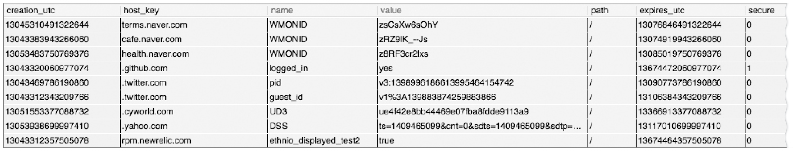

### 11.1 개별 접촉
HTTP는 익명으로 사용하며 무상태(Stateless)이며, 요청과 응답으로 통신하는 프로토콜이다.
서버는 요청을 보낸 사용자를 식별하거나, 연속적인 요청을 추적하기 위해 *약간의 정보*를 이용할 수 있다.

- 개별 인사 : 온라인 상점은 개인에게 특화된 환영 메시지나 페이지 내용을 만든다.
- 사용자 맞춤 추천 : 온라인 상점은 고객이 선호할 것이라 예상되는 제품들을 추천할 수 있다.
- 저장된 사용자 정보 : 온라인 상점은 복잡한 주소와 신용카드 정보 등 한번 식별하고나면 더 편리하게 해줄 수 있는 정보를 DB에 저장할 수 있다.
- 세션 추척 : HTTP 트랜잭션은 상태가없지만, 사이트와 상호작용할 수 있게끔 사용자의 상태를 남긴다. (ex 장바구니)
    - 이를 위해, 각 사용자에게서 오는 HTTP 트랜잭션을 식별할 방법이 필요하다.

### 11.2 HTTP 헤더

|헤더이름|헤더 타입|설명|
|------|------|---|
|From|요청|사용자의 이메일 주소|
|User-Agent|요청|사용자의 브라우저|
|Referer|요청|사용자가 현재 링크를 타고 온 근원 페이지|
|Authorization|요청|사용자 이름과 비밀번호|
|Client-ip|확장(요청)|클라이언트의 IP주소|
|X-Forwarded-For|확장(요청)|클라이언트의 IP주소|
|Cookie|확장(요청)|서버가 생성한 ID라벨|

- From헤더 : 각 사용자는 서로 다른 이메일 주소를 가지므로, From헤더로 사용자를 식별할 수 있다. 
    - 하지만 악의적 서버가 이메일 주소를 모아 스팸 메일을 발송하는 문제가 있어, From 헤더를 보내는 브라우저는 많지 않다.
- User-Agent : 사용자가 쓰고 있는 브라우저 정보, OS 정보를 포함하여 서버에게 알려준다.
    - 특정 브라우저에서 제대로 동작하도록 콘텐츠를 최적화하는데 유용하지만, 특정 사용자 식별엔 도움을 주지 않는다.
- Refer : 현재 페이지로 유입하게한 웹 페이지의 URL을 가르킨다.
    - 이 헤더로 사용하를 식별할 수는 없지만, 이전에 어떤페이지를 방문했는지 알려줌으로써 사용자의 취향을 파악할 수 있다.

위 3개의 헤더로는 확실히 식별하기엔 부족하다.

### 11.3 클라이언트 IP 주소
초기 웹 선구자들은 사용자 식별에 클라이언트 IP 주소를 사용하려했다. 사용자는 확실한 IP 주소를 가지고 있고, 좀처럼 바뀌지 않으며 웹 서버 요청마다 클라이언트 IP를 알 수 있다면 문제없이 동작한다.   
하지만 아래와 같은 약점을 가지고 있다.
- 클라이언트 IP주소는 사용자가 아닌, 사용하려는 컴퓨터를 가르킨다.
  만약 여러 사용자가 같은 컴퓨터를 사용한다면 그들을 식별할 수 없다.
- 많은 인터넷 서비스 제공자(ISP)는 사용자가 로그인하면, 동적으로 IP주소를 할당한다.
  로그인한 시간에 따라 매번 다른 주소를 받으므로, 웹 서버는 사용자를 IP 주소로 식별할 수 없다.
- 보안을 강화하고 부족한 주소들을 관리하기위해 많은 사용자는 네트워크 주소 변환(Network Address Translation, NAT) 방화벽을 통해 인터넷을 사용한다. 
  이 NAT 장비들은 실제 IP주소를 방화벽 뒤로 숨기고, 클라이언트의 실제 IP주소를 내부에서 사용하는 하나의 방화벽 IP주소(그리고 다른 포트번호)로 변환한다.
- HTTP 프락시와 게이트웨이는 서버에 새로운 TCP 연결을 한다. 웹 서버는 클라이언트의 IP주소 대신 프락시 서버의 IP주소를 사용하게된다. 
  일부 프락시는 원본 IP주소를 `Client-ip`나 `X-Forwarded-For HTTP`와 같은 확장헤더를 추가해 문제를 해결하려 했다.
  (하지만 모든 프락시가 이런 식으로 동작하지 않는다.)
  

### 11.4 사용자 로그인
- 웹 서버는 사용자 이름과 비밀번호로 **인증(로그인)** 할 것을 요구해서 사용자에게 명시적으로 식별 요청을 할 수 있다.   
- 웹 사이트 로그인이 더 쉽도록 HTTP는 `WWW-Authenticate`와 `Authorization` 헤더를 사용해 사용자 이름을 전달하는 체계를 갖는다.
- 한번 로그인하면, 브라우저는 사이트로 보내는 모든 요청에 이 로그인 정보를 헤더에 담아 보내므로 웹서버는 로그인 정보를 항상 확인할 수 있다.
- 서버에서 로그인을 요구하고자 하면, 401 응답코드를 보낼 수 있다. 로그인 후엔 Authorization 헤더에 로그인 정보를 담아 보낸다.

> 한번 로그인하면, 브라우저는 요청마다 해당 사용자의 식별정보 토큰을 Authorization 헤더에 담아 서버로 전송하여, 한 세션이 진행되는 내내 사용자에대한 식별을 유지한다.

- 하지만 로그인은 귀찮은 일이다.

### 11.5 뚱뚱한 URL
- 뚱뚱한 URL : 사용자의 상태 정보를 포함하고 있는 URL이며, 사용자를 식별하는 데 사용할 수 있다.
- 웹서버와 통신하는 독립적인 HTTP 트랜잭션을 하나의 세션 혹은 방문으로 묶는 용도로 뚱뚱한 URL을 사용할 수 있다.
- 사용자가 웹 사이트에 처음 방문하면 서버에선 유일한 ID가 생성하고 그 값은 URL에 추가하며 클라이언트를 이 뚱뚱한 URL로 리다이렉트 시킨다.
- 그리고 서버는 이 뚱뚱한 URL을 포함한 요청을 받으면, 사용자의 추가적인 정보(쇼핑카트, 프로필 등)를 찾아 밖으로 향하는 모든 하이퍼링크를 뚱뚱한 URL로 바꾼다.
- 하지만 아래와 같은 심각한 문제가 있다.
    - 못생긴 URL : 브라우저에 보이는 뚱뚱한 URL은 사용자에게 혼란을 준다.
    - 공유하지 못하는 URL : 뚱뚱한 URL은 사용자와 세션에 대한 상태 정보를 포함한다. 만약 그 주소를 누군가에게 보내면 누적된 개인정보를 공유하는 것이다.
    - 캐시를 사용할 수 없음 : URL이 달라지기 때문에 기존 캐시에 접근할 수 없다.
    - 서버 부하 가중 : 서버는 뚱뚱한 URL에 해당하는 HTML 페이지를 다시 그려야한다.
    - 이탈 : 사용자가 링크를 타고 다른 사이트로 이동하는 등 뚱뚱한 URL 세션에서 이탈하기 쉽다. 이탈하게되면 지금까지의 진척상황들(장바구니 등)이 초기화 될것이다.

### 11.6 쿠키

#### 11.6.1 쿠키의 타입
- 세션 쿠키 : 사용자가 사이트를 탐색할 때, 관련한 설정과 선호 사항들을 저장하는 임시 쿠키다.
    - 사용자가 브라우저를 닫으면 삭제된다.
- 지속 쿠키 : **디스크**에 저장되어, 브라우저를 닫거나 컴퓨터를 재시작하더라도 남아있다.
    - 사용자가 주기적으로 방문하는 사이트에 대한 설정 정보나, 로그인 이름을 유지하기 위해 사용한다.
  
> 세션 쿠키와 지속 쿠키의 다른점은 파기되는 시점이다.   
> Discard 파라미터가 설정되어있거나, 파기되기까지 남은 시간을 가리키는 Expires 혹은 Max-Age 파라미터가 없으면 세션 쿠키가 된다.

#### 11.6.2 쿠키는 어떻게 동작하는가
- 사용자가 처음  웹사이트에 방문하여 요청을 보내면, 웹서버는 사용자를 식별하기 위한 유일한 값을 쿠키에 할당한다.
- 쿠키는 임의의 *이름 = 값* 형태의 리스트를 가지며, 이 리스트는 `Set-Cookie`, `Set-Cookie2`같은 HTTP 응답 헤더에 기술되어 사용자에게 전달된다.
- 쿠키는 어떤 정보든 포함할 수 있다.
  1. 서버가 사용자 추적 용도로 생성한 유일한 단순 식별 번호를 쿠키에 포함할 수 있다.
    - `id=34294`라는 쿠키를 사용자에게 할당하면, 서버는 이 쿠키 값으로 DB에서 사용자의 정보(구매 내용, 주소 정보 등)를 찾는데 사용할 수 있다.
  2. 단순 식별 번호 뿐 아니라 이름, 전화번호와 같은 정보도 포함할 수 있다.
    - `Cookie : name = "Brian Totty"; phone="555-1212"`
- 브라우저는 서버로 온 Set-Cookie 헤더에 있는 정보를 브라우저내 쿠키 DB에 저장한다.
- 미래에 같은 사이트를 방문하면, 할당받았던 쿠키를 Cookie 요청 헤더에 기술해 서버에게 전송한다.

#### 11.6.3 쿠키 상자 : 클아이언트 측 상태
- 브라우저는 서버 관련 정보를 저장하고, 사용자가 해당 서버에 접근할 때 그 정보를 함께 전송하는 것이다.
- 브라우저는 쿠키 정보를 저장할 책임이 있으며, 이 시스템을 *클라이언트 측 상태*라고 한다. ➡️ HTTP 상태 관리 체계(HTTP State Management Mechanism)
- 각 브라우저는 각기 다른 방식으로 쿠키를 저장한다.
- 구글 크롬 쿠키
  - 구글 크롬은 Cookies라는 SQLite 파일에 쿠키를 저장한다.
  
  

  - creation_utc : 쿠키가 생성된 시점 (Jan 1, 1970 00:00:00 GMT로부터 생성된 시간을 초단위로 기술)
  - host_key : 쿠키의 도메인
  - name : 쿠키의 이름
  - value : 쿠키의 값
  - path : 쿠키와 관련된 도메인에 있는 경로
  - expire_utc : 쿠키 파기 시점 (Jan 1, 1970 00:00:00 GMT로부터 파기될 시간을 초단위로 기술)
  - secure : ssl 커넥션일 경우에만 보낼지를 가르킴
  
#### 11.6.4 사이트마다 각기 다른 쿠키들
- 브라우저는 쿠키 전부를 모든 사이트에 보내지 않고 2~3개 쿠키만 보낸다. 이유는 아래와 같다.
  - 쿠키를 모두 전달하면 성능이 크게 저하된다. 쿠키를 모두 전달하면 브라우저는 실제 콘텐츠 바이트보다 더 많은 쿠키 바이트를 전달하게 된다.
  - 쿠키 대부분은 서버에 특화된 이름/값 쌍을 포함하고 있기 때문에, 대부분 사이트에서는 인식하지 않는 무의미한 값이다.
  - 모든 사이트에 쿠키 전체를 전달하는것은, 신뢰하지 않는 사이트에서 가져갈 수 있어 잠재적인 개인정보 문제를 일으킬 수 있다.
- 보통 쿠키를 생성한 서버에만 쿠키에 담긴 정보를 전달한다.
  - 많은 웹사이트 들은 광고 협력업체와 계약한다. 이 광고들은 웹사이트 자체의 일부인것처럼 제작되고 **지속 쿠키**를 만들어낸다.
  - 같은 광고사에서 제공하는 서로 다른 웹사이트에 사용자가 방문하면, 브라우저는 앞서 만든 지속쿠키를 다시 광고사 서버로 전송한다.
  - 이는 **지속 쿠키 도메인이 같기 때문이다.**
  - 광고사는 이 기술에 Refer헤더를 접목하여 사용자의 프로필과 웹 사이트를 사용하는 습관에 대한 데이터를 구축할 수 있다.
    > Refer헤더 : 현재 페이지로 유입하게한 웹 페이지의 URL을 가르킨다.

쿠키 Domain 설정
- `Set-cookie: user="mary17"; domain="airtravelbargains.com"`
  - user="mary17"이라는 쿠키를 `.airtravelbargains.com` 도메인을 가지는 모든 사이트에 전달한다는 의미다.

쿠키 Path 속성
- `Set-cookie: pref=compact; domain="airtravelbargains.com"; path=/autos/`
  - `www.airtravelbargains.com/spcials.html` 에 접근하면 user="mary17" 쿠키만 얻을 수 있지만,
  - `www.airtravelbargains.com/autos/cheapo/index.html` 에 접근하면 user="mary17", pref=compact 두개를 얻을 수 있다.

따라서 쿠키는 일종의 상태 정보라고 할 수 있으며, 서버가 생성하여 클라이언트에게 전달하고, 클라이언트는 그 쿠키를 유요한 사이트에만 다시 전달하고 관리한다.

