### 14.1 HTTP안전하게 만들기

웹은 안전한 방식의 HTTP를 필요로 하며, 아래와 같은 보안 기술이 필요로한다.

- 서버 인증 - 클라이언트는 자신이 위조된 서버가 아닌 진짜와 이야기 하고 있음을 알 수 있어야 한다.
- 클라이언트 인증 - 서버는 자신이 가짜가 아닌 진짜 사용자와 이야기 하고 있음을 알 수 있어야 한다.
- 무결성 - 클라이언트와 서버는 그들의 데이터가 위조되는 것으로부터 안전해야 한다.
- 암호화 - 클라이언트와 서버는 도청에 대한 걱정 없이 서로 대화할 수 있어야 한다.
- 효율 - 저렴한 클라이언트나 서버도 이용할 수 있도록 알고리즘은 충분히 빨라야한다.
- 편재성(Ubiquity) - 프로토콜은 거의 모든 클라이언트와 서버에서 지원되어야 한다.
- 관리상 확장성 - 누그든 어디서든 즉각적인 보안 통신을 할 수 있어야 한다.
- 적응성 - 현재 알려진 최선의 보안 방법을 지원해야 한다.
- 사회적 생존성 - 사회의 문화적, 정치적 요구를 만족시켜야 한다.

#### 1.4.1 HTTPS
- HTTPS는 HTTP를 안전하게 만드는 방식 중 가장 인기 있는 것이다.
    - 넷스케이프 커뮤니케이션 주식회사에서 개척하여, 주류 브라우저와 서버에서 지원한다.
    - URL이 `https://`로 시작한다.
- HTTPS를 사용할 때, 모든 HTTP 요청과 응답 데이터는 네트워크로 보내지기 전 암호화 된다.
- HTTPS는 HTTP 하부에 전송 레벨 암호 보안 계층을 제공함으로써 동작한다.
    - 이 보안 계층은 안전 소켓 계층(Secure Sockets Layer, SSL)혹은 그를 계승한 전송 계층 보안(Transport Layer Security, TLS)로 구현된다.
- SSL과 TLS는 매우 비슷하기 때문에 이 책에서는 양쪽 모두 **SSL**이라는 단어를 사용한다.
- HTTPS

    |프로토콜|계층|
    |------|---|
    |HTTP|응용 계층|
    |SSL 혹은 TLS|보안 계층|
    |TCP|전송 계층|
    |IP|네트워크 계층|
    |네트워크 인터페이스|데이터 링크 계층|

    > 인코딩/디코딩은 대부분 SSL 라이브러리 안에서 일어나기 때문에, HTTP를 사용하기 위해 클라이언트/서버가 프로토콜 처리 로직을 변경할 필요는 없다.
   
    > 대부분 TCP 입력/출력 호출을 SSL 호출로 대체하고, 보안 설정 및 관리를 위한 몇가지 호출을 추가하기만 하면된다.

### 14.2 디지털 암호학

- 암호 : 텍스트를 아무나 읽지 못하도록 인코딩하는 알고리즘
- 키 : 암호의 동작을 변경하는 숫자로 된 매개변수
- 대칭키 암호 체계 : 인코딩과 디코딩에 같은 키를 사용하는 알고리즘
- 비대칭키 암호 체계 : 인코딩과 디코딩에 다른 키를 사용하는 알고리즘
- 공개키 암호법 : 비밀 메시지를 전달하는 수백만 대의 컴퓨터를 쉽게 만들 수 있는 시스템
- 디지털 서명 : 메시지가 위조 혹은 변조되지 않았음을 입증하는 체크섬
- 디지털 인증서 : 신뢰할 만한 조직에 의해 서명되고 검증된 신원 확인 정보

#### 14.2.1 비밀 코드의 기술과 과학
- 암호법(cryptography) : 메시지 인코딩과 디코딩에 대한 과학이자 기술이다.
- 암호법은 단순 메시지를 암호화하는 것 뿐 아니라, 변조를 방지하기 위해 사용할 수 있다.
- 암호법은 누군가를 어떤 메시지나 트랜잭션의 저자임을 증명하는데도 사용될 수 있다.

#### 14.2.2 암호(cipher)
- 암호법은 암호라 불리는 비밀 코드에 기반한다.
- **암호** : 메시지를 인코딩하는 어떤 특정한 방법과, 그 메시지를 디코딩하는 방법
- 평문 : 인코딩 되기 전의 원본
- 암호문 : 암호가 적용되어 코딩된 메시지
- 평문 ➡ 인코더 ➡ 암호문 ➡ 디코더 ➡ 평문

    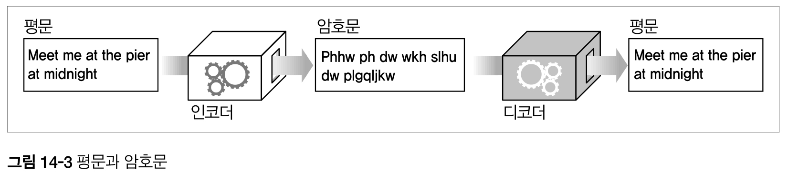

- Rotate-by-3 암호 : 글자의 알파벳 순서상 세 번 뒤의 글자로 교체

    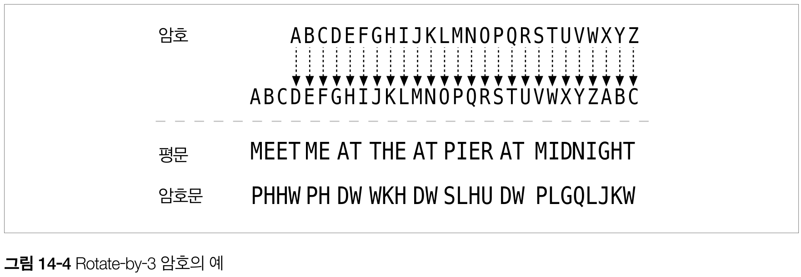

    - 인코딩 : 3글자 만큼 회전
    - 디코딩 : -3글자 만큼 회전
    
#### 14.2.3 암호 기계
- 암호는 상대적으로 간단한 알고리즘으로 시작했다.
    - 간단한 암호로 인해 사람들은 암호화 작업을 수기로 수행할 수 있었고 암호를 깨뜨리는 것도 가능했다.
- 기술이 진보하면서 복잡한 암호로 메시지를 빠르고 정확하게 인코딩, 디코딩하는 기계를 만들었다.
    - 단순 회전대신 글자를 대체하고 순서를 바꾸고 메시지를 토막냈다.

#### 14.2.4 키가 있는 암호
- 키 : 암호의 동작방식을 변경할 수 있는 숫자
- 디코딩 과정을 바르게 동작시키려면 올바른 키를 암호 기계에 입력해야한다.
- 암호 키는 하나의 암호 기계를 여러 가상 암호 기계의 집합처럼 만들어준다.
- 이 가상 암호 기계들은 서로 다른 키 값을 갖고 있기 때문에 제각각 다르게 동작한다.

    > 오늘날 대부분의 암호 알고리즘은 키를 사용한다.

#### 14.2.5 디지털 암호
- 디지털 계산의 도래로 디지털 암호가 발전했다.
    - 복잡한 인코딩, 디코딩 알고리즘이 가능해졌다.
    - 매우 큰 키를 지원하는 것이 가능해졌다.
    - 단일 암호 알고리즘으로 키의 값마다 다른 수조 개의 가상 알고리즘을 만들어 낼 수 있다.
- 디지털 키는 물리적 금속 키나 다이얼 설정과 달리, 그냥 숫자에 불과하다.
    - 디지털 키 값은 인코딩/디코딩 알고리즘에 대한 입력값이다.
- 평문 메시지 P, 인코딩 함수 E, 인코딩 키 e가 주어지면 암호화 C를 인코딩할 수 있다.
- 암호문 C를 디코더 함수 D와 디코딩 키 d를 사용해서 평문 P로 디코딩할 수 있다.
   
    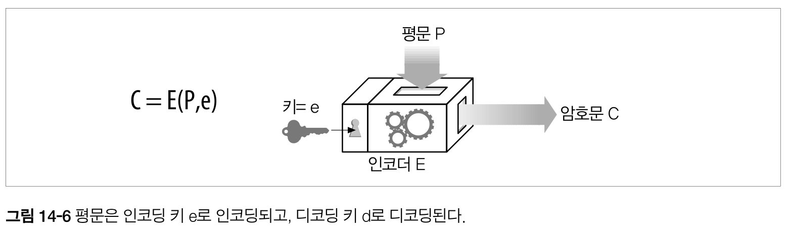

    > 인코딩 함수 E와 디코더 함수 D는 역의 관계다.

### 14.3 대칭키 암호법
- 대칭키 암호법은 인코딩/디코딩할 때 암호키가 같다.
- 따라서 발신자와 수신자 모두 통신을 위해 비밀키를 똑같이 공유해야한다.
- ex) DES, Triple-DES, RC2, RC4 등

#### 14.3.1 키 길이와 열거 공격(Enumeration Attack)
- 대부분 인코딩, 디코딩 알고리즘은 공개적이므로 **비밀 키**는 절대 누설되면 안된다.
- 열거 공격 : 무차별로 모든 키 값을 대입해보는 공격
    - 만약 가능한 키가 몇가지 없다면 열거 공격으로 암호를 깰 수 있다.
    - 하지만 가능한 키가 아주 많다면 우주 수명만큼 시간을 들여야한다.
- 가능한 키 값의 개수는 **몇비트**인지, 얼마나 많은 키가 **유효**한지에 달려있다.
    - 대칭키 암호에서는 보통 모든 키가 유효하다.
    - 8비트 : 256가지
    - 40비트 : 2^40(약 1조)
    - 128비트 : 2^128
- 암호에 기반한 보안에서 **키의 길이**는 굉장히 중요하다.
    - 미국정부는 긴 키를 사용하는 암호화 SW 수출을 통제한다.
    - 적대적 조직이 이를 통해 깰 수 없는 암호문을 만들 수 있기 때문에
- DES 암호를 깨뜨리는데 걸리는 시간
    
    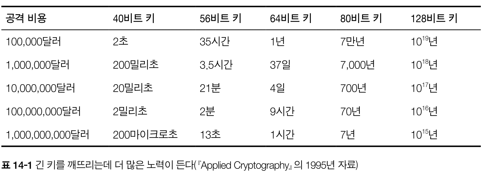
  
    > Triple-DES 키와 비슷한 크기인 128비트키는 누가 얼마를 들이든 실질적으로 깨뜨릴 수 없다고 알려짐. 

#### 14.3.2 공유키 발급하기
- 대칭키 암호의 단점은 발송자/수신자가 **둘 다 공유키를 가져야 한다는 것**이다.
- 만약 N개의 노드가 있고, 각 노드가 상대 N-1과 통신을 해야한다면? 대략 N^2개의 비밀키가 필요하다.
  
  > N(N-1)/2

- 관리해야하는 입장에서 지옥이다.

### 14.4 공개키 암호법
- 공개키 암호 방식은 두개의 비대칭 키(인코딩키, 디코딩키)를 사용한다.
- 인코딩 키는 모두를 위해 공개되어있지만 호스트만이 개인 디코딩 키를 알고 있다.

    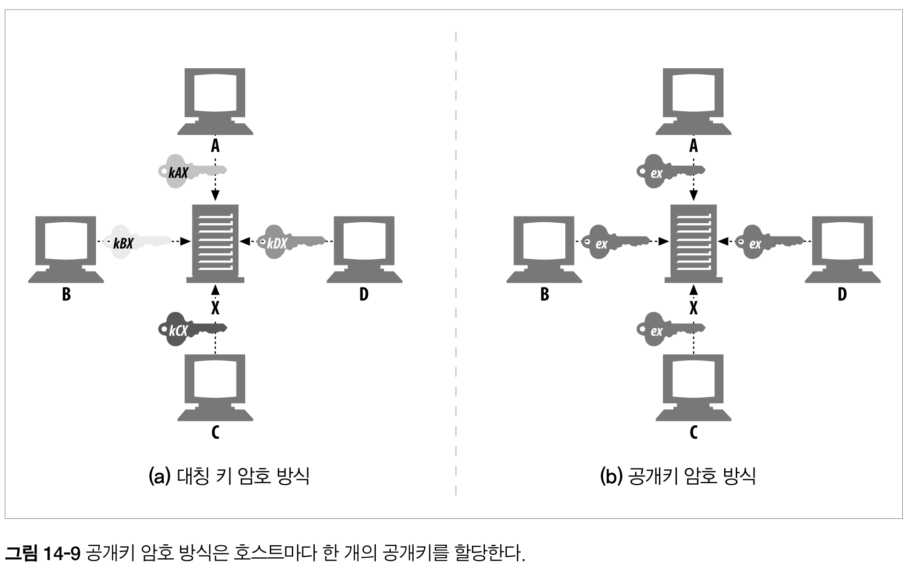

- 서버는 키를 공개적으로 배포할 수 있다.
- 호스트는 누구나 사용할 수 있는 **공개키(인코딩키)** 를 할당받아 메시지를 인코딩할 수 있다.
    > 공개키를 사용하면, 호스트 마다 키를 할당해야하는 대칭키의 폭발적 증가(N^2)를 피할 수 있다.
- 하지만 **개인키(디코딩키)** 는 서버만 가지고 있기 때문에, 서버를 제외하고 그 누구도 메시지를 디코딩할 수 없다.
- 공개키 암호화 기술은 **보안 프로토콜**을 전세계의 모든 컴퓨터 사용자에게 적용하는 것을 가능하게 했다.

#### 14.4.1 RSA
RSA 알고리즘은 아래와 같은 내용을 알고있어도 절대 개인키를 계산할 수 없다.
- 공개키
- 가로채서 얻은 암호문의 일부
- 메시지와 그것을 암호화한 암호문

> 큰 숫자를 소수들로 분해하는 빠른 방법을 찾아 내는 것보다 어렵다고 합니다..

#### 14.2.2 혼성 암호 체계와 세션 키
- 비대칭 공개키는 누구나 공개키만 알면, 서버에 안전하게 메시지를 보낼 수 있다.
- 두 노드가 안전한 의사소통을 위해 개인키에 대한 협상을 할 필요가 없다.
- 하지만 공개키 암호 방식의 알고리즘은 **계산이 느리다.**
- 실제로는 **대칭과 비대칭 방식을 섞은 것**이 쓰인다.
- 대표적인 예
- 의사소통 채널 수립엔 편리한 **비대칭을 사용**하고, 만들어진 채널에 무작위 대칭키를 생성하여 교환 후 나머지 데이터를 암호화할 땐 빠른 **대칭키를 사용**한다.

### 14.5 디지털 서명
- 암호 체계는 메시지를 인코딩/디코딩뿐만 아니라, 누가 메시지를 썼고 그 메시지가 위조되지 않았음을 증명하기 위한 **메시지 서명**에 이용될 수 있다.

#### 14.5.1 서명은 암호 체크섬이다.
디지털 서명(digital signing) = 특별한 암호 체크섬
- 서명은 메시지 작성자가 누군지 알려준다.
    - 저자는 저자만의 개인키를 갖고 있기 때문에, 오직 저자만이 이 체크섬을 계산할 수 있다. 체크섬은 저자의 **개인 서명**처럼 동작한다.
- 서명은 메시지 위조를 방지한다.
    - 만약 송신 중 공격자가 메시지를 수정했다면, 체크섬은 더이상 그 메시지와 맞지 않게 된다.
    - 그리고 체크섬은 저자의 개인키에 관련되어 있기 때문에, 침입자는 올바른 체크섬을 날조할 수 없다.
- 보통 디지털 서명은 **비대칭 공개키**에 의해 생성된다. 개인키는 오직 저자만 알고 있기 때문에 `지문` 처럼 사용된다.

    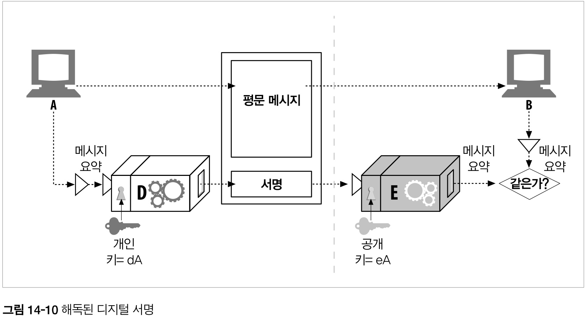
  
- 노드A는 가변 길이 메시지를 정제하여 고정된 길이의 **요약(digest)** 으로 만든다.
- 노드A는 그 요약에 사용자의 개인 키를 매개변수로 하는 `서명 함수 D`를 적용한다.
    - 올바른 서명 함수 = 서명자가 소유자임을 보여준다.
- 노드A는 이를 메시지 끝에 붙이고 노드 B에게 전송한다.
- 메시지를 받은 노드B는 원한다면 서명을 검사할 수 있다.
    - 서명에 공개키를 이용한 `역함수 E`를 적용하여 노드B가 가지고 있는 요약과 비교한다.
    - 일치하지 않는다면 위조되었거나, 저자는 노드A가 아닌것이다.
    
### 14.6 디지털 인증서

- 디지털 인증서는 신뢰할 수 있는 기관(certs)으로부터 보증받은 사용자나 회사에 대한 정보를 담고있다.

#### 14.6.1 인증서 내부
- 디지털 인증서 또한 `인증 기관`에 의해 디지털 서명된 정보 집합이다.

    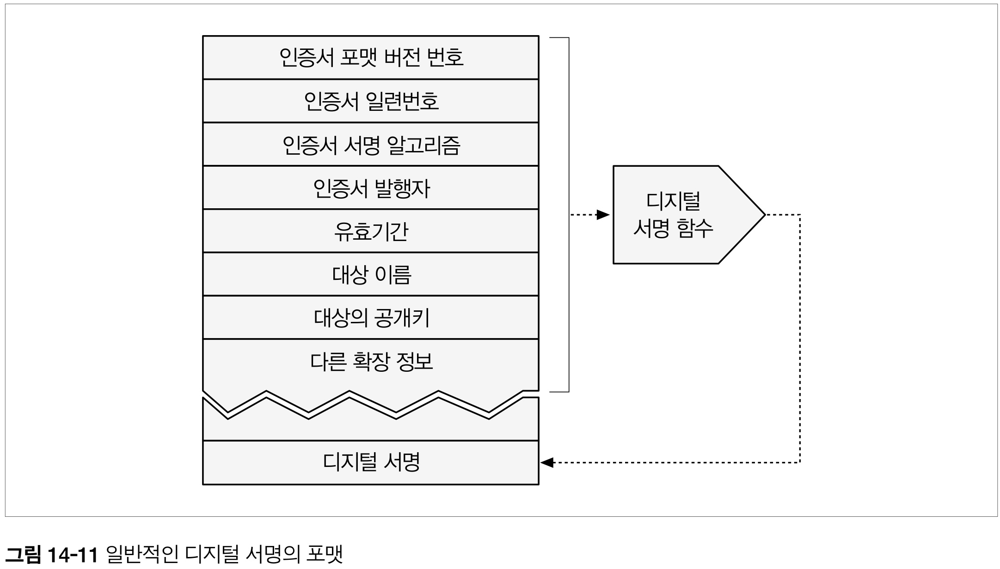

- 대상 정보 + 서명 알고리즘 + **대상의 공개키** 등 
- 누구나 디지털 인증서를 만들 수 있지만, 모두가 인증서를 보증하고 개인 키로 서명할 수 는 없다.

#### 14.6.2 X.509 v3 인증서
- 오늘날 사용되는 대부분의 인증서가 **X.509**라는 표준화된 서식에 저장하고있다.
- **X.509 v3인증서**는 인증 정보를 파싱 가능한 필드에 넣어 구조화하는 표준화된 방법을 제공한다.
  - 다른 종류의 인증서는 다른 필드 값을 가지지만, 대부분은 X.509 v3구조를 따른다.
- X.509 기반 인증서 : **웹 서버 인증서**, 클라이언트 이메일 인증서, 소프트웨어 코드사인(code-signing)인증서, 인증기관 인증서 등
- X.509 인증 필드

  |필드|설명|
    |------|---|
  |버전|X.509 인증서 버전의 번호(보통 버전3)|
  |일련번호|인증기관에 의해 생성된 고유한 정수. CA로부터 각 인증서는 반드시 고유한 일련번호를 가져야함.|
  |서명 알고리즘 ID|서명을 위해 사용된 암호 알고리즘. ex) `RSA 암호화를 이용한 MD2 요약`|
  |인증서 발급자|인증서를 발급하고 서명한 기관의 이름 ➡️ X.500포맷으로 기록|
  |유효 기간|인증서가 유효한 기간(시작일과 종료일)|
  |대상의 이름|인증서에 기술된, 사람이나 조직과 같은 엔터티 ➡️ X.500포맷으로 기록|
  |대상의 공개 키 정보|인증 대상의 공개 키, 공개 키에 사용된 알고리즘, 추가 매개변수|
  |발급자의 고유 ID(선택적)|발급자의 이름이 겹치는 경우를 대비한, 인증서 발급자에 대한 선택적인 고유한 식별자.|
  |대상 고유 ID(선택적)|대상의 이름이 겹치는 경우를 대비한, 인증서 대상에 대한 선택적인 고유한 식별자.|
  |확장|선택적인 확장 필드의 집합(버전3 이상에서 지원)️. 중요 확장필드라면 인증서 사용자에 의해 반드시 이해되어야하며 그렇지 못하다면 인증서를 거절해야한다. <br> 흔히 쓰이는 확장자는 아래와 같다. <br> - 기본제약(대상과 인증기관과의 관계) <br> - 인증서 정책(인증서 정책) <br> - 키사용(공개키가 어떻게 사용도리 수 있는지에 대한 제한)|
  |인증기관 서명|위의 모든 필드에 대한 인증기관의 디지털 서명. ➡️ 명시된 서명 알고리즘을 사용|

#### 14.6.3 서버 인증을 위해 인증서 사용하기
- 클라이언트가 HTTPS를 통한 안전한 웹 트랜잭션을 시작할 때, 브라우저는 자동으로 접속한 서버에서 디지털 인증서를 가져온다.
- 만약 서버가 디지털 인증서를 갖고 있지 않다면, 보안 커넥션은 실패한다.
- 서버 인증서는 아래 필드를 포함한 많은 필드를 갖는다.
  - 웹사이트의 이름과 호스트명
  - 웹 사이트의 공개키
  - 서명기관의 이름
  - 서명기관의 서명
- 브라우저는 인증서를 받으면, 서명기관을 검사한다.
- 신뢰할만한 기관이면, 브라우저는 공개키를 이미 알고 있을 것이며 그 서명을 검증한다.
- 모르는 기관이면, 브라우저는 신뢰해야 할지 확신할 수 없으므로, 대게 사용자에게 서명 기관을 신뢰하는지 확인한다.
- 대게 서명기관은 사용자가 다니는 회사의 IT부서 혹은 소프트웨어 개발사일 수 있다.

  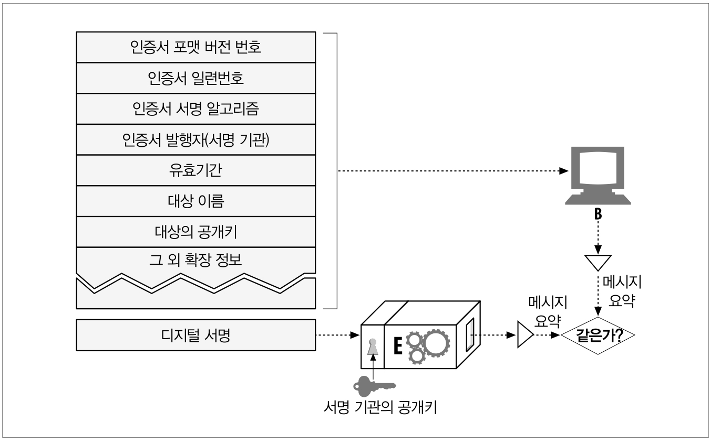

### 14.7 HTTPS의 세부사항
- HTTPS는 주류 상용브라우저와 서버에 구현되어있다.
- HTTPS는 HTTP 프로토콜에 대칭, 비대칭 인증서 기반 암호 기법의 강력한 집합을 결합한 것이다.
- 이 기법들의 집합은 HTTPS를 매우 안전하고 유연하고 관리하기 쉽게 만들어준다.

#### 14.7.1 HTTPS 개요
- HTTPS는 보안 전송 계층을 통해 전송되는 HTTP이다.
- HTTPS는 HTTP 메시지를 TCP를 통해 전송하기 전, 먼저 암호화하는 보안 계층으로 보낸다. 
  
  |프로토콜|계층|
  |------|---|
  |HTTP|응용 계층|
  |SSL 혹은 TLS|보안 계층|
  |TCP|전송 계층|
  |IP|네트워크 계층|
  |네트워크 인터페이스|데이터 링크 계층|

- 오늘날, HTTPS의 보안계층은 SSL과 TLS로 구현되어있다.

#### 14.7.2 HTTPS 스킴
- 보안이 되는 HTTPS 프로토콜에서 URL의 스킴 접두사는 `https`이다.
  - `https://www.naver.com/`
- 클라이언트(웹 브라우저 등)는 웹 리소스에 대한 트랜잭션 수행을 요청받으면 URL의 스킴을 검사한다.
- 만약 http 스킴을 갖고 있다면, 클라이언트는 서버에 80번(기본값)포트로 연결하고 평범한 HTTP 명령을 전송한다.
- 만약 https 스킴을 갖고 있다면, 클라이언트는 443번(기본값)포트로 연결하고 서버와 바이너리로 포맷된 몇몇 SSL 보안 매개변수를 교환하면서, 핸드셰이크를 하고 암호화된 HTTP 명령이 뒤를 잇는다.
  - SSL 트래픽은 바이너리 프로토콜이기 때문에, HTTP와 완전히 다르며 다른 포트(SSL은 보통 443포트)로 전달된다.
  - 만약 SSL, HTTP 트래픽 모두 80번 포트로 도착한다면, 대부분의 웹브라우저는 바이너리 SSL트래픽을 잘못된 HTTP로 해석하고 커넥션을 닫을 것이다.

#### 14.7.3 보안 전송 셋업
- HTTPS에서, 클라이언트는 먼저 웹 서버의 443포트로 연결한다.
- TCP 연결이 되고 나면, 클라이언트와 서버는 암호법 매개변수와 교환키를 협상하면서 SSL계층을 초기화한다.
- 핸드셰이크가 완료되면, SSL 초기화는 완료되며 클라이언트는 요청 메시지를 보안 계층에 보낼 수 있다.
- 이 메시지는 TCP로 보내지기 전 암호화된다.

  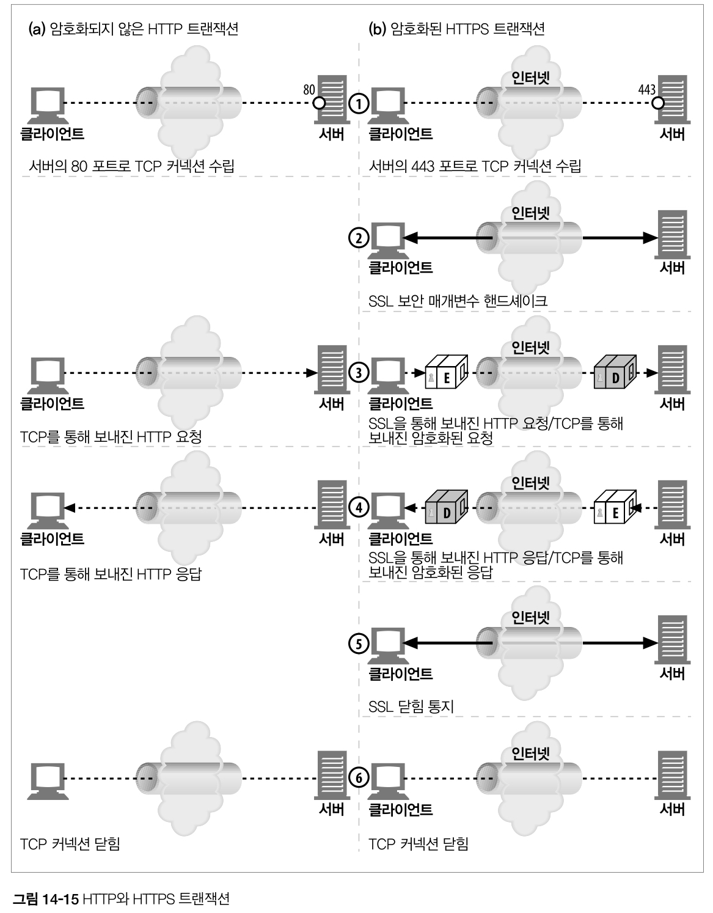

#### 14.7.4 SSL 핸드셰이크
- 암호화된 HTTP 메시지를 보낼 수 있게 되기 전, 클라이언트와 서버는 SSL 핸드셰이크를 해야 한다.
  - 프로토콜 버전 번호 교환
  - 양쪽이 알고 잇는 암호 선택
  - 양쪽의 신원을 인증
  - 채널을 암호화하기 위한 임시 세션 키 생성
  
- 아래 그림은 단순화 한 버전이다. SSL이 어떻게 사용되는 가에 따라 복잡해질 수 있다.

  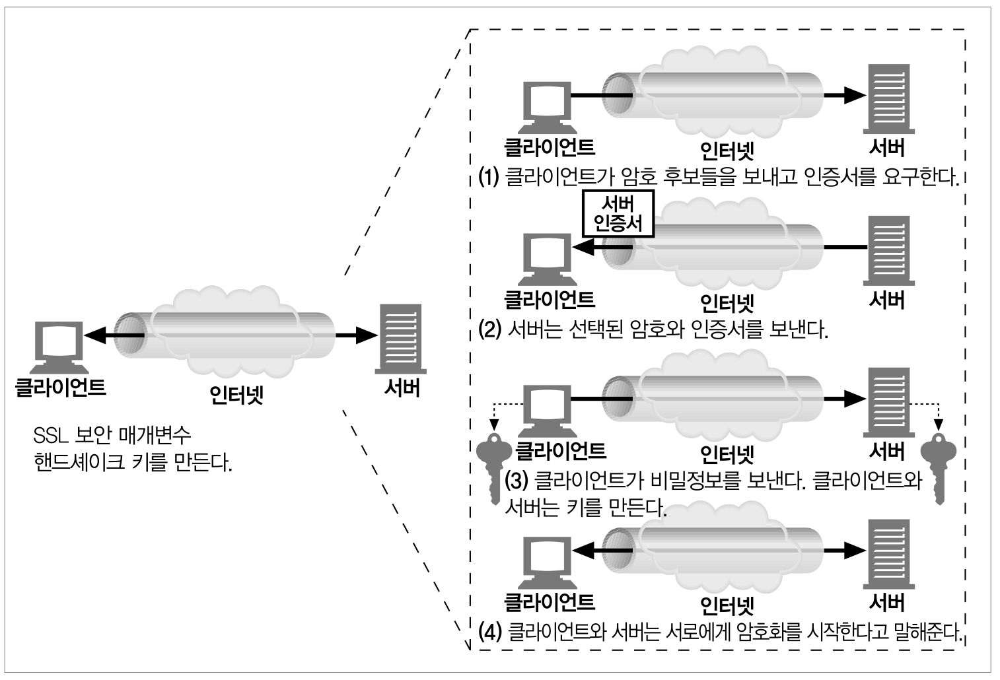

#### 14.7.5 서버 인증서
- SSL은 서버 인증서를 클라이언트로, 다시 클라이언트 인증서를 서버로 전달해주는 상호 인증을 지원한다.
  - 하지만 오늘날, 클라이언트 인증서는 사용되지 않는다.
- 보안 HTTPS 트랜잭션은 항상 서버 인증서를 요구한다.
  - 잘 알려진 인증기관에 의해 서명된 서버 인증서는, 신용카드나 개인 정보를 보내기 전 신뢰할 수 있는 서버인지 판단하는 것을 도와준다.
- 서버 인증서는 조직의 이름, 주소, 서버 DNS 도메인 이름, 그 외 정보를 보여주는 X.509 v3에서 파생된 인증서다.
- 사용자와 클라이언트SW는 신뢰할만한 것인지 확인하기 위해 인증서를 검증할 수 있다.

  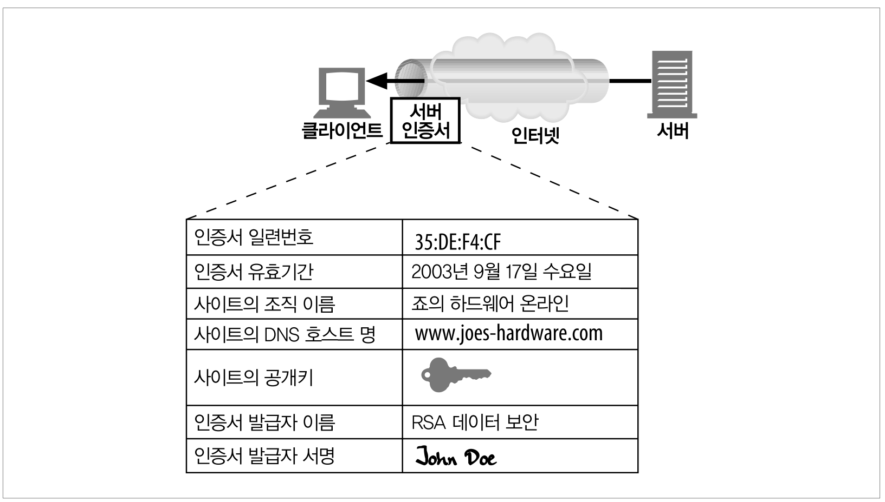

#### 14.7.6 사이트 인증서 검사
- SSL이 사용자에게 웹 서버 인증서를 검증할 것을 요구하지 않지만, 최신 웹브라우저들 대부분 기본적인 검사를 하고 그 결과와 더불어 더 철저한 검사 방법을 사용자에게 알려준다.
- 대부분의 웹브라우저의 검사 기법의 기초인 넷스케이프가 제안한 **웹 서버 인증서 검사 알고리즘** 수행단계는 다음과 같다.
- 날짜 검사
  - 인증서의 **시작 및 종료일**을 검사한다.
  - 인증서가 만료되었거나 아직 활성화되지 않았다면, 인증서 검사는 실패하고 브라우저는 에러를 보여준다.
- 서명자 신뢰도 검사
  - 모든 인증서는 CA(Certificate Authority)에 의해 서명되어 있다.
    - 여러가지 수준의 인증서가 있으며, 각각 다른 수준의 배경 검증을 요구한다.
    - ex) 전자상거래 서버 인증서 발급 요구 ➡️ 사업체로서 법인에 대한 법적 증명을 제시
  - 누구나 인증서를 생성할 수 있지만, 몇몇 CA는 인증서 지원자의 선량함을 입증하는 알기 쉬운 절차를 갖춘, 잘 알려진 기관이다.
  - 따라서 브라우저는 **신뢰할 만한 서명 기관의 목록**을 포함한 채로 배포된다.
  - 만약 알려지지 않은 인증기관으로부터 인증서를 받았다면, 브라우저는 경고를 보여준다.
- 서명검사
  - 서명기관이 믿을 만하다고 판단하면, 브라우저는 서명기관의 공개키를 서명에 적용하여 그의 체크섬과 비교해봄으로써 인증서의 무결성을 검사한다.
- 사이트 신원 검사
  - 다른 서버가 인증서를 복사하거나 트래픽을 가로채는 것을 방지하기 위해, 브라우저는 **인증서 도메인 이름이 대화중인 서버의 도메인 이름과 맞는지** 검사한다.
    - 보통 단일 도메인 이름이 들어있지만, 몇몇 CA는 서버 클러스터나 팜을 위해 서버 이름 목록이나 와일드카드 표현이 들어있는 인증서를 만든다.
  - 만약 호스트 명이 인증서의 신원과 맞지 않는다면, 클라이언트는 반드시 사용자에게 알리거나 잘못된 인증서 에러와 함께 커넥션을 끊어어야한다.

### 14.8 진짜 HTTPS 클라이언트
- 실습 생략

### 14.9 프락시를 통한 보안 트래픽 터널링
- 클라이언트는 종종 대신 웹 서버에 접근해주는 **웹 프락시 서버**를 이용한다.
  - ex) 기업 네트워크와 공공 인터넷을 잇는 경계에 보안을 위한 프락시를 설치한다.
  - 이 프락시는 방화벽 라우터가 HTTP 트래픽의 교환을 허락한 유일한 장치이며, 바이러스 검사나 콘텐츠 제어를 수행한다.
- 그러나 클라이언트가 서버로 보낼 데이터를 **서버의 공개키로 암호화**하기 시작하면, **프락시는 더 이상 HTTP헤더를 읽을 수 없다.**
  - 프락시는 요청을 어디로 보내야하는지 알 수 없게 된다.
  - 따라서 클라이언트는 프락시에게 어디에 접속하려고 하는지 말해주는 방법을 수정해야한다.
- 인기 있는 방법은 **HTTPS SSL 터널링 프로토콜**이다.
  - 이 프로토콜을 사용해서, 클라이언트는 암호화 시작전 평문으로 자신이 접속하려는 호스트와 포트를 프락시에게 말해준다.
  - CONNECT 메서드 : 프락시에게 희망하는 호스트와 포트로 연결해 달라고 말해주며, 프락시로 부터 허가가 완료되면 클라이언트와 서버 사이에서 데이터가 직접 오갈 수 있게 해주는 터널을 만든다. 
  ```
  CONNECT www.naver.com:443 HTTP/1.1  #호스트:포트 HTTP버전문자열과 CRLF(개행)
  User-agent: Mozilla/1.1N            # 0개 이상의 HTTP 요청 해더줄
                                      # 빈줄
  <SSL로 암호화된 데이터가 이 다음 온다>      
  ```

  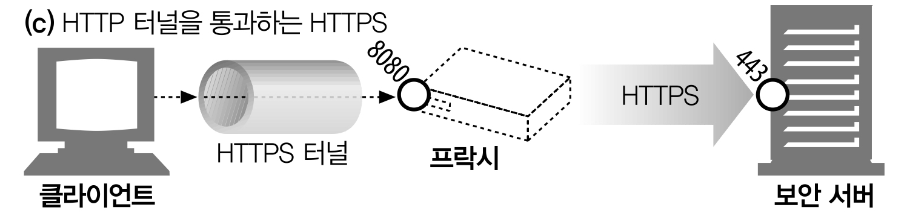


