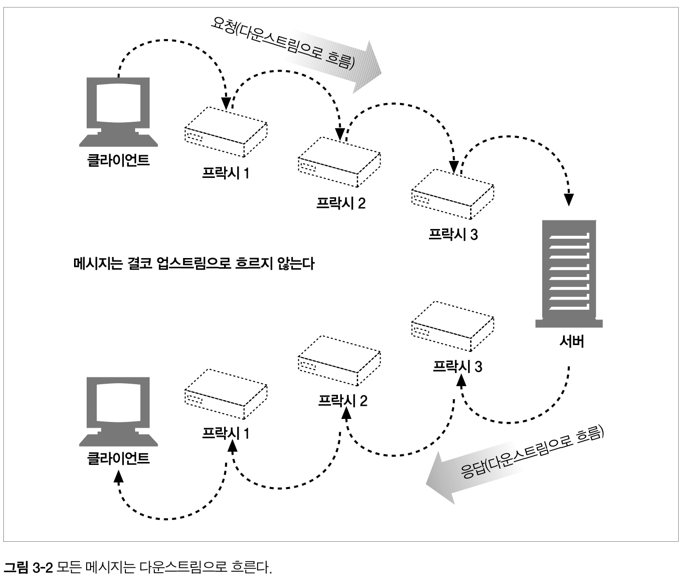
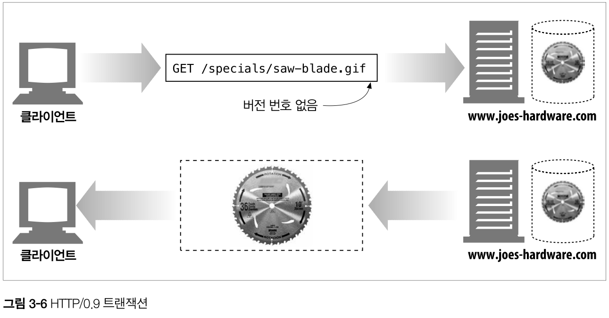
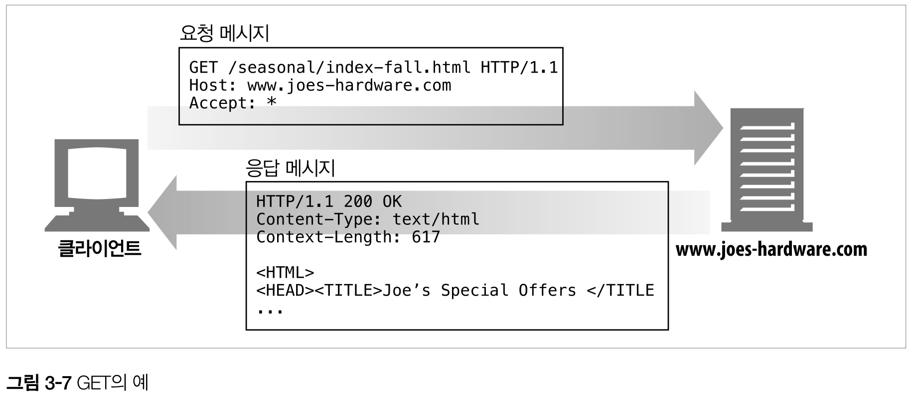
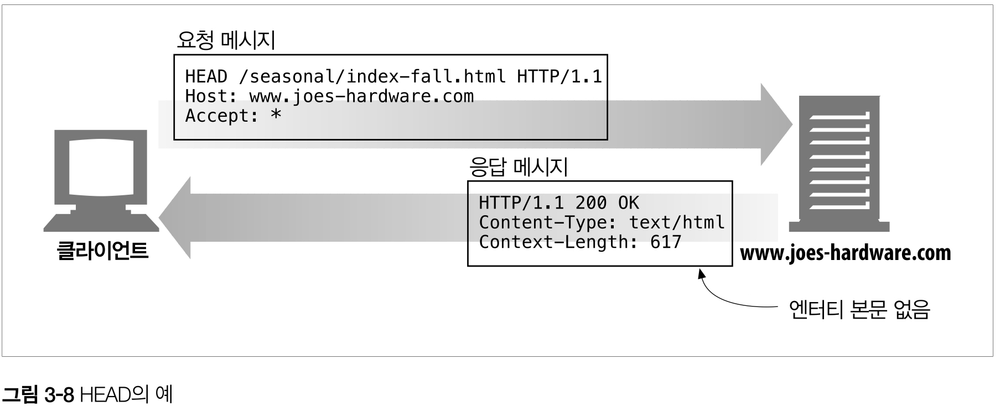
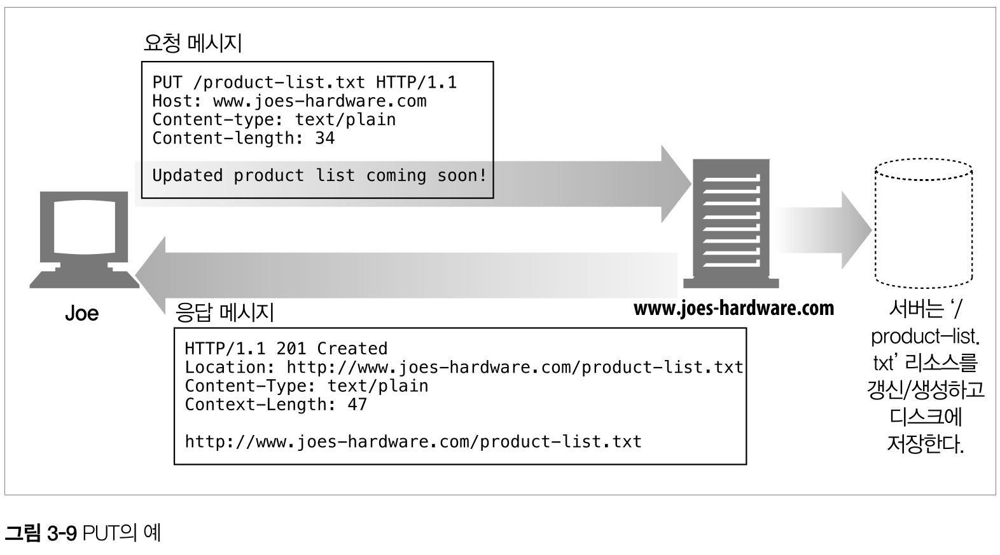
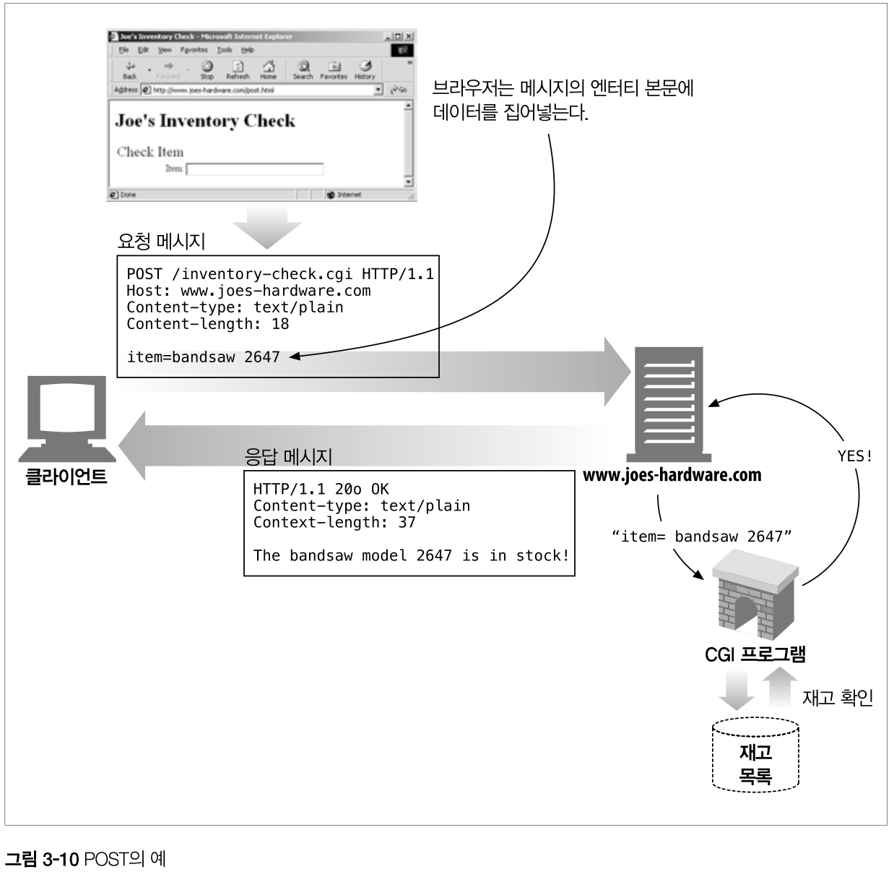
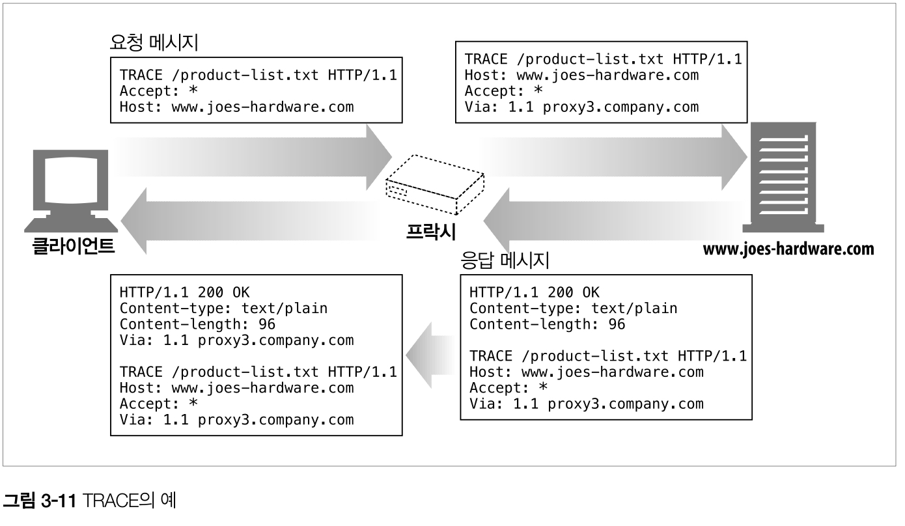
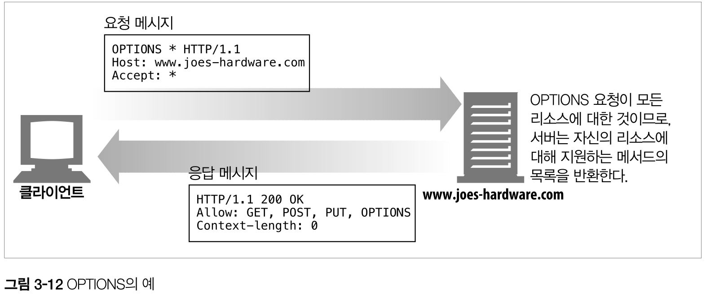
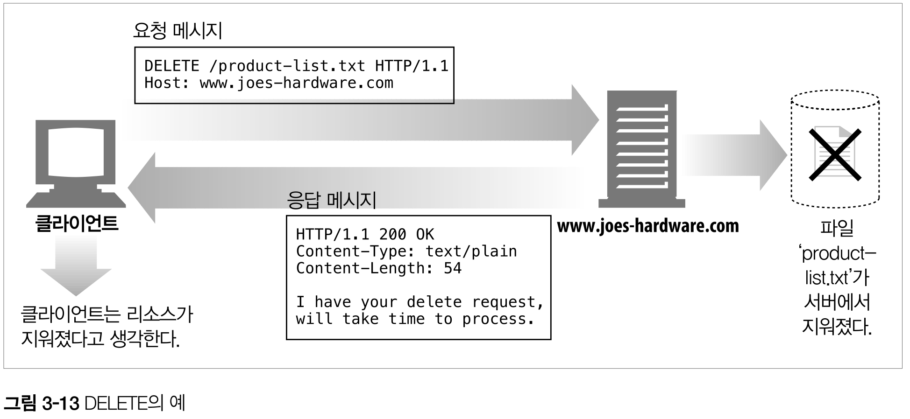

## 3. HTTP 메시지
### 3.1 메시지의 흐름
- HTTP 메시지 : HTTP 애플리케이션 간 주고받는 데이터 블록

#### 3.1.1 메시지는 원 서버 방향을 인바운드로 하여 송신된다
- HTTP는 인바운드와 아웃바운드라는 용어로 트랜잭션 방향을 표현한다.
- 인바운드 : 메시지가 원 서버로 향하는 것
- 아웃바운드 : 모든 처리가 끝난 뒤 메시지가 사용자 에이전트로 돌아오는 것

#### 3.1.2 다운스트림으로 흐르는 메시지
- 메시지는 다운스트림으로 흐른다.
- 메시지의 발송자는 수신자의 업스트림이다.

    

    > 요청에서는 프락시 1이 프락시 3의 업스트림이지만, 응답에서는 프락시 3의 다운스트림이다.

### 3.2 메시지의 각 부분
메시지
- 시작줄 : 어떤 메시지인지 서술 (ASCII 문자열) ex)`HTTP/1.0 200 OK`
- 헤더 블록 : 속성 (ASCII 문자열)
    - Content-Type : 본문이 무엇인지 알려줌 ex)`text/plain`
    - Content-Length : 본문의 크기 ex)`19` 
- 본문 : 데이터 (텍스트 or 이진데이터 or 없을 수 있음)

#### 3.2.1 메시지 문법
요청 메시지 형식
```
<메서드> <요청 URL> <버전>
<헤더>

<엔터티 본문>
```

응답 메시지 형식
```
<버전> <상태 코드> <사유 구절>
<헤더>

<엔터티 본문>
```

- 메서드 : 클라이언트 측에서 서버가 리소스에 대해 수행해주길 바라는 동작
    - GET, HEAD, POST 등
- 요청 URL
    - 요청 대상이 되는 리소스를 지칭하는 완전한 URL 혹은 URL의 경로 구성요소
- 버전
    - 이 메시지에서 사용중인 HTTP의 버전
    - `HTTP/<메이저>.<마이너>`
- 상태코드
    - 요청 중 무엇이 일어났는지 설명하는 세 자리 숫자
    - 첫 번째 자리수는 상태의 일반적인 분류(성공, 에러 등)을 나타냄
- 사유 구절(reason-phrase)
    - 숫자로된 상태 코드의 의미를 사람이 이해할 수 있게 설명해주는 짧은 문구
    - 사유 구절은 오로지 사람에게 읽히기 위한 목적으로 존재한다.
    - `HTTP/1.0 200 NOT OK`, `HTTP/1.0 200 OK` 사유구절이 서로 다르지만 동등하게 성공을 의미하는 것으로 처리되어야 한다.
- 헤더들
    - 이름, 콜론(:), 선택적 공백, 값, CRLF 가 순서대로 나타나는 0개 이상의 헤더들.
    - 헤더는 **빈 줄(CRLF)** 로 끝나 헤더의 끝과 본문의 시작을 표시한다.
- 엔터티 본문
    - 임의의 데이터 블록
    - 모든 메시지가 본문을 갖는 것은 아니므로, 때때로 메시지는 CRLF로 끝난다.
    
#### 3.2.2 시작줄
모든 HTTP 메시지는 시작줄로 시작한다.

- 요청줄
    - 서버에게 리소스 에 대해 무언가 해달라고 부탁한다.
    - 요청줄은 메서드, 요청 URL 그리고 HTTP 버전을 포함한다.
    - 모든 필드는 공백으로 구분되며, HTTP/1.0 이전에는 요청줄에 HTTP 버전이 들어있을 필요가 없었다.

- 응답줄
    - 수행 결과에 대한 상태 정보와 결과 데이터를 클라이언트에게 돌려준다.
    - 응답줄은 HTTP 버전, 상태코드, 사유구절을 포함한다.
    - 모든 필드는 공백으로 구분되며, HTTP/1.0 이전에는 요청줄에 HTTP 버전이 들어있을 필요가 없었다.

- 메서드
  - 서버에게 무엇을 해야할지 말해준다. 
  
  |메서드|설명|메시지 본문이 있는가?|
  |----|---|----------------|
  |GET|서버에서 어떤 문서를 가져온다|없음|
  |HEAD|서버에서 어떤 문서에 대해 헤더만 가져온다.|없음|
  |POST|서버가 처리해야 할 데이터를 보낸다.|있음|
  |PUT|서버에 요청 메시지의 본문을 저장한다.|있음|
  |TRACE|메시지가 프락시를 거쳐 서버에 도달하는 과정을 추적한다.|없음|
  |OPTION|서버가 어떤 메서드를 수행할 수 있는지 확인한다.|없음|
  |DELETE|서버에서 문서를 제거한다.|없음|

> 더 나아가, HTTP는 쉽게 확장할 수 있도록 설계되었기 때문에, 다른 서버는 그들만의 메서드를 추가로 구현할 수 있다.
> 추가 메서드 = **확장 메서드**

- 상태 코드
    - 클라이언트에게 무엇이 일어났는 지 말해준다.
    
    |전체 범위|정의된 범위|분류|
    |-------|-------|---|
    |100-199|100-101|정보|
    |200-299|200-206|성공|
    |300-399|300-305|리다이렉션|
    |400-499|400-415|클라이언트 에러|
    |500-599|500-505|서버 에러|

    > 만약 모르는 상태코드를 받게 되면, 누군가 프로토콜의 확장으로 정의했을 가능성이 있다.   
    > 그럴 경우 해당되는 전체 범위의 **분류**로 다루자. ex) 515 ➡️ 서버 에러

    - 가장 흔하게 만날 수 있는 상태 코드

    |상태 코드|사유 구절|의미|
    |-------|-----|---|
    |200|OK|성공! 요청한 모든 데이터는 응답 본문에 들어있다.|
    |401|Unauthorized|사용자 이름과 비밀번호를 입력해야 한다.|
    |404|Not Found|서버는 요청한 URL에 해당하는 리소스를 찾지 못했다.|
    
- 사유 구절
    - 사유 구절은 상태 코드와 일대일로 대응된다.
    - 개발자들이 그들의 사용자에게 요청 중 무슨 일이 일어났는지 알려주기 위해 넘겨주는 상태코드의 사람이 이해하기 쉬운 버전이다.
    - HTTP 명세는 사유 구절에 대한 규칙을 제공하지 않는다.
    
- 버전 번호
    - 버전 번호는 대화 상대의 능력과 메시지의 형식에 대한 단서를 제공해 주기 위한 것이다.
    - 버전 번호는 어떤 애플리케이션이 지원하는 가장 높은 HTTP버전을 가리킨다.
        - 만약 HTTP/1.1로 된 응답을 받았을 때, 이는 HTTP/1.1 메시지가 아니라 응답한 애플리케이션이 HTTP/1.1까지 이해할 수 있음을 의미한다.
    - 버전 번호는 분수로 다루어지지 않는다.
        - 2.22은 2.3보다 크다.
        - 22는 3보다 큰 숫자이기 때문.
    
#### 3.2.3 헤더
요청과 응답 메시지에 추가 정보를 더하며, 기본적으로 이름:값 쌍의 목록이다.

- 헤더 분류
    - 일반 헤더 : 요청과 응답 양쪽에 모두 나타낼 수 잇음
    - 요청 헤더 : 요청에 대한 부가 정보를 제공
    - 응답 헤더 : 응답에 대한 부가 정보를 제공
    - Entity 헤더 : 본문 크기와 콘텐츠, 혹은 리소스 그 자체를 서술
    - 확장 헤더 : 명세에 정의되지 않은 새로운 헤더

- 헤더는 간단한 문법을 가진다.
    - 이름, 쉼표, 공백, 필드 값, CRLF 순서로 온다.
    - 흔히 쓰이는 헤더의 예
    
    |헤더의 예|설명|
    |-------|---|
    |Date: Tue, 3 Oct 1997 02:16:03 GMT|서버가 응답을 만들어 낸 시각|
    |Content-length : 15040|15,040바이트의 데이터를 포함한 엔터티 본문|
    |Content-type : image/gif|엔터티 본문은 GIF이미지다.
    |Accept: image/gif, image/jpeg, text/html|클라이언트는 GIF, JPEG 이미지와 HTML을 받아들일 수 있다.|

- 헤더를 여러 줄로 나누기
    - 긴 헤더 줄을 여러 줄로 쪼갤 수 있다.
    - 추가 줄 앞에 최소 하나의 스페이스 혹은 탭 문자가 오면된다.
    ```
    Server: Test Server
        Version 1.0
    ```

#### 3.2.4 엔터티 본문
- HTTP 메시지의 화물
- 이미지, 비디오, HTML 문서, 소프트웨어 애플리케이션, 신용카드 트랜잭션, 전자우편 등 여러종류의 디지털 데이터를 실어 나를 수 있다.

#### 3.2.5 버전 0.9 메시지
- HTTP 프로토콜의 초기 버전으로 단순한 프로토콜로 되어 있다.

    

- 요청과 응답으로 이루어져 있지만
    - 요청은 그저 메서드와 요청 URL만 갖고 있고 응답은 오직 엔터티로만 이루어져 있다.
- 상태코드, 사유구절, 헤더도 없다.
- 지나치게 단순하여, HTTP/0.9로는 다양한 상황에 대응할 수 없다.

### 3.3 메서드
- 모든 서버가 모든 메서드를 구현하지 않는다.
    - HTTP/1.1과 호환되고자 한다면, 서버는 GET과 HEAD메서드만 구현하는 것으로 충분하다.
- 모든 메서드를 구현하지 않았더라도, 메서드는 대부분 제한적으로 사용될 것이다.
    - DELETE,  PUT을 지원하는 서버는 아무나 저장된 리소스를 삭제하길 원치 않을 것이다.
    - 이 제한은 서버 설정에 의해 정해지며, 서버마다 다르다.

#### 3.3.1 안전한 메서드(Safe Method)
- GET, HEAD메서드는 안전하다고 할 수 있다.
    - 위 메서드를 사용하는 HTTP요청의 결과로 인해 서버에서 일어나는 일은 아무것도 없다는 의미다.
    - 물론 보장은 없다(이는 개발자에게 달렸다.)
- 안전한 메서드의 목적은, 서버에 어떤 영향을 줄 수 있는 **안전하지 않은 메서드가 사용될 때 사용자들에게 그 사실을 알려주는 HTTP애플리케이션**을 만들 수 있도록 하는 것에 있다.

#### 3.3.2 GET
- 서버에게 리소스를 달라고 요청하기 위해 쓰인다.
- HTTP/1.1은 서버가 이 메서드를 구현할 것을 요구한다.

    

#### 3.3.3 HEAD
- GET처럼 행동하지만, 서버는 응답을 헤더만을 돌려준다.
- 클라이언트가 리소스를 실제로 가져올 필요 없이 헤더만을 조사할 수 있도록 해준다.
    - 리소스를 가져오지 않고도 그에 대해 무엇인가(타입이라거나)를 알아낼 수 있다.
    - 응답의 상태 코드를 통해, 개체가 존재하는지 확인할 수 있다.
    - 헤더를 확인하여 리소스가 변경되었는지 검사할 수 있다.
- 개발자들은 반환되는 헤더가 **GET으로 얻는 것과 정확히 일치함**을 보장해야한다.
- HTTP/1.1은 서버가 이 메서드를 구현할 것을 요구한다.

    
  
#### 3.3.4 PUT
- GET이 서버로부터 문서를 읽어들인다면, PUT은 서버에 문서를 쓴다.
- 서버가 요청의 본문을 가지고 요청 URL의 이름대로 새문서를 만들거나, 이미 URL이 존재한다면 본문을 사용해서 교체하는 것이다.
- PUT은 콘텐츠를 변경할 수 있게 해주기 때문에, 많은 웹서버가 PUT을 수행하기전 로그인을 하도록 요구한다.

    

#### 3.3.5 POST
- 서버에 입력 데이터를 전송하기 위해 설계되었다.
- 실제 HTML 폼을 지원하기 위해 흔히 사용된다.
- 채워진 폼에 담긴 데이터를 서버에 전송하여 서버는 이를 모아 필요한 곳에 보낸다.

    
  
#### 3.3.6 TRACE
- 클라이언트가 어떤 요청을 할 때, 그 요청은 방화벽, 프락시, 게이트웨이 등의 애플리케이션을 통과할 수 있다.
    - 그리고 이 애플리케이션은 HTTP 요청을 수정할 수 있는 기능이 있다.
- TRACE메서드는 클라이언트에게 자신의 요청이 서버에 도달했을 때 어떻게 보이게 되는지 알려주며 주로 **진단**을 위해 사용된다.
    - TRACE요청은 목적지 서버에서 `루프백(loopback)`진단을 시작한다.
    - 요청 전송의 마지막 단계에 있는 서버는 받은 요청 메시지를 본문에 넣어 TRACE응답으로 되돌려 준다.
    - 클라이언트는 자신과 목적지 서버 사이에 있는 모든 HTTP애플리케이션의 요청/응답 연쇄를 따라가면서, 자신이 보낸 메시지가 망가졌거나 수정되었는지 내용을 확인할 수 있다.
- TRACE 요청은 어떤 엔터티 본문도 보낼 수 없다. TRACE 응답의 엔터티 본문에는 서버가 받은 요청이 그대로 들어있다.

    

> 진단을 위해 사용할 때는 괜찮지만, 중간 애플리케이션이 여러 다른 메서드에 따라 다르게 동작한다면 문제가 있다.   
> TRACE는 메서드를 구별하는 매커니즘을 제공하지는 않으며, 어떻게 TRACE 요청을 처리할 것인지에 대해 일반적으로 중간 애플리케이션이 결정을 내린다.

#### 3.3.7 OPTIONS
- 웹 서버에게 여러 가지 종류의 지원 범위에 대해 물어본다.
- 서버에게 특정 리소스에 대해 어떤 메서드가 지원되는지 물어볼 수 있다.

    

#### 3.3.8 DELETE
- 서버에게 요청 URL로 지정한 리소스를 삭제할 것을 요청한다.
- 그러나 클라이언트는 삭제가 수행되는 것을 보장하지 못한다.
- 왜냐하면 HTTP 명세는 **서버가 클라이언트에게 알리지 않고 요청을 무시하는 것**을 허용하기 때문이다.

    
  
#### 3.3.9 확장 메서드
- HTTP는 필요에 따라 확장해도 문제가 없도록 설계되어 있다.
- 새로운 기능을 추가해도 과거에 구현된 소프트웨어들의 오작동을 유발하지 않는다.
- 확장 메서드는 HTTP/1.1명세에 정의되지 않은 메서드다.
- 확장된 대표적인 몇가지
  
    |메서드|설명|
    |-----|---|
    |LOCK|사용자가 리소스를 잠글 수 있게 해준다. 예를 들어, 문서를 편집하는 동안 다른 사람이 동시에 같은 문서를 편집하지 못하도록 문서를 잠글 수 있다.|
    |MKCOL|사용자가 문서를 생성할 수 있게 해준다.|
    |COPY|서버에 있는 리소스를 복사한다.|
    |MOVE|서버에 있는 리소스를 옮긴다.|

- 모든 확장된 메서드가 형식을 갖춘 명세로 정의된 것은 아니다.
    - 만약 개발자가 어떤 확장 메서드를 정의한다면, 대부분의 HTTP 애플리케이션은 이해할 수 없을 것이다.
- 이런 경우 프락시는, 종단 간(end-to-end)행위를 망가뜨리지 않을 수 있다면, 알려지지 않은 메서드가 담긴 메시지를 다운스트림 서버로 전달하려 시도한다.
    - 그렇지 않으면 프락시는 501 Not Implemented 상태 코드로 응답해야한다.
- 확장 메서드를 다룰 때는 `엄격하게 보내고 관대하게 받아들여라`라는 규칙을 따르는 것이 좋다.
