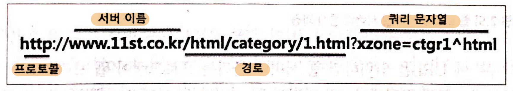
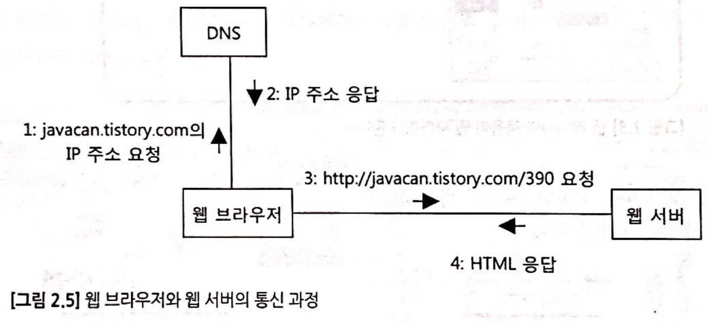
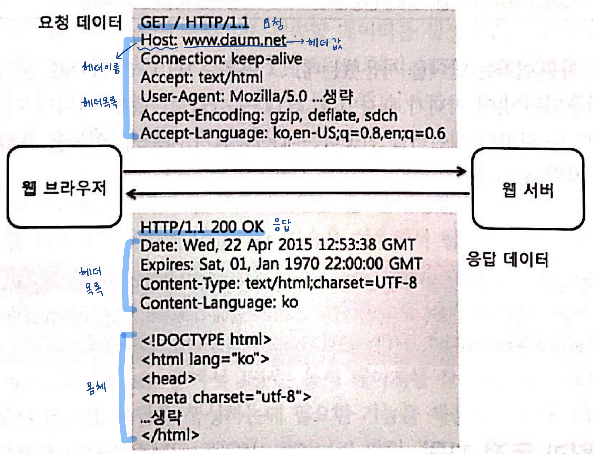
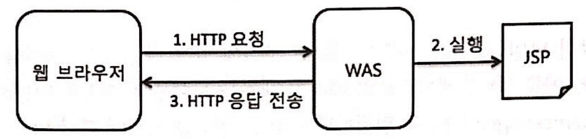

## 최범균의 JSP2.3 웹프로그래밍 기초부터 중급까지
### URL과 웹페이지
- URL(Uniform Resource Locator) : 웹브라우저 주소줄에 입력하는 일종의 주소
    - 
- 웹 페이지(web page) : 웹브라우저에 출력된 내용
### 웹 브라우저와 웹서버

- 웹브라우저에 URL을 입력하면 웹 서버가 웹 브라우저에게 웹페이지를 제공한다.
  - 요청(request) : 웹브라우저가 웹서버에 웹페이지를 달라고하는 것
  - 응답(response) : 요청한 웹페이지를 웹 브라우저에 제공하는 것
- 웹브라우저가 웹서버에 연결하려면, 웹서버의 컴퓨터 주소를 알아야하며 이를 IP주소라고 부른다.
- DNS(Domain Name Server) : 웹브라우저에 URL을 입력하면, DNS가 해당하는 IP 주소를 응답한다.

> 클라이언트(client) : 프로그램에서 요청하는 쪽 :arrow_right: 웹브라우저   
> 서버(server) : 요청을 받아 알맞은 기능이나 데이터를 제공하는 쪽 :arrow_right: 웹서버

- 또한 하나의 컴퓨터는 여러개의 웹 서버를 실행할 수 있기 때문에 **포트(port)** 번호로 연결한다.   
`http://localhost:8080/jsp_war_exploded/` (기본포트 80)
### HTML 과 HTTP
- 렌더링(rendering) : HTML 표준에 따라 알맞은 화면을 생성하는 과정
- HTTP(HyperText Transfer Protocol) : 웹브라우저와 웹 서버가 HTML을 비롯해 이미지, 동영상 등 다양한 데이터를 주고받을 때 사용하는 일종의 규칙 
- 
  
  - 요청 데이터 : 웹브라우저가 웹 서버로부터 무엇을 받고싶은지 기술
  - 응답 데이터 : 웹서버는 요청 데이터에 기술한 정보를 이용해 요청한 것을 응답 데이터에 담아 보냄
### 정적 자원과 동적 자원
- 정적 자원 : 이미지, HTML 파일 등 자주 바뀌지 않는 자원 (동일 URL :arrow_right: 동일 파일 응답)
- 동적 자원(동적 페이지) : 시간이나 특정 조건에 따라 응답데이터가 달라지는 자원

### 웹 프로그래밍과 JSP
- 웹 프로그래밍 : 웹 서버가 웹 브라우저에 응답을 전송할 데이터를 생성해주는 프로그램을 작성하는 것
  - 간단히 말해, 웹 서버가 실행하는 프로그램을 만드는 것
- JSP(JavaServer Pages) : 동적페이지를 작성하는데 사용되는 자바 표준 기술(주로 HTML 응답 생성 목적)
  - JSP를 이용해서 만든 프로그램을 실행하려면 `Tomcat` 등의 서버 프로그램(WAS)이 필요함
- WAS(Web Application Server) : 웹을 위한 연결, 프로그래밍 언어, DB연동과 같이 어플리케이션을 구현하는데 필요한 기능을 제공한다.
  - 웹브라우저로부터 요청이 오면 알맞은 프로그램을 찾아 실행하고 응답을 전송함.   
  

> 프로젝트 환경설정은 [IntelliJ IDEA로 JSP 프로젝트 생성](https://parkgang.github.io/series/from-jsp-project-setup-to-deployment/create-jsp-project-with-intellij-idea/) 을 참고했다.
