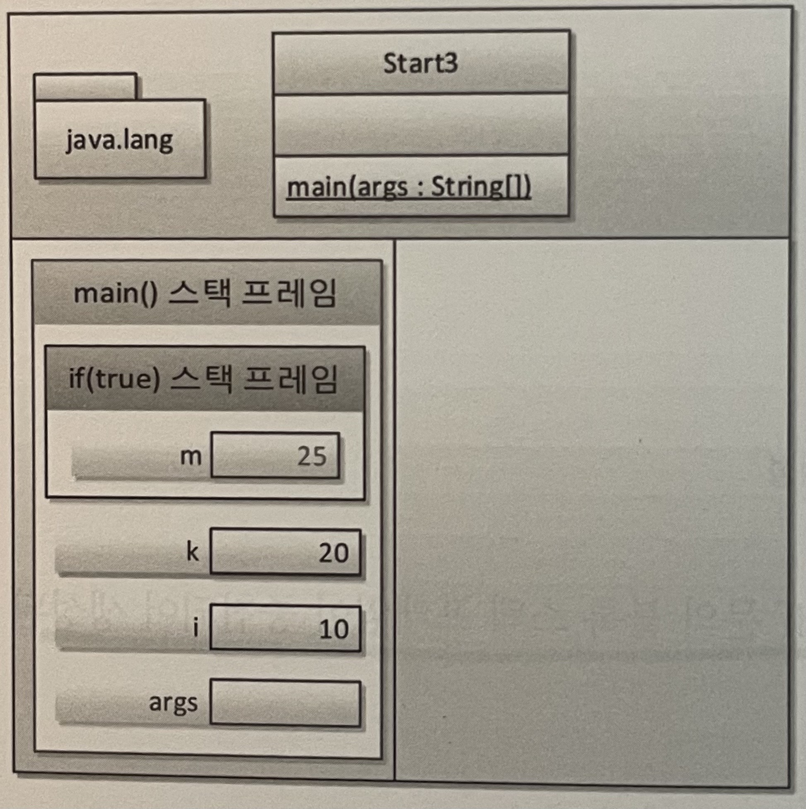
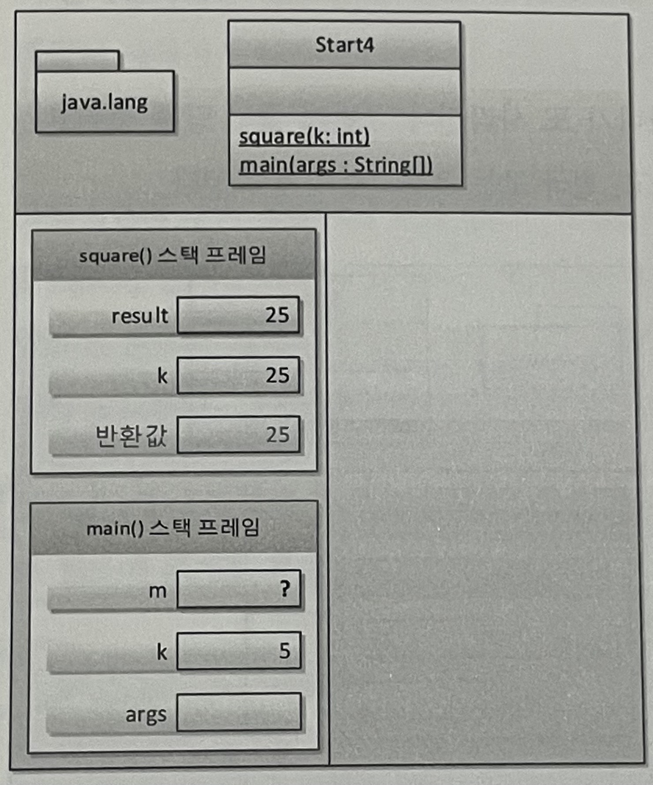

## 2. 자바와 절차적/구조적 프로그래밍

### 자바 프로그램의 개발과 구동
|현실세계         |가상 세계(자바 월드) ||
|---------|----------|----------|
|소프트웨어 개발 도구|JDK(Java Development Kit) - 자바 개발 도구|JVM용 소프트웨어 개발 도구|
|운영체제|JRE(Java Runtime Environment) - 자바 실행 환경|JVM용 OS|
|하드웨어 - 물리적 컴퓨터|JVM(Java Virtual Machine) - 자바 가상 기계|가상의 컴퓨터|
- JDK를 이용해 개발된 프로그램은 JRE에 의해 가상의 컴퓨터인 JVM상에서 구동된다.
  
    
  
    - JDK가 JRE를 포함하고 JRE는 JVM을 포함하는 형태로 배포된다.
    - 이로인해 개발자는 본인 OS에 맞는 JVM용으로 프로그램을 작성하고 배포하면 JVM이 중재자로서 각 OS에서 구동하는 데 아무 문제 없이 만들어준다.

- 객체 지향 프로그램의 메모리 사용방식

  
  
  - 데이터 저장 영역 = T메모리 구조

<hr/>

### 자바에 존재하는 절차적/구조적 프로그래밍의 유산
- 절차적 프로그래밍 : **goto**를 쓰지 말라는 것
  - goto : 프로그램의 실행 순서를 이리저리 이동 시키는 예약어 (제어의 역할)
  - 이동이 잦아지면 프로그램 이해가 힘들다. 프로그램을 논리적으로 잘 구성하면 goto를 피할 수 있다.
- 구조적 프로그래밍 : **함수**를 쓰라는 것
  - 중복코드를 한곳에 모아 관리할 수 있고 논리를 함수 단위로 분리해서 이해하기 쉬운 코드를 작성할 수 있다.
  > 공유 문제로 전역변수보다 지역변수를 쓰라는 지침도 있음.
- 객체 지향 언어에서 절차적/구조적 프로그래밍의 유산은 메서드 안에서 확인할 수 있다.
  - **제어문**이 존재할 수 있는 공간은 바로 **메서드 내부**이기 때문.
  - goto = 제어문 , 함수 = 메서드
  > 함수와 메서드 차이 : 함수는 클래스나 객체와 아무관계 없지만 메서드는 반드시 클래스 안에 존재해야 한다.
- 절차적/구조적 프로그래밍의 유산의 예를 보면 자바 키워드 중 절반 이상이다.
  - for, switch, if, else, while, return, continue, break 등
- 객체지향을 이해하기위해 절차적/구조적 프로그래밍을 이해해보자.

<hr/>

### 다시 보는 main()메서드 : 메서드 스택 프레임
```java
ackage section2.ex2_1;

public class Start{

  public static void main(String[] args) {
    System.out.println("Hello OOP!!");
  }
}
```
1. JRE는 프로그램 안에 `main()`메서드가 있는지 확인한다.
2. 확인 되면 JRE는 JVM에 전원을 넣어 부팅한다.
3. 부팅된 JVM은 목적 파일을 실행한다. (메모리 구조를 구성 및 구문 실행)   
   3-1. `main()`메서드 실행전 **전처리** 작업을 진행한다.
   
   - 가장 먼저 `java.lang` 패키지를 T메모리 스태틱 영역에 배치한다.
   - 개발자가 작성한 모든 클래스와 `import패키지` 역시 T메모리 스태틱 영역에 배치한다.
  
   3-2. `main()`메서드를 스택프레임(stack frame)에 할당한다.   
   
   - 여는 중괄호를 만날 때 스팩프레임이 하나씩 생기며 닫는 중괄호를 만나면 스택프레임이 소멸된다.
  
   3-3. 메서드 인자인 `args`를 스택프레임(stack frame)의 변수 공간에 할당한다.    
   3-4. 메모리 구조 구성 후 `main()`메서드의 첫 명령문을 실행한다.
   
   
   
   3-5. 구문 실행이 끝나면 `main()`메서드의 스택프레임이 소멸된다.
4. 실행이 끝나면 JRE는 JVM을 종료한다.
5. JRE도 사용했던 자원을 운영체제에 반납한다. (운영체제 상의 메모리에서 소멸)

- 실제 Debug 화면
  
    

<hr/>

### 변수와 메모리 : 변수! 너 어디 있니?

```java
package section2.ex2_2;

public class Start2 {

  public static void main(String[] args) {
    int i;
    i = 10;

    double d = 20.0;
  }
}
```
- `int i;`
    - 메모리에 4바이트 크기의 정수 저장 공간을 main()메서드 스택프레임안에 마련하라는 명령어다.
    - 아직 초기화 되지 않은 상태이므로, 다른 프로그램이 청소하지 않고 간 값을 그대로 가지고 있게 된다.
    - 이 상태로 i 변수를 사용하는 코드를 만나게 되면, 컴파일 에러가 발생한다.
        - `The local variable i may not have been initialized`
    
    
  
- `i = 10;` `double d = 20.0;`
    - `double d = 20.0;`의 경우 변수 선언 명령문과 할당 명령문이 한줄에 있는 것

    
    
<hr/>

### 블록 구문과 메모리 : 블록 스택 프레임

```java
package section2.ex2_3;

public class Start3 {

  public static void main(String[] args) {
    int i = 10;
    int k = 20;

    if (i == 10) {
      int m = k + 5;
      k = m;
    } else {
      int p = k + 10;
      k = p;
    }
  }

  //k = m + p;
}
```

- `if (i == 10)` 분기
    - 비교 결과가 true 이므로 if블록의 스택 프레임이 main() 메서드의 스택프레임 안에 **중첩**되어 생성된다.
- `int m = k + 5;`
    - 변수 m에 값을 할당한다. 
    - 이 때 if 스택 프레임 밖에 있는 k 변수를 연산에 참여시킨다.
      
    

- if 블록 종료 후 스택 프레임은 소멸된다.
    - else 블록은 스택 메모리에 등장하지도 못했음.

    

> 만약 주석을 해제한다면?   
> m변수와 p변수는 더 이상 존재하지 않는다. 주석을 풀고 실행하면 컴파일 오류가 발생한다.   
> `m cannot be resolved to a variable` , `p cannot be resolved to a variable`
    
<hr/>

### 지역 변수와 메모리 : 스택 프레임에 갇혔어요!
- 지역 변수 : 스택 프레임 안에서 일생을 보낸다. 스택 프레임이 사라지면 함께 사라진다.
- 클래스 멤버 : 스태틱 영역에서 일생을 보낸다. JVM이 종료될 때 까지 고정된(static) 상태로 자리를 지킨다.
- 객체 멤버 변수 : 힙에서 일생을 보낸다. 객체와 함께 가비지 컬렉터(메모리 회수기)에 의해 일생을 마친다.

> 외부 스택 프레임에서 내부 스택 프레임의 변수에 접근하는 것은 불가능 하나 그 역은 가능하다.   
> 그래서 스택 메모리 내의 스택 프레임 안의 변수를 **지역 변수**라고 한다.

<hr/>

### 메서드 호출과 메모리 : 메서드 스택 프레임2
```java
package section2.ex2_5;

public class Start4 {

  public static void main(String[] args) {
    int k = 5;
    int m;

    m = square(k);
  }

  private static int square(int k) {
    int result;

    k = 25;
    
    result = k;

    return result;
  }
}
```

- `square()` 호출
    
        

    - main()메서드의 변수 k와 square()메서드의 변수 k는 별도의 변수 공간이다.
    - 이를 **Call By Value(값에 의한 호출)**라하며, square()메서드의 k에 무슨 짓을 해도 main()메서드의 k에 영향이 없다.
      - 인자로 전달되는 것은 변수 자체가 아니라 변수가 저장한 값만 복제해서 전달한다.
    - square()가 끝나면 스텍프레임은 사라지지만, 반환값이 있으니 그값을 돌려주면서 소멸된다. 

#### 여기서 드는 몇가지 의문
- main()어딘가 square()내의 지역변수에 접근할 수 있을까? **없다.**
  - square()호출 전엔 스택 프레임 조차 존재하지 않는다.
  - square()호출이 끝난 후엔 바로 스텍 프레임이 소멸된다.
- square()어딘가 main()내의 지역변수에 접근할 수 있을까? **없다.**   
    **저자가 짐작하는 이유 3가지**
    1. 그것이 이치에 맞기 때문이다.
       - 메서드는 서로의 고유 공간이며, 서로 침범하면 문제를 유발할 수 있기 때문이다.
    2. 포인터 문제 때문이다. 
       - square()메서드에서 main()메서드 내부의 지역변수에 접근하려면 변수의 정확한 위치를 알아야한다.
       - 위치를 알기위해선 포인터(메모리 주소값)을 알아야한다. 하지만 Java엔 포인터가 없다.
    3. 메서드는 다양한 곳으로부터 호출된다.
        - 메서드를 호출하면서 만들어지는 스택 구조는 항시 변화한다.
        - A ➡️ B ➡️ C로 호출될 수 있고 F ➡️ B ➡️ C로 호출될 수도 있다.
        - 만약 한 C메서드가 하단 메서드 스택 프레임 중 한 변수를 참조한다면, 어느 스택 프레임의 변수를 참조해야하는가?
        - 결국 이 문제를 해결하려면 또 포인터가 필요하다.

#### 메서드 사이 값 전달 방법
1. 메서드의 인자와 반환값
2. 전역 변수(공유변수)

<hr/>

