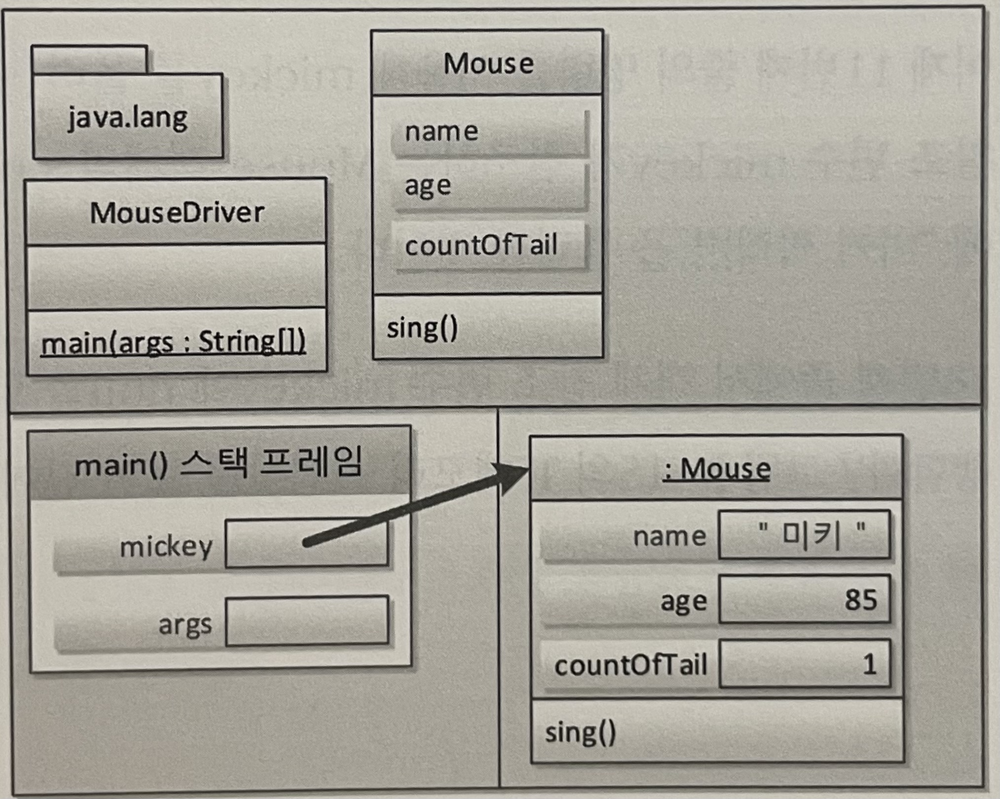
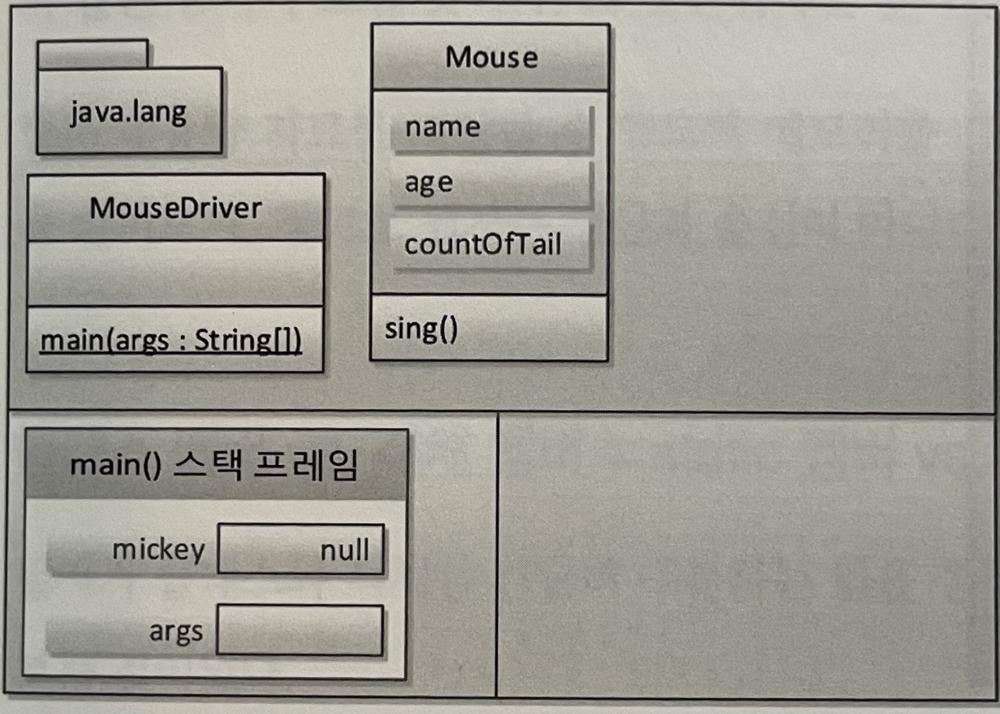
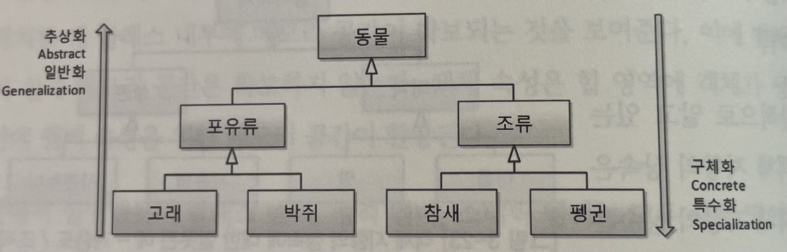

## 3. 자바와 객체 지향

### 객체 지향은 인간 지향이다

- 1장에서 본 발전사를 보면 개발자(인간)을 배려하기 위한 과정임을 알 수 있다.
- 하지만 2장에서 본 절차적/구조적 프로그래밍은 인간이 기계를 이해하려는 노력에서 크게 벗어나지 못했다.
    - 특히 포인터는 기계 수준으로 눈높이를 낮추지 않으면 이해하기 힘들다.
- 기계 종속적인 개발에서 벗어나, 우리가 눈으로 보고 느끼고 생활하는 **현실 세계처럼 프로그래밍을 하기 위해 탄생한 것이 객체지향**이다.
    - 현실 세계를 반영한다는 증거가 **객체**다.
    
#### 구조적 프로그래밍에서 가장 중요한것은 **함수**다.

- Devide and Conquer : 몇만 라인의 명령어를 논리적 단위(함수)로 나누어 블록화해서 작성하자는 것
- 함수의 목적 : 1. 중복제거, 2. **논리의 분할**

#### 그 뒤로 나온 파격적 제안이 바로 **객체 지향**이다.

- 눈으로 보여지는 것, 손으로 만져지는 것, 머리속으로 상상되는 모든 것은 사물(Object)이다.
- "우리가 주변에서 사물로 인지하는 방식대로 프로그래밍 할 수 있지 않겠는가?" ➡️ 객체 지향의 출발
- 0과 1로 대변되는 기계(컴퓨터)에 맞춰 사고하던 방식을 버리고 **현실세계를 인지하는 방식으로 프로그램을 만들자는 것**

- 사물이란?
    ```
    - 세상에 존재하는 모든 것은 사물, 즉 객체(Object)다
    - 각각의 사물은 고유하다.
    - 사물은 속성을 갖는다.
    - 사물은 행위한다.
    ```
- 사물을 분류(class)해서 이해하는 것 ➡️ 인간의 인지법
    ```
    - 직립보행을 하며 말을 하는 존재를 사람이라고 분류한다.
    - 강동원(object), 한효주(object), 김연아(object)는 모두 사람이라는 분류에 속한다.
    - 객체(object)들은 나이, 키 등의 속성(property)과 먹다, 자다 등의 행위(method)를 가지고있다.
    ```
    |        |사람(class명) |강동원(객체명)|
    |---------|----------|----------|
    |속성들|나이, 키|나이:=35, 키:=185|
    |행위들|먹다, 자다|먹다, 자다|

#### 직관적인 객체지향

- 객체지향 이전에는 속성과 메서드를 객체라는 단위로 묶지 않고 따로 분리된 형태로 프로그램을 작성했다.
- 객체지향에서는 우리가 사물을 인지 및 사고하는 방식대로 **객체 단위의 프로그래밍**이 가능하다.
- 완전한 인간 지향을 실천하고 있기 때문에 직관적이고 쉽다.

<hr/>

### 객체 지향의 4대 특성 - 캡! 상추다
- 캡 - 캡슐화(Encapsulation) : 정보 은닉 (information hiding)
- 상 - 상속(~~Inheritance~~) : 재사용
- 추 - 추상화(Abstraction) : 모델링
- 다 - 다형성(Polymorphism) : 사용 편의
> Inheritance라는 단어를 쓰지말자. 오해의 소지가 크다.

<hr/>

### 클래스 vs 객체 = 붕어빵틀 vs 붕어빵 ???

```java
클래스 객체명 = new 클래스();
```
```java
붕어빵틀 붕어빵 = new 붕어빵틀(); // 붕어빵틀을 만들었는데 붕어빵이 되었다?
```
- 붕어빵틀은 붕어빵을 만드는 팩터리일 뿐, 클래스와 객체관계가 아니다.

#### 클래스와 객체
- **클래스**는 **분류**에 대한 개념이지 실체가 아니다.
- **객체**는 **실체**이다.
- 붕어빵틀과 붕어빵이라는 메타포 대신 아래의 메타포를 사용하자.
```
클래스 : 객체 = 펭귄 : 뽀로로 = 사람 : 김연아 
```

<hr/>

### 추상화: 모델링
- 추상 : [명사] [심리] 여러 가지 사물이나 개념에서 **공통되는 특성이나 속성 따위를 추출**하여 파악하는 작용
- 추상화 : [명사] 추상적인 것으로 됨. 또는 그렇게 만듦

#### 추상화는 모델링이다
- 객체지향의 4대 특성은 **클래스**를 통해 구현된다. 또는 **객체**
    - 객체: 세상에 존재하는 유일무이한 사물
    - 클래스 : 분류, 집합, 같은 **속성과 기능을 가진 객체**를 총칭하는 개념
    - 즉, 객체를 특성(속성 + 기능)에 따라 분류해보니 객체를 통칭할 수 있는 집합적 개념, 즉 클래스(분류)가 나오게 된다.
    - 예시
        ```java
        사람 홍길동 = new 사람();
        ```
        - 사람이라는 클래스(분류)를 이용해서 유일무이하고 새로운 하나의 사람(객체)를 만들어 홍길동(객체 참조 변수)라는 이름을 지어주었다.
    - 객체(object) = 클래스(class)의 인스턴스(instance)
- 개발자는 어플리케이션의 창조자가 되고, 객체지향 프로그래밍을 할 때 **클래스**를 먼저 설계하게 된다.
    - 사람이라는 클래스를 만들기 위해 주변에 보이는 실체들, 즉 사람 객체를 관찰해서 공통된 특성을 찾는다.
        - 키, 나이, 혈액형 등(속성) + 먹다, 자다, 일하다 등(메서드)
    - 모든 특성을 나열할 필요는 없다. 왜? 애플리케이션의 경계에 있는 특성만 있으면 된다.
- 애플리케이션의 경계(Context) : 내가 만들고자 하는 애플리케이션은 어디에 사용될 것인가?
  
  |애플리케이션 경계|병원 애플리케이션|은행 애플리케이션|
  |---------|----------|----------|
  |사람이란|사람은 환자다.|사람은 고객이다.|
  |클래스 모델링|속성 : 시력, 몸무게, 혈액형, 키<br>메서드 : 먹다, 자다, 운전하다, 운동하다|속성 : 나이, 직업, 연봉<br>메서드 : 일하다, 입금하다, 출금하다, 이체하다|
  
    - 추상화란 구체적인 것을 분해해서 관찰자가 관심있는 특성만 가지고 재조합하는 것
        - IT용어를 이용해 바꾸어본다면
    - **추상화란 구체적인 것을 분해해서 관심 영역(애플리케이션 경계, Application Boundary)에 있는 특성만 가지고 재조합 하는것** = **모델링**
- 모델 : 실제 사물을 정확히 복제하는 것이 아닌, 목적에 맞게 관심 있는 특성만 추출해서 표현하는 것.
    - 모델은 추상화를 통해 실제 사물을 단순하게 묘사하는 것.
    - **모델링(추상화)는 객체 지향에서 클래스를 설계할 때, 테이블을 설계할 때 필요한 기법이다.**
- 정리
    - OOP의 추상화는 모델링이다.
    - 클래스 : 객체 = 펭귄 : 뽀로로
    - 클래스 설계에서 추상화가 사용된다.
    - 클래스 설계를 위해서는 애플리케이션 경계부터 정해야 한다.
    - 객체 지향에서 추상화의 결과는 클래스다.
- 추상화를 넓게 본다면?
    - **상속**을 통한 추상화, 구체화
    - **인터페이스**를 통한 추상화
    - **다형성**을 통한 추상화
- 추상화 = 모델링 = 자바의 class 키워드
    ```java
    클래스 객체_참조_변수 = new 클래스(); // 새로운 객체를 하나 생성해 그 객체의 주소값(포인터)을 객체 참조 변수에 할당
    ```

#### 추상화와 T메모리
- 쥐 클래스를 설계해보자.
  - 클래스 설계(모델링)에서 중요한 것은 추상화다.
  - 추상화를 통해 애플리케이션 경계 내에서 관심 있는 특성들만 뽑아오자.
  - 추상화의 결과물 = 모델 = Java의 클래스
    
    |쥐|
    |---------|
    |성명<br>나이<br>꼬리수|
    |울다()|
    
- UML 클래스 표기법에 따른 클래스
    ```java
    package section3.ex3_1;
    
    public class Mouse {
    
      public String name;
      public int age;
      public int countOfTail;
    
      public void sing() {
      }
    }
    ```
- 순수 타이핑으로 로직을 구현한 클래스
    ```java
    package section3.ex3_2;
    
    public class Mouse {
    
      public String name;
      public int age;
      public int countOfTail;
    
      public void sing() {
        System.out.println(name + " 찍찍!!!");
      }
    }
    ```
- 테스트용 클래스
  ```java
  package section3.ex3_3;
  
  import section3.ex3_2.Mouse;
  
  public class MouseDrive {
  
    public static void main(String[] args) {
      Mouse mickey = new Mouse();
      mickey.name = "미키";
      mickey.age = 85;
      mickey.countOfTail = 1;
      mickey.sing();
  
      mickey = null;
  
      Mouse jeerry = new Mouse();
      jeerry.name = "제리";
      jeerry.age = 73;
      jeerry.countOfTail = 1;
      jeerry.sing();
    }
  }
  ```
- 힙 역영 : 객체가 생성되면, 속성의 값을 저장하기 위한 메모리 공간이 **힙영역**에 할당된다.
  
  
  
  - main()은 클래스 멤버의 메서드이고, sing()은 객체의 멤버 메서드이다.
    - 클래스 멤버는 밑줄 그어짐 ➡️ UML 표기법
  - `Mouse mickey` : 객체 참조 변수가 main()메서드 스택 프레임 안에 생성된다.
  - `new Mouse()` : 객체 생성자를 호출하여 힙 형역에 객체를 배치된다.
  - `=` : 객체의 주소(포인터)를 객체 참조 변수에 할당한다.
  - `mickey.name="미키` : 객체 참조 변수와 참조 연산자(`.`)를 이용해 속성에 값을 할당한다.
  > sing()메서드는 메모리상 변화가 없다. 코드 실행 영역에 실행되어 "미키 찍찍"을 출력할 것.

- 가비지 컬렉터(Garbage Collector) : 아무도 참조하지 않는 객체를 쓰레기로 인지하고 수거해 간다.

  
  
  - `mickey = null` : mickey는 더 이상 힙영역의 Mouse객체를 참조하지 않는다. GC가 다녀가면 메모리공간에서 Mouse객체는 사라진다.
  
#### 클래스 멤버 vs 객체 멤버 = static 멤버 vs 인스턴스 멤버
- 클래스 멤버 = static 멤버 = 정적 멤버
  - 클래스 멤버들은 static키워드와 함께 사용되고 T메모리의 static 영역에 상주하게 되므로 static(정적)멤버라고 한다.
- 객체 멤버 = 인스턴스 멤버
  - 객체 멤버들 객체가 클래스의 인스턴스이므로 인스턴스 멤버라고도한다.
  
|클래스 설계||
|---------|---------|
|클레스 멤버(정적 멤버)|클래스 멤버 속성(정적 속성) <br> 클래스 멤버 메서드(정적 메서드)|
|객체 멤버|객체 멤버 속성 <br> 객체 멤버 메서드|
  
- 정적 속성 : 해당 클래스의 모든 객체가 같은 값을 가질 때 사용하는 것.
  - 이 외의 경우엔 정당한 논리를 가지고 써야한다.
- 정적 메서드 : 객체들의 존재여부에 관계없이 쓸 수 있는 메서드
  - 객체가 아닌 클래스에 속해있으며, JVM 구동 시 스태틱 영역에 바로 배치된다.
  - ex) main(), 정적 변수 접근자 메서드(getter), 정적 변수 설정자 메서드(setter)
  > 실무에서는 유틸리티성 메서드를 주로 정적 메서드로 구성한다.

- 세가지 변수 유형
  - 지역 변수(local 변수)
    - 개발자가 별도로 초기화하지 않으면 쓰레기 값을 갖는다.
    - 한 지역에서만 쓰는 변수이다.
    - 사는 곳 : 스택 프레임 영역
  - 멤버 변수(instance 변수)
    - 별도의 초기화를 해주지 않아도 자동으로 초기화를 해준다.
    - 객체 안에서 다수의 객체 메서드가 공유하는 **공유 변수**이다.
    - 사는 곳 : 힙 영역
  - 클래스 변수(static 변수)
    - 별도의 초기화를 해주지 않아도 자동으로 초기화를 해준다.
    - 전역 변수로서 프로그램 어디서든 접근 가능한 **공유 변수**이다.
    - 사는 곳 : 스태틱 영역
  - 공유 변수는 별도의 초기화가 필요없이 기본값으로 초기화된다.
    - 객체 멤버는 생성자, 정적 멤버는 정적 실행 영역을 통해 초기화하는 경우가 있다.
      - 하지만 누가 초기화해야한다고 규정할 수 없다.
    - 지역 변수는 한 지역에서만 사용되고 소멸되는 변수이기에 그 지역에서 초기화하는 것이 논리적으로 맞다.

<hr/>

### 상속 : 재사용 + 확장
- 상속 : 객체지향에서 상속은 상위 클래스의 특성을 하위 클래스에서 상속(특성 상속)을 하고 거기에 필요한 특성을 추가, 즉 **확장**해서 사용할 수 있다는 의미.
  - 부모 클래스 - 자식 클래스 보다 **상위 클래스 - 하위 클래스** 또는 **슈퍼 클래스 - 서브클래스** 로 표현하자.
  - 상위 클래스 쪽으로 갈수록 `추상화`, `일반화` 됐다고 말하며, 하위 클래스 쪽으로 갈수록 `구체화`, `특수화` 됐다고 말한다.
  
  

> 객체지향의 상속은 조직도나 계층도가 아닌 **분류도**라는 사실을 기억해라.

> 포유류는 동물의 특성을 확장했다고 할 수 있고, 고래는 포유류의 특성을 확장했다고 할 수 있다.

- **하위 클래스는 상위 클래스다.**
  - 이는 상속 관계에서 반드시 만족해야하는 문장이다.
  - 딸은 아버지다?? (괴이하다.) 
    ```java
    아버지 영희아빠 = new 딸();
    ```
  - 펭귄은 동물이다. (자연스럽다.)
    ```java
    동물 뽀로로 = new 펭귄();
    ```
  - 이는 객체 지향 설계 5원칙 중 LSP(리스코프치환원칙)을 나타내는 말이다.
- 자바에는 inheritance(상속) 대신 **extends(확장)**이 존재한다.

#### 상속의 강력함
```java
package section3.ex3_6;

public class 동물 {
    String myClass;

    동물(){
        myClass = "동물";
    }

    void showMe(){
        System.out.println(myClass);
    }
}
```
```java
package section3.inheritance01;

public class 포유류 extends 동물 {
    포유류(){
        myClass = "포유류";
    }
}
```
- 상속한다는 것은 상위 클래스의 특성을 상속한다는 의미이다.
  - 부모-자식 관계가 아니다.
