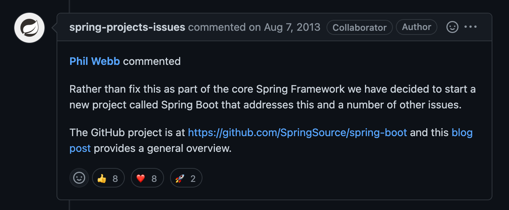
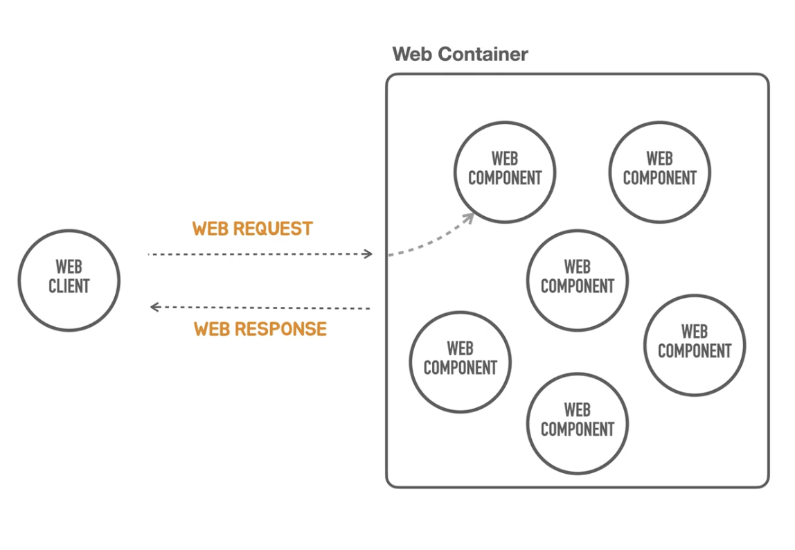
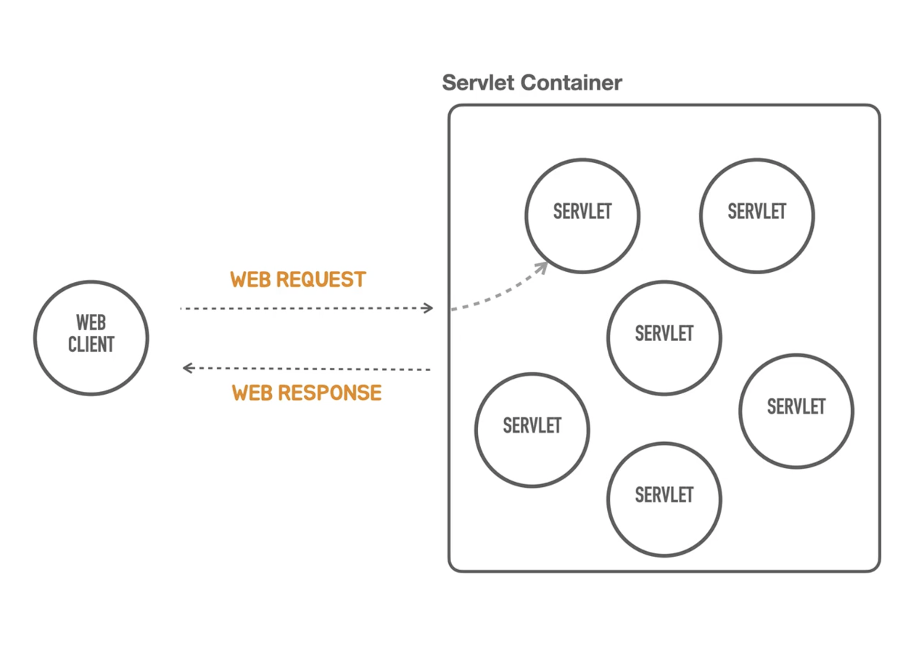
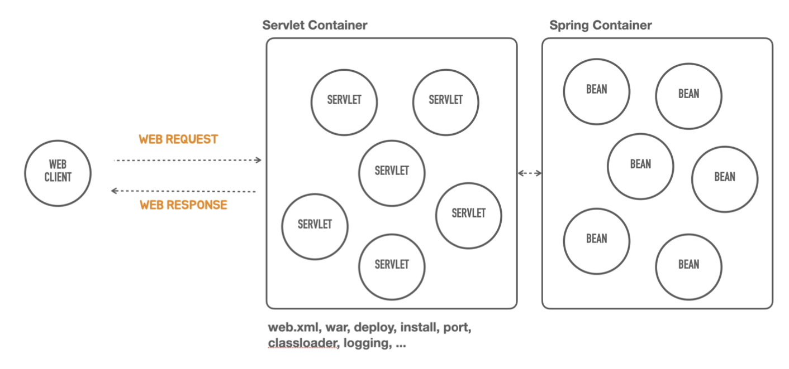
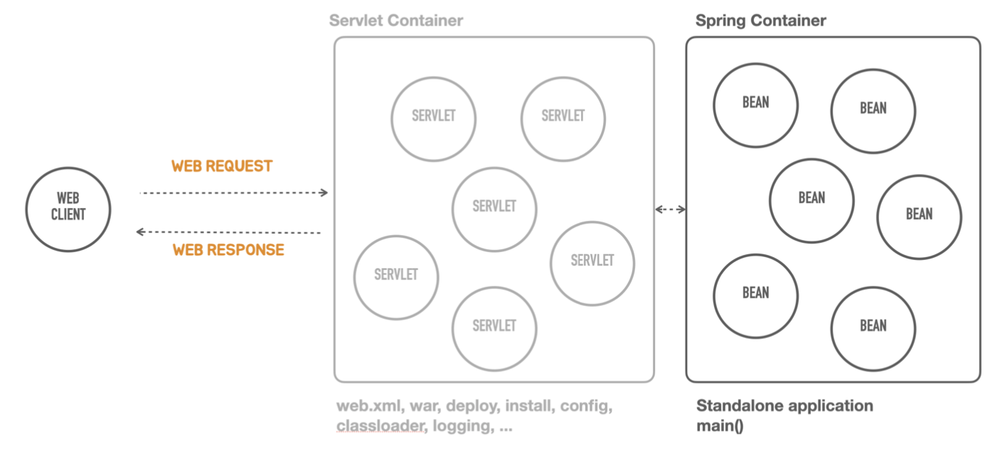

# [Section1] 스프링부트 살펴보기

## 스프링 부트 살펴보기

### 스프링부트 소개

스프링 부트(Spring Boot)는 **스프링을 기반**으로 실무 환경에 사용 가능한 수준의 **독립 실행형 애플리케이션**을 복잡한 고민없이 빠르게 작성할 수 있게 도와주는 여러가지 도구의 모음

> 가장 큰 장점
- 스프링으로 애플리케이션을 개발하지만 고민없이 빠르게 개발할 수 있게 해줌 → 결정을 다 해준 다는 것
> 

<aside>
💡 **스프링 ≠ 스프링부트**
부트가 스프링의 버전을 결정해 주지만 이 둘을 혼동하면 안된다.

</aside>

### 스프링 부트의 핵심 목표

- 매우 빠르고 광범위한 영역의 스프링 개발 경험을 제공
- 강한 주장을 가지고 즉시 적용 가능한 기술 조합을 제공하면서, 필요에 따라 원하는 방식으로 손쉽게 변형 가능
    
    > 빠르고 고민없이 개발할 수 있게 해준다의 다른 표현
    부트가 구성방식을 제안하지만, 언제든 원한다면 다른 방식으로 바꿔서 사용가능
    > 
- 프로젝트에서 필요로 하는 다양한 비기능적인 기술(내장형 서버, 보안, 메트릭, 상태 체크, 외부 설정 방식 등) 제공
- 코드 생성이나 XML설정을 필요로 하지 않음
    
    > 기존 Spring은 XML설정이 필수였음
    > 

### 스프링 부트의 역사

2012년 스프링 프레임워크 프로젝트에 이슈로 등록된 “**Containerless 웹 개발 아키텍처의 지원 요청**”에서 논의와 개발 시작

[https://github.com/spring-projects/spring-framework/issues/14521](https://github.com/spring-projects/spring-framework/issues/14521)

- 이 이슈를 받아들여 framework를 만들기보다 boot라는 새로운 프로젝트로 개발 시작

---

### 컨테이너리스 개발

“컨테이너 없는” 웹 어플리케이션 아키텍처란?

- Serverless와 유사하다.
- 그렇다면 Container가 무엇인가?
    - WebContainer
      
       
      
        - 웹컴포넌트를 관리 (웹컴포넌트를 메모리에 올리고 동작하도록 life cycle관리)
            - 하나가 아닌 여러 개의 웹컴포넌트들을 관리한다.
        - 요청이 들어오면 알맞은 컴포넌트에게 요청을 넘겨준다.
            - 웹컴포넌트를 선택하는 작업 : 라우팅, 매핑(handler mapping)
- 이를 자바용어로 바꿔보자

    
  
    - 유명한 Servlet Container : 톰캣
    - 서블릿들을 여러개띄워놓고 mapping정보를 넣으면 요청에 따라 특정 서블릿이 요청을 처리하고 응답을 생성하여 돌려주는 서블릿 컨테이너가 존재한다.
- 하지만 너무 제한적이다. 좀더 나은방법으로 개발을 하고싶다 → **스프링프레임워크**

    
  
    - 스프링도 컨테이너다. Spring Container는 Servlet Container 뒤에존재한다.
    - 어떤 기능을 담당하는 컴포넌트 = Java Bean
    - 서블릿을 통해 들어온 요청을 Bean들에게 넘기고 동작함
    - 하지만 스프링어플리케이션 개발에만 집중을 하면 좋을텐데, 동작을 시키려면 **서블릿 컨테이너**를 무조건 띄워야함.
        - 서블릿 컨테이너는 오래된 기술이며 다양한 설정 및 배포 방법 학습을 요구함
            
            > 서블릿 컨테이너설치, WAR 폴더구조, web.xml, WAR빌드, 컨테이너로 배치, 포트 설정, 클래스로더, 로깅 등..
            > 
        - 개발 외에 신경써야 할 부분이 너무 많다.
        - 또한 서블릿 컨테이너는 표준 스펙이고 그거를 구현한 제품을 가져다 써야하기 때문에
            - 만약 톰캣에서 다른걸로 바꾼다? 하면 그에 대한 러닝커브가 너무 큼.
- 그래서 서블릿컨테이너가 없는 컨테이너리스 웹아키텍처를 만들었으면 좋겠다. → **스프링부트**
    - 서블릿컨테이너라는게 웹 어플리케이션에 필요 하지만, 이거를 설치하고 관리하는 데에 개발자가 시간을 들이고 지식을 학습하고 적용하는 수고를 제거함.
    
       
      
    - 나중에 필요하면 서블릿컨테이너를 커스터마이징 할 수 있음.
        - 하지만 일단 몰라도됨.
        - 스프링컨테이너만 안다면 웹 환경에서 동작하는 스프링 웹어플리케이션을 만들 수 있다.
    - 스프링부트 이용 시 main메서드만 실행해주면 알아서 전부 실행됨. → **독립실행형**(standalone)

---

### Opinionated

> 내가 다 정해줄게 일단 개발만 해
> 

**스프링 프레임워크의 설계철학**

- 극단적인 **유연함** 추구
- 다양한 관점을 수용
- Not opinionated
- 수많은 선택지를 다 포용

→ 주장을 강하게 고집하지 않아. 모든 선택지를 포용할게.

> 하지만 개발자가 직접 선택하고 적용하고 따져보는데 시간이 오래걸림.
> 

**스프링부트의 설계 철학**

- Opinionated - 자기 주장이 강한, 자기 의견을 고집하는, 독선적인
- 일단 정해주는 대로 **빠르게 개발**하고 고민은 나중에
- 스프링을 잘 활용하는 뛰어난 방법을 제공 (Best Practice)

**사용 기술과 의존 라이브러리 결정**

- 업계에서 검증된 스프링 생태계 프로젝트, 표준 자바 기술, 오픈소스 기술의 종류와 의존관계, 사용버전을 정해줌
- 각 기술을 스프링에 적용하는 방식(DI 구성)과 디폴트 설정값 제공
    - 기술에 대한 고민을 하지 않아도 됨

**유연한 확장**

- 스프링 부트에 내장된 디폴트 구성을 커스터마이징하는 매우 자연스럽고 유연한 방법 제공
- 스프링 부트가 스프링을 사용하는 방식을 이해한다면 언제라도 스프링부트를 제거하고 원하는 방식으로 재구성 가능
- 스프링 부트처럼 기술과 구성을 간편하게 제공하는 나만의 스프링 부트 모듈도 작성 가능

---

### 스프링부트의 이해

**스프링부트를 이용한 개발 방법**

- 부트가 결정한 기술과 수정, 디폴트 설정을 수용
- 외부설정 파일을 이용한 설정 변경 방법을 활용
- 아주 빠르게 개발을 시작할 수 있다
- 하지만…

**스프링 부트를 이용한 개발의 오해와 한계**

- 애플리케이션 기능 코드만 잘 작성하면 된다.
    - 처음에는 맞을 수도있지만 아니다.
- 스프링을 몰라도 개발을 잘 할 수있다.
- 스프링부트가 직접적으로 보여주지 않는 것은 몰라도된다
- 뭔가 기술적인 필요가 생기면 검색을 해서 해결한다.

**스프링 부트를 이해하게 되면?**

- 스프링 부트가 스프링의 기술을 어떻게 활용하는지 배우고 응용할 수 있다.
- 스프링 부트가 선택한 기술, 자동으로 만들어주는 구성, 디폴트 설정이 어떤 것인지 확인할 수 있다.
- 필요할 때 부트의 기본 구성을 수정하거나, 확장할 수 있다.
- 나만의 **스프링 부트 모듈**을 만들어 활용할 수 있다.

**강의의 목표**

- 스프링 부트로 만든 스프링 애플리케이션의 기술과 구성 정보를 직접 확인할 수 있다.
- 적용 가능한 설정 항목을 파악할 수 있다
- 직접 만든 빈 구성 정보를 활용하고 그에 따른 변화를 분석할 수 있다.
- 스프링 부트의 기술을 꼼꼼히 살펴볼 수 있다.

