# [Section2] 스프링부트 시작하기

### 개발환경 준비

#### JDK

- 토비님은 **sdkman**을 추천
- sdkman 설치방법
    1. `curl -s "[https://get.sdkman.io](https://get.sdkman.io/)" | bash`
    2. `source "$HOME/.sdkman/bin/sdkman-init.sh"`
    3. `sdk version`
    
        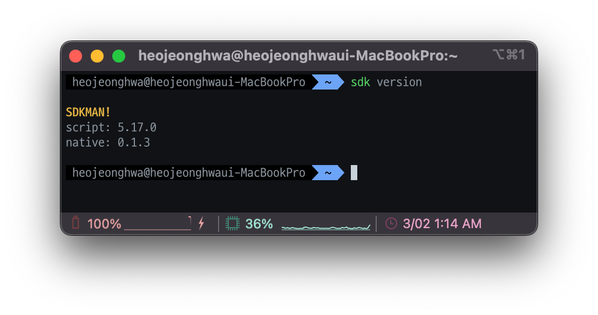
    
    [Installation - SDKMAN! the Software Development Kit Manager](https://sdkman.io/install)
    
- `sdk list java` : java 전체 목록 확인

    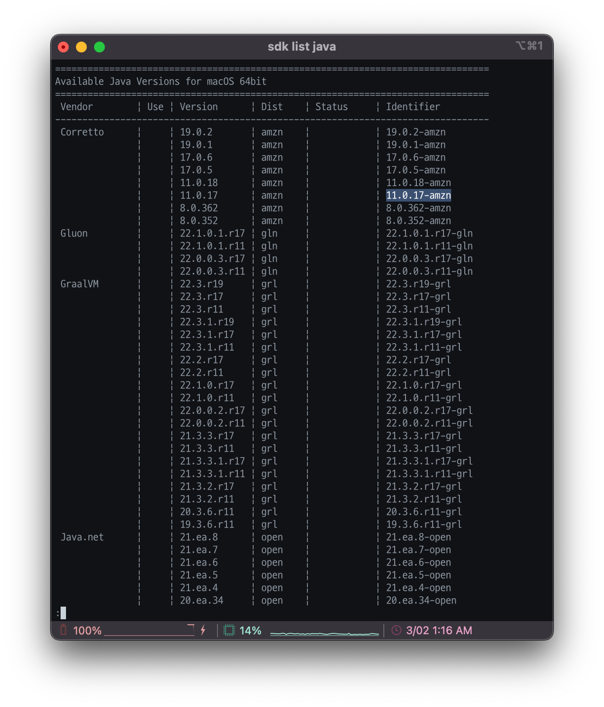
  
- `sdk install java 11.0.17-amzn` : 특정 버전 java 설치

   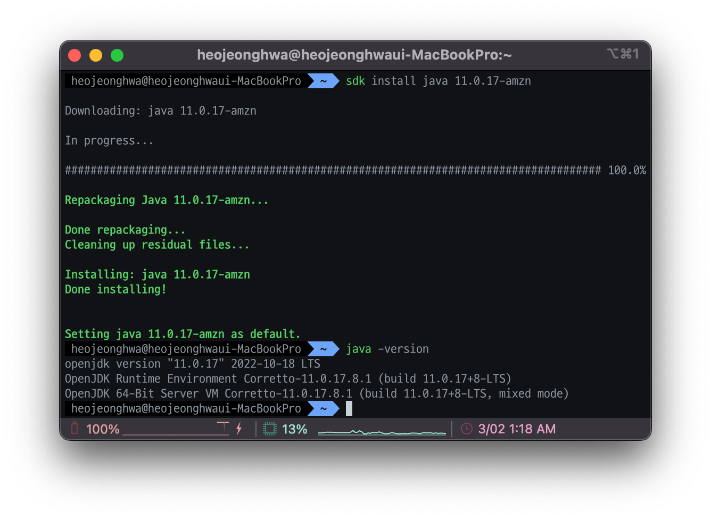

> 만약 특정 프로젝트에 특정 java버전을 사용하고싶다면 ? 
프로젝트 폴더 들어가서 `java use java [jdk 버전]`
> 

#### IDE

- **IntelliJ IDEA** 추천

#### SpringBoot

- `sdk install springboot 2.7.6`   : Spring Boot CLI 설치

   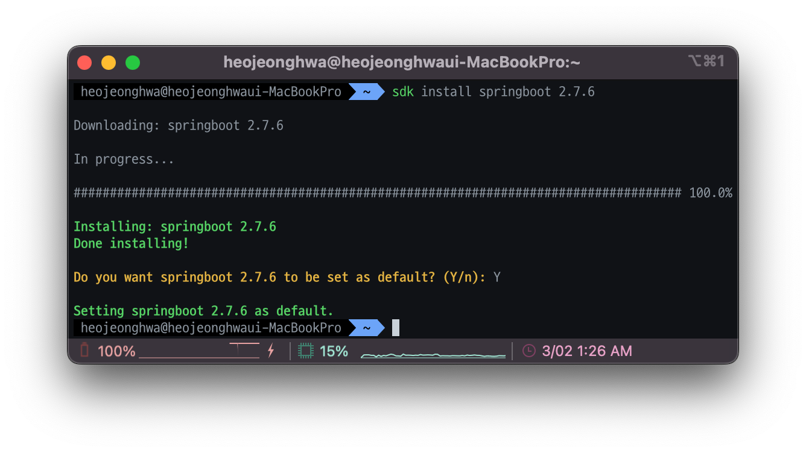
  
- cli로 간단한 프로젝트 생성 및 구동하기
    - `vi hello.groovy` 생성
    
        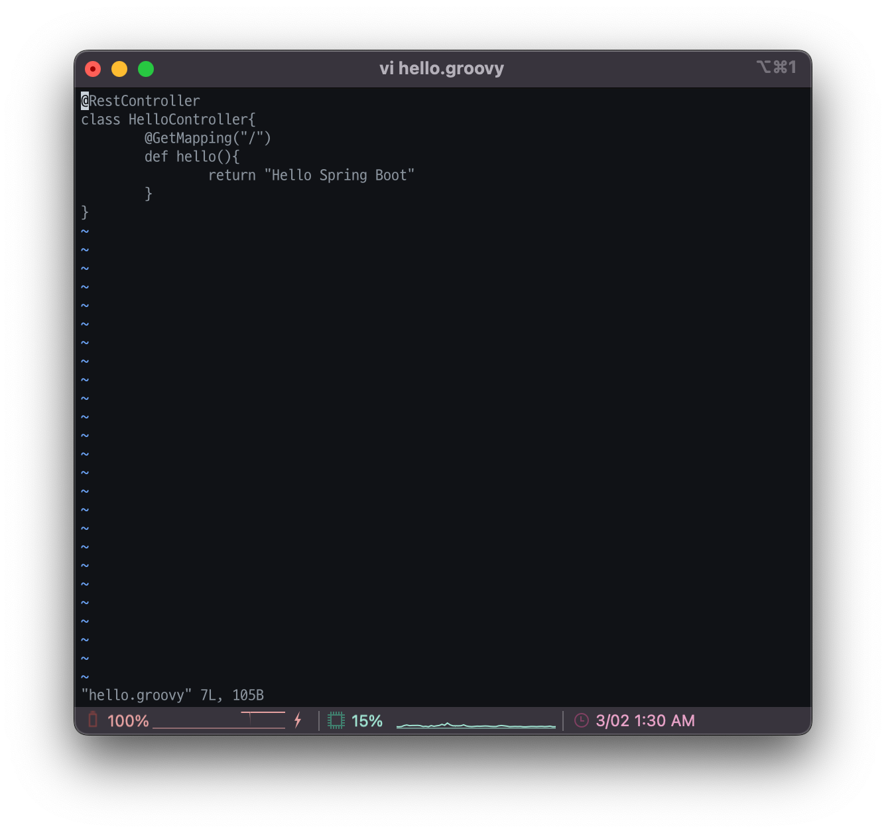        

    - `spring run hello.groovy`
    
       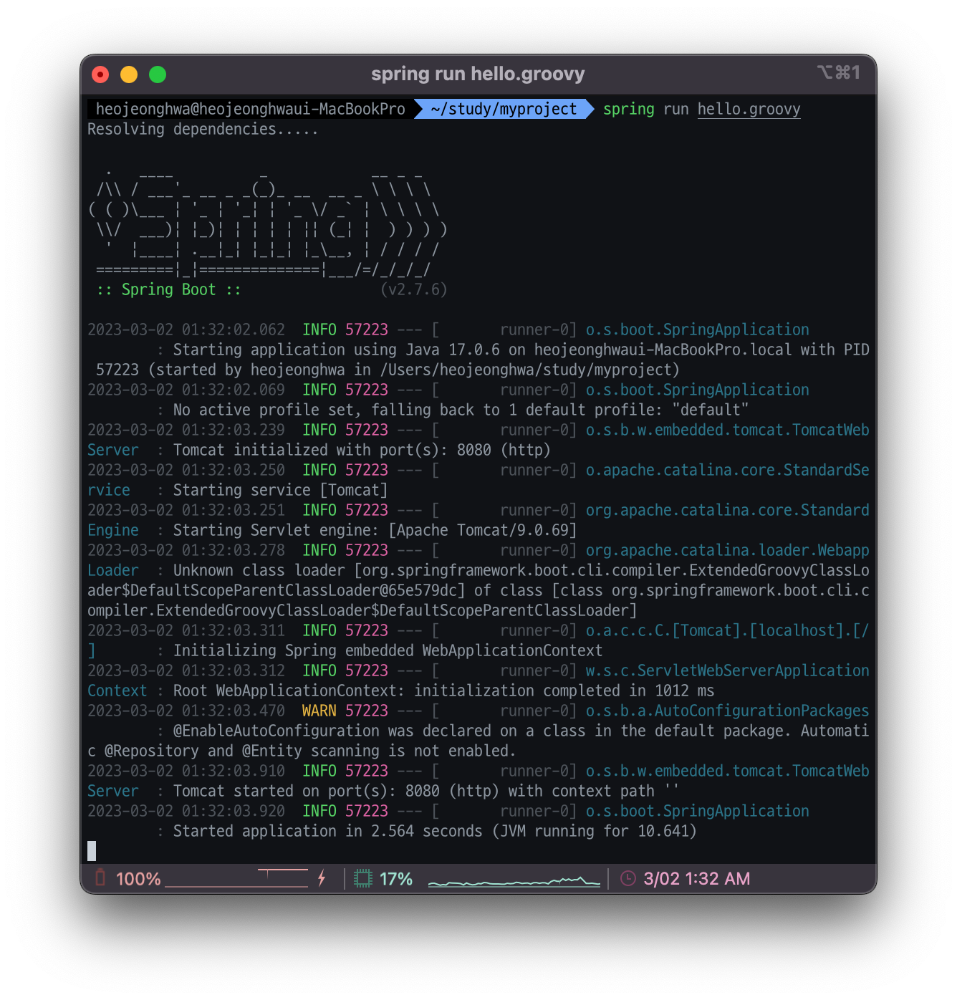

---

### 프로젝트 생성

- 웹 Spring Initializr - [https://start.spring.io/](https://start.spring.io/)
- IDE - New Project - Spring Initailizr

    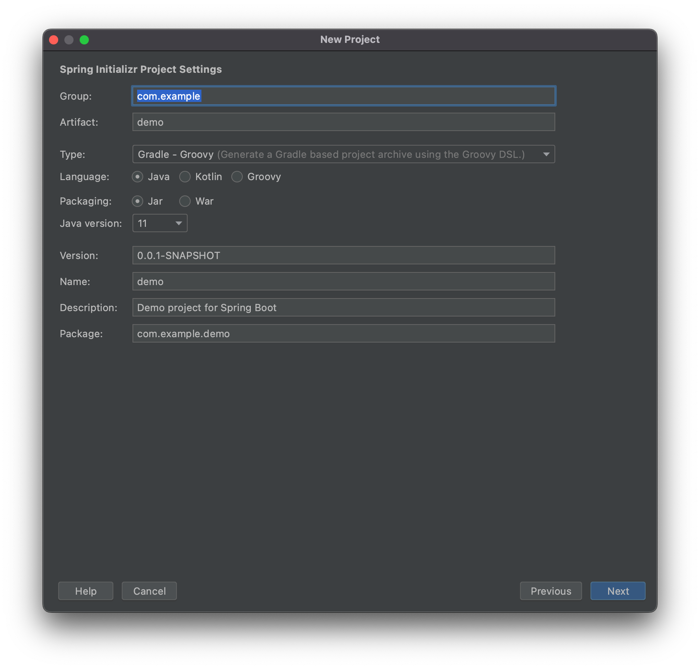
  
- **Spring Boot CLI**
1. `spring shell`
2. `init -b 2.7.6 -d web -g tobyspring -j 11 -n helloboot -x helloboot`
    1. -b : boot 버전 설정
    2. -d : 디펜던시 추가
    3. -j : java 버전 설정
    4. -g : group 지정
    5. -n : 프로젝트이름
    6. -x : zip 압축풀기 옵션
3. `cd helloboot`
4. `./gradlew bootRun`

   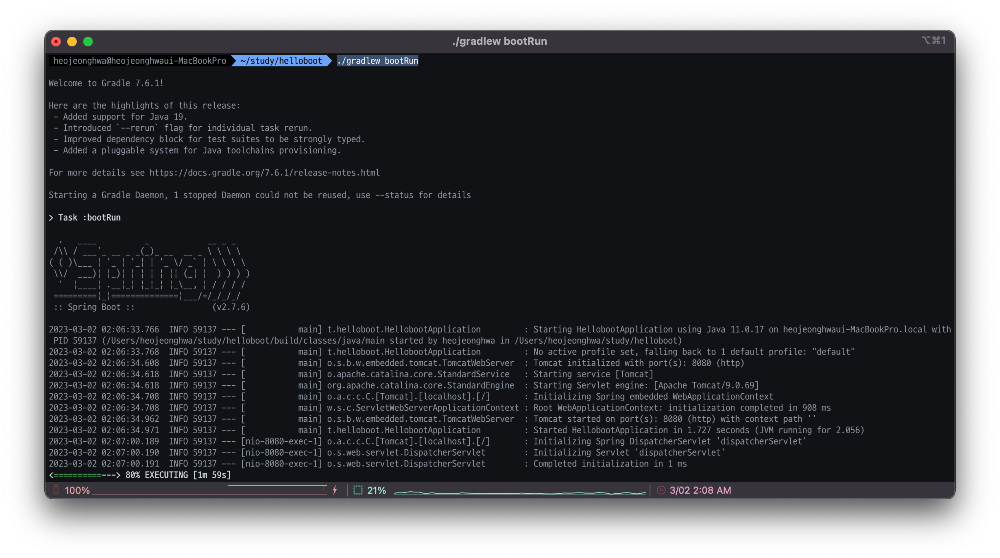

> `control` + `c` 로 종료
> 

#### 생성 옵션

- Project: Gradle
- Langauge: Java
- SpringBoot Version: 2.7.6
- Group Id: tobyspring
- Name: hello
- Packaging: Jar
- Java Version: 11
- Dependency: Web

---

### Hello 컨트롤러

> `idea .` : 인텔리제이로 프로젝트 오픈 (toolbox 설치 필요)
> 
- Controller : 스프링컨테이너안에서 마치 웹컨테이너의 웹컴포넌트처럼 웹의요청을받아 결과를 리턴해줌
- RestController : Rest방식을 이용해서, html파일을 통째로 return하는 대신 api의 요청이 들어오면 응답을 특정한 타입으로 인코딩해서 바디에 담아 보냄.
- Prameter(`String name`) : 쿼리스트링 `/hello?name=~~` 으로 데이터가 올때, 파라미터로 받을 수 있음.

```java
package tobyspring.helloboot;

import org.springframework.web.bind.annotation.GetMapping;
import org.springframework.web.bind.annotation.RestController;

@RestController
public class HelloController {

  @GetMapping("/hello")
  public String hello(String name) {
    return "Hello"+name;
  }
}
```

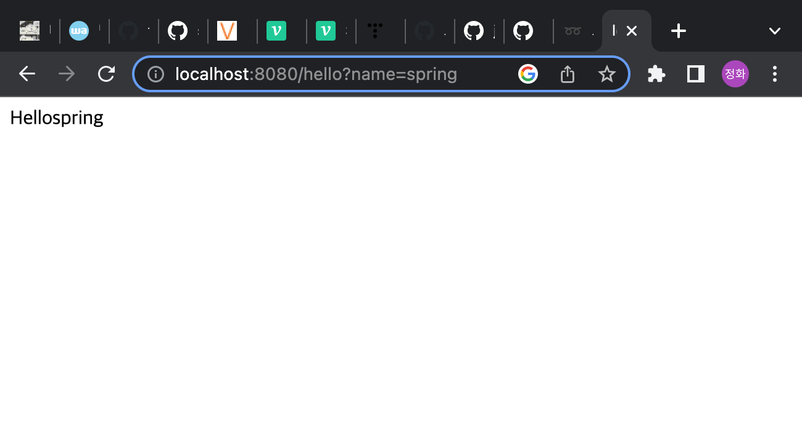

브라우저로 직접 띄워서 출력만 테스트했는데 과연 이걸로 충분할까?

---

### Hello API 테스트

hello()컨트롤러 메소드를 호출할 수 있는 HTTP Request를 생성하고 리턴되는 HTTP Response를 확인한다.

HTTP 요청을 만들고 응답을 확인하는데 사용되는 도구

#### 웹 브라우저 개발자 도구

- 중요한 것 : **Content-Type**

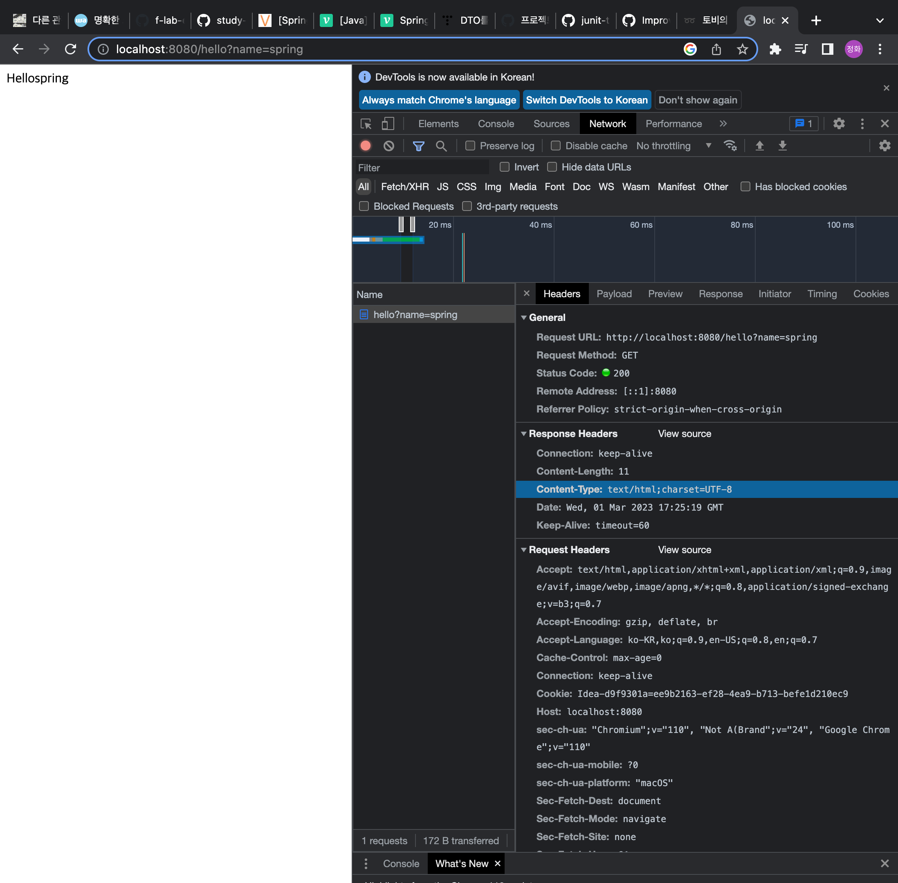

- curl
- **HTTPie (토비님 선호툴)**
    
    [HTTPie – API testing client that flows with you](https://httpie.io/)
    
    - 설치
    
    ```bash
    # Install httpie
    brew update
    brew install httpie
    ```
    
- 인텔리제이 - http request
- Postman
- JUnit Test

#### HTTPie 실제 테스트

- `http -v ":8080/hello?name=Spring”`

   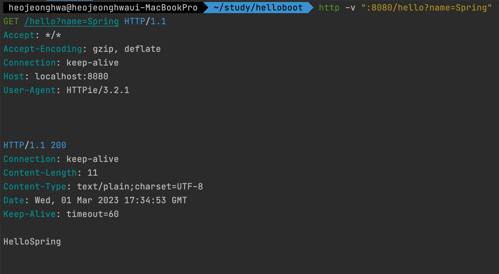
  
- 전달된 request
    - Request Line
    - Headers
    - body(생략)
- 응답 response
    - Status Line
    - Headers
        - **context-type** : 바디에 들어가는게 text/plain이다.
        - 내가 만든 controller가 올바른 타입으로 return하는지 확인해야함.
    - body

---

### HTTP 요청과 응답

#### 이전시간 복습

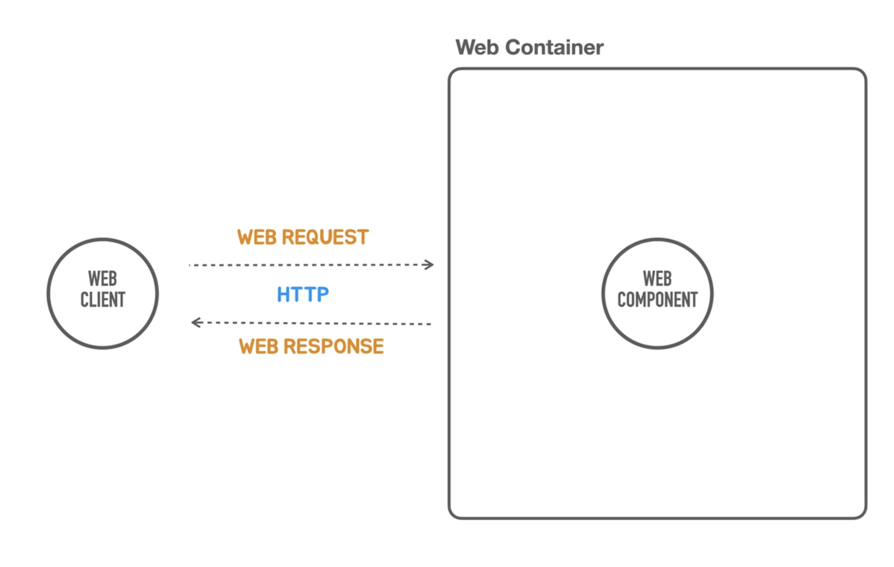

- 웹 클라이언트는 웹컨테이너에 요청을 보낸다.
- 웹컨테이너는 이를 처리할 웹컴포넌트를 찾아 요청을 위임한다.
- 웹컴포넌트는 요청을 분석한 다음 작업을 수행한 다음 결과를 만들어낸다.
- 그 결과를 응답으로 웹클라이언트에게 return한다.

> 요청과 응답은 항상 쌍으로 수행된다. 요청이 없는 응답은 없다.
> 

> 웹 요청은 어떤식으로 보내고 응답은 어떻게 받아야하는가에 대한 표준기술 - **HTTP 프로토콜**
> 

#### HTTP

웹 Request와 Response의 기본 구조를 이해하고 내용을 확인할 수 있어야한다.

#### Request

- Request Line : Method, Path, HTTP Version
    - Method : 어떤 메서드를 이용하겠다. Get, Post, Delete 등 HTTP Method
    - Path : hostname과 port를 제외한 경로. 쿼리스트링 정보가 들어가있기도함.
- Headers
    - 중요한 정보들이 들어감.
        
        → 요청을 처리하는 방식이 달라지거나, 응답을 생성하는 content-type이 달라지기도함.
        
- Message Body
    - 헤더에 설정된 content type에 맞는 내용을 담고있음

#### Response

- Status Line : HTTP Version, Status Code, Status Text
    - **Status Code :** 상태코드값으로 문제를 인지할 수 있음
        - 500대 에러 → 서버에서 문제가 생겼구나.
        - 400대 에러 → 내가 보낸 요청 자체가 문제가 있구나.
- Headers
- Message Body

```bash
GET /hello?name=Spring HTTP/1.1 #Request Line
Accept: */* #모든 content type을 수용하겠다
Accept-Encoding: gzip, deflate
Connection: keep-alive
Host: localhost:8080
User-Agent: HTTPie/3.2.1

HTTP/1.1 200 #Status Line 200 OK
Connection: keep-alive
Content-Length: 11
Content-Type: text/plain;charset=UTF-8
Date: Wed, 01 Mar 2023 17:34:53 GMT
Keep-Alive: timeout=60

HelloSpring
```
