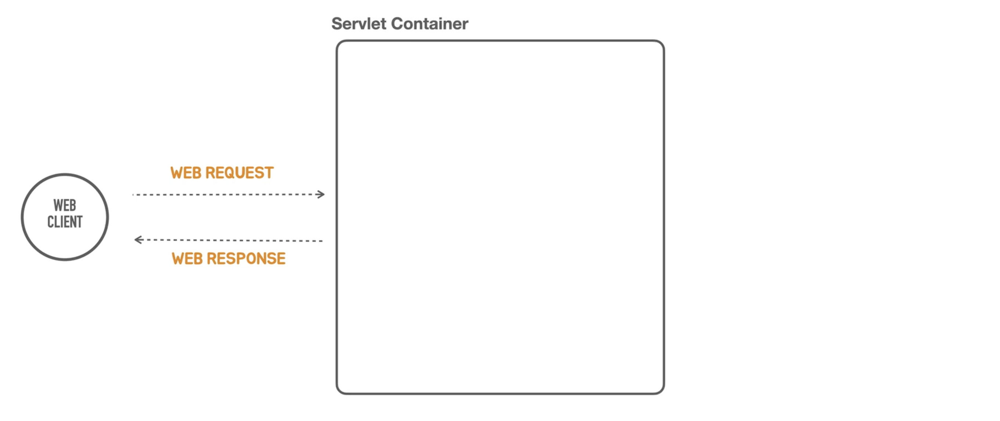
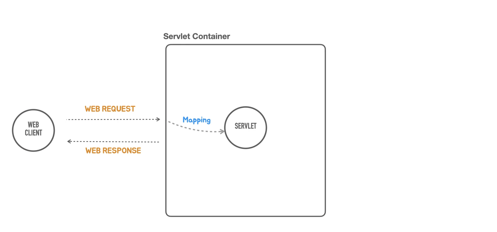
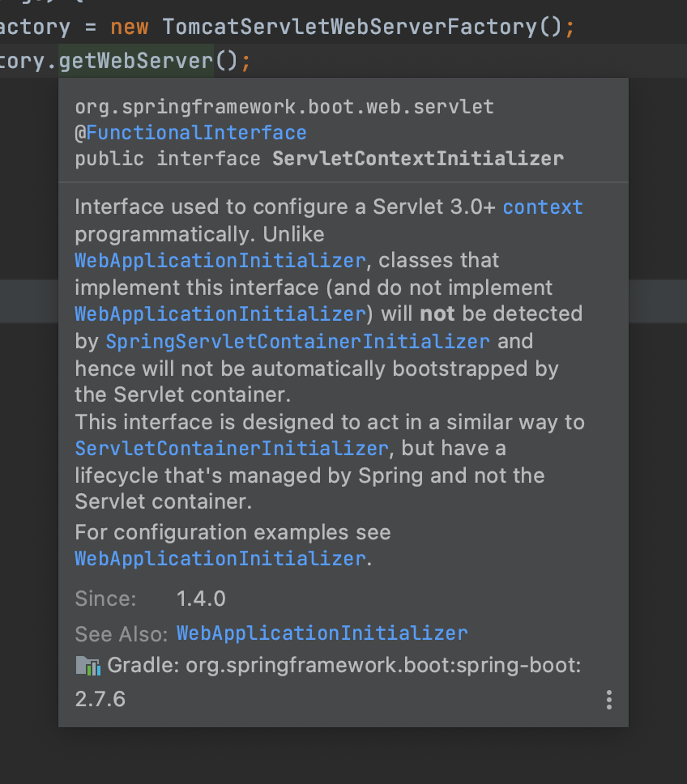
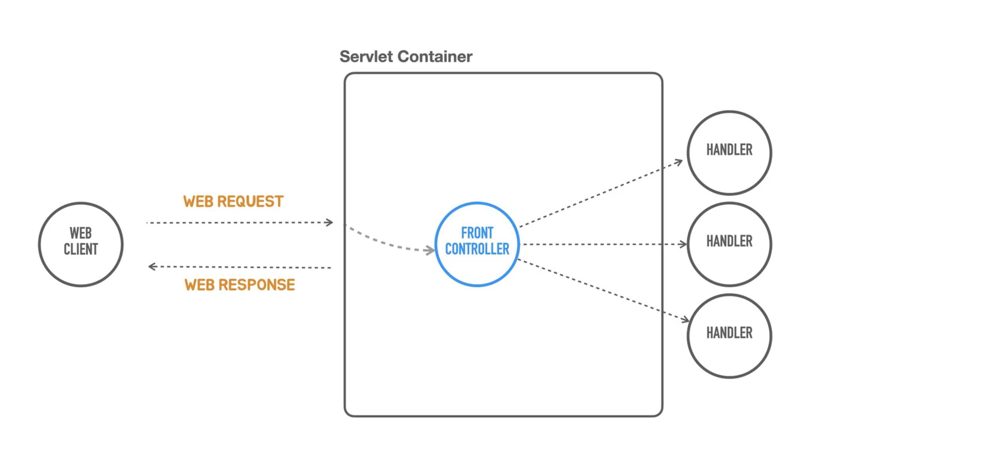

# [Section3] 독립 실행형 서블릿 애플리케이션

### Containerless 개발 준비


```java
package tobyspring.helloboot;

import org.springframework.web.bind.annotation.GetMapping;
import org.springframework.web.bind.annotation.RestController;

@RestController
public class HelloController {

  @GetMapping("/hello")
  public String hello(String name) {
    return "Hello"+name;
  }
}
```

1. `/hello`라는 경로로 들어오는 요청을 받아서 parameter `name`값을 가져온다.
2. @RestController로 등록을 해놓았기 때문에 웹응답이 만들어질 때, return 타입인 String을 보고 자동으로 Content type을 text/plain으로 결정한 후 body에 넣는다.

```java
@SpringBootApplication
public class HellobootApplication {

	public static void main(String[] args) {
		SpringApplication.run(HellobootApplication.class, args);
	}

}
```

- tomcat을 설치하고 빌드를 설정하지 않았다.
- 단지 스프링부트가 만들어준 `main` 메서드를 실행하기만했는데, 톰캣(서블릿컨테이너)이 떠서 동작하고
- 스프링관련된 설정을 하지 않았는데, 스프링컨테이너도 떳다.
    - 컨트롤러로 만들어 놓은 코드가 스프링위에 올라갔기 때문에 기능이 동작한다.
- 그렇다면 여기서 어떤일이 일어나는지 알기위해 `@SpringBootApplication`과 `SpringApplication.run`를 지우고 구현을 시작하자.

```java
public class HellobootApplication {

	public static void main(String[] args) {
		System.out.println("Hello Containerless Standalone Application");
	}

}
```

---

### 서블릿 컨테이너 띄우기



비어있는 서블릿 컨테이너를 코드로 띄워보자.

- 톰캣도 자바로 만들어진 프로그램이다. 톰캣을 설치하지 말고 임베디드해서 main메서드에 띄워보자.

```java
package tobyspring.helloboot;

import org.springframework.boot.web.embedded.tomcat.TomcatServletWebServerFactory;
import org.springframework.boot.web.server.WebServer;
import org.springframework.boot.web.servlet.server.ServletWebServerFactory;

public class HellobootApplication {

 public static void main(String[] args) {
  ServletWebServerFactory serverFactory = new TomcatServletWebServerFactory();
  WebServer webServer = serverFactory.getWebServer(); 
  webServer.start();
 }
}
```

`TomcatServletWebServerFactory` 

- 이 자체가 `TomcatServletWebServer`는 아니고 복잡한 초기화 작업과 설정을 지원하도록 스프링부트가 제공하는 도우미 클래스이다.

`serverFactory.getWebServer()`

- 서블릿컨테이너를 만드는 생성함수
- Tomcat외 jetty나 다른 서버도 쓸 수 있기에, 종속성을 제거하기위해 `WebServer`로 추상화를 해놓음

http 테스트를 해보면 404에러가 발생한다.

→ 서블릿 컨테이너 까지는 잘 뜨는걸 확인. 하지만 **서블릿을 등록하는 과정**이 필요하다.

```bash
http -v ":8080/hello?name=Spring"
```

```bash
GET /hello?name=Spring HTTP/1.1
Accept: */*
Accept-Encoding: gzip, deflate
Connection: keep-alive
Host: localhost:8080
User-Agent: HTTPie/3.2.1

HTTP/1.1 404 
Connection: keep-alive
Content-Language: en
Content-Length: 682
Content-Type: text/html;charset=utf-8
Date: Fri, 03 Mar 2023 07:41:42 GMT
Keep-Alive: timeout=60

<!doctype html><html lang="en"><head><title>HTTP Status 404 – Not Found</title><style type="text/css">body {font-family:Tahoma,Arial,sans-serif;} h1, h2, h3, b {color:white;background-color:#525D76;} h1 {font-size:22px;} h2 {font-size:16px;} h3 {font-size:14px;} p {font-size:12px;} a {color:black;} .line {height:1px;background-color:#525D76;border:none;}</style></head><body><h1>HTTP Status 404 – Not Found</h1><hr class="line" /><p><b>Type</b> Status Report</p><p><b>Description</b> The origin server did not find a current representation for the target resource or is not willing to disclose that one exists.</p><hr class="line" /><h3>Apache Tomcat/9.0.69</h3></body></html>
```

---

### 서블릿 등록



- 기능을 수행하는 웹컴포넌트(서블릿)을 추가하자.
    - 서블릿컨테이너는 클라이언트에게 요청을 받으면 이를 서블릿에 mapping을 한다.
    - 서블릿이 웹응답을 만들고 종료되면, 서블릿컨테이너가 클라이언트에게 응답을 보내도록 만들자.
- **HTTP 프로토콜** 구조는 꼭 기억하자.
    
    ```
    **Request**
    - Request Line : Method, Path, HTTP Version
    - Headers
    - Message Body
    
    **Response**
    - Status Line : HTTP Version, Status Code, Status Text
    - Headers
    - Message Body
    ```
    
    - **요청**과 **응답**이라는 관점에서 어디에 어떻게 mapping이 되는지를 계속 생각하고 파악해야한다.
    - 서블릿으로 직접 개발하고 자세히 알필요는 없지만, 서블릿코드에서 요청과 응답을 처리하는 부분은 집중해야한다.

```java
package tobyspring.helloboot;

import java.io.IOException;
import javax.servlet.ServletException;
import javax.servlet.http.HttpServlet;
import javax.servlet.http.HttpServletRequest;
import javax.servlet.http.HttpServletResponse;
import org.springframework.boot.web.embedded.tomcat.TomcatServletWebServerFactory;
import org.springframework.boot.web.server.WebServer;
import org.springframework.boot.web.servlet.server.ServletWebServerFactory;

public class HellobootApplication {

  public static void main(String[] args) {
    ServletWebServerFactory serverFactory = new TomcatServletWebServerFactory();
    WebServer webServer = serverFactory.getWebServer(servletContext -> {
      servletContext.addServlet("hello", new HttpServlet() {
        @Override
        protected void service(HttpServletRequest req, HttpServletResponse resp)
            throws ServletException, IOException {
          // 상태코드
          resp.setStatus(200);
          // 헤더 (content type 필수)
          resp.setHeader("Content-Type", "text/plain");
          // 바디
          resp.getWriter().println("Hello Servlet");
        }
      }).addMapping("/hello");
    });
    webServer.start();
  }

}
```

- `ServletContextInitializer` : 서블릿컨테이너에 서블릿을 등록하는데 필요한 작업을 수행하는데 필요한 오브젝트. @FunctionalInterface이므로 람다식으로 전환해서 사용.

      

- `.addMapping("/hello");` : `/hello`로 url이 들어오면 이 서블릿이 받겠다는 의미.

http 테스트 결과

```bash
http -v ":8080/hello"
```

```bash
GET /hello HTTP/1.1
Accept: */*
Accept-Encoding: gzip, deflate
Connection: keep-alive
Host: localhost:8080
User-Agent: HTTPie/3.2.1

HTTP/1.1 200 
Connection: keep-alive
Content-Length: 14
Content-Type: text/plain;charset=ISO-8859-1
Date: Fri, 03 Mar 2023 08:59:18 GMT
Keep-Alive: timeout=60

Hello Servlet
```

---

### 서블릿 요청 처리

```java
package tobyspring.helloboot;

import java.io.IOException;
import javax.servlet.ServletException;
import javax.servlet.http.HttpServlet;
import javax.servlet.http.HttpServletRequest;
import javax.servlet.http.HttpServletResponse;
import org.springframework.boot.web.embedded.tomcat.TomcatServletWebServerFactory;
import org.springframework.boot.web.server.WebServer;
import org.springframework.boot.web.servlet.server.ServletWebServerFactory;
import org.springframework.http.HttpHeaders;
import org.springframework.http.HttpStatus;
import org.springframework.http.MediaType;

public class HellobootApplication {

  public static void main(String[] args) {
    ServletWebServerFactory serverFactory = new TomcatServletWebServerFactory();
    WebServer webServer = serverFactory.getWebServer(servletContext -> {
      servletContext.addServlet("hello", new HttpServlet() {
        @Override
        protected void service(HttpServletRequest req, HttpServletResponse resp)
            throws ServletException, IOException {
          String name = req.getParameter("name");

          resp.setStatus(HttpStatus.OK.value());
					resp.setHeader(HttpHeaders.CONTENT_TYPE, MediaType.TEXT_PLAIN_VALUE);
          resp.getWriter().println("Hello "+name);
        }
      }).addMapping("/hello");
    });
    webServer.start();
  }

}
```

- text로 하드코딩하는 것은 오타의 위험이 크다 따라서 스프링에서 제공해주는 값(Enum, static변수)들을 쓰자
    - 200 → HttpStatus.OK.value()
    - “Content-Type” → HttpHeaders.CONTENT_TYPE
    - “text/plain” → MediaType.TEXT_PLAIN_VALUE
- `String name = req.getParameter("name");`
    - URL로 전달된 파라미터값을 추출하여 적절한 응답을 생성한다.

http 테스트 결과

```bash
http -v ":8080/hello?name=Spring"
```

```bash
GET /hello?name=Spring HTTP/1.1
Accept: */*
Accept-Encoding: gzip, deflate
Connection: keep-alive
Host: localhost:8080
User-Agent: HTTPie/3.2.1

HTTP/1.1 200 
Connection: keep-alive
Content-Length: 13
Content-Type: text/plain;charset=ISO-8859-1
Date: Fri, 03 Mar 2023 09:05:49 GMT
Keep-Alive: timeout=60

Hello Spring
```

---

### 프론트 컨트롤러



- 원래 서블릿은 각 url에 맞게 매핑을 해서 각 서블릿이 처리를 해줘야하는데, 모든 서블릿에 공통적으로 처리해줘야하는 코드가 반복되는 문제가 발생
- 이런 반복되는 공통 로직을 중앙화된 오브젝트에서 처리한 후 요청의 종류에 따라 또 다른 오브젝트에게 위임하는 방식을 고안함 → **FrontController**
    - 즉 공통적인 로직을 앞 단에서 처리하자. (+후처리 작업도)
- 그 후 FrontController를 내장하는 프레임워크가 많이 등장하기 시작함.
    - 대표적인 패턴으로 자리를 잡음.

> 공통 로직이란 ? 인증, 보안, 다국어처리 등
> 

---

### 프론트 컨트롤러로 전환

- 응답을 생성하는 작업을 위임해서 처리할 command 객체 (HelloController) → 핸들러
    
    ```java
    package tobyspring.helloboot;
    
    public class HelloController {
    
      public String hello(String name) {
        return "Hello" + name;
      }
    }
    ```
    
- 프론트컨트롤러와 Hello컨트롤러 바인딩
    
    ```java
    package tobyspring.helloboot;
    
    import java.io.IOException;
    import javax.servlet.ServletException;
    import javax.servlet.http.HttpServlet;
    import javax.servlet.http.HttpServletRequest;
    import javax.servlet.http.HttpServletResponse;
    import org.springframework.boot.web.embedded.tomcat.TomcatServletWebServerFactory;
    import org.springframework.boot.web.server.WebServer;
    import org.springframework.boot.web.servlet.server.ServletWebServerFactory;
    import org.springframework.http.HttpHeaders;
    import org.springframework.http.HttpMethod;
    import org.springframework.http.HttpStatus;
    import org.springframework.http.MediaType;
    
    public class HellobootApplication {
    
      public static void main(String[] args) {
        ServletWebServerFactory serverFactory = new TomcatServletWebServerFactory();
        WebServer webServer = serverFactory.getWebServer(servletContext -> {
          HelloController helloController = new HelloController(); // 한번만 생성하도록
    
          servletContext.addServlet("frontcontroller", new HttpServlet() {
            @Override
            protected void service(HttpServletRequest req, HttpServletResponse resp)
                throws ServletException, IOException {
              // 인증, 보안, 다국어, 공통 기능
              if (req.getRequestURI().equals("/hello") && req.getMethod()
                  .equals(HttpMethod.GET.name())) {
                String name = req.getParameter("name");
    
                String ret = helloController.hello(name);
    
                resp.setStatus(HttpStatus.OK.value());
                resp.setHeader(HttpHeaders.CONTENT_TYPE, MediaType.TEXT_PLAIN_VALUE);
                resp.getWriter().println(ret);
              } else if (req.getRequestURL().equals("/user")) {
                //
    
              } else {
                resp.setStatus(HttpStatus.NOT_FOUND.value());
              }
            }
          }).addMapping("/*");
        });
        webServer.start();
      }
    
    }
    ```
    
    - **매핑**
        - HTTP요청 정보를 활용해서 어떤 로직을 수행하는 코드를 호출할 것 인가를 결정하는 작업
        - `if(req.getRequestURI().equals("/hello")&&req.getMethod().equals(HttpMethod.GET.name()))`
    - **바인딩**
        - 웹요청 정보를 추출해서 오브젝트(평범한 자바타입)로 변환하여 처리하는 로직에 전달하는 작업
        - ex) form을 통해 많은 정보들이 넘어왔다면 DTO로 변환 후 처리 로직에 넘기기
        - `String name = req.getParameter("name");`