# [Section4] 독립 실행형 스프링 애플리케이션

### 스프링 컨테이너 사용

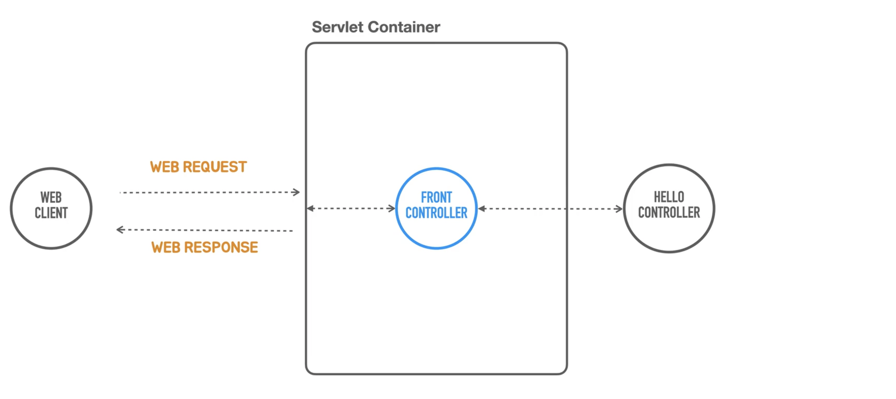
<br>
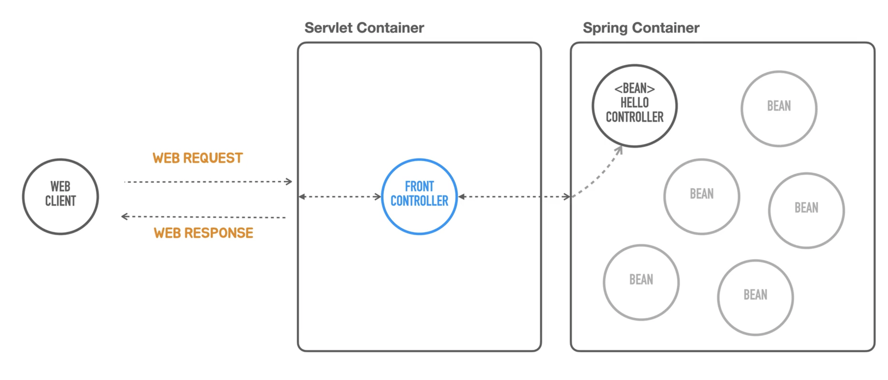

- HelloController를 오브젝트를 Spring Container 안에 집어 넣는다.
- 기존엔 FrontController가 직접 HelloController를 생성해서 사용했다면, 이번엔 SpringContainer를 이용하는 방식으로 변경한다.

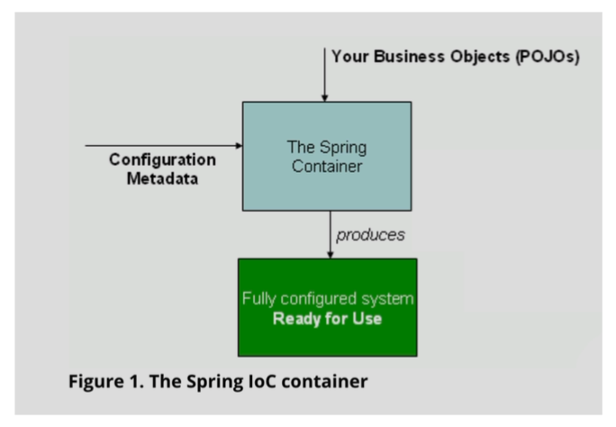

SpringContainer를 사용하기위해서는 크게 2가지가 필요하다.

1. 비지니스로직을 담고있는 평범한 자바 Object =  POJO
    1. 특정 클래스 상속 X
2. application을 어떤 식으로 구성할지에 대한 구성정보를 담고있는 Configuration Metadata

이 두가지를 가지고 SpringContainer가 내부에서 조합하여 사용가능한 ServerApplication을 만들어낸다.

스프링컨테이너를 만들기 위해 `GenericApplicationContext`를 사용한다.

- `GenericApplicationContext` : 코드로 손쉽게 스프링컨테이너를 만들 수 있는 인터페이스

```java
package tobyspring.helloboot;

import java.io.IOException;
import javax.servlet.ServletException;
import javax.servlet.http.HttpServlet;
import javax.servlet.http.HttpServletRequest;
import javax.servlet.http.HttpServletResponse;
import org.springframework.boot.web.embedded.tomcat.TomcatServletWebServerFactory;
import org.springframework.boot.web.server.WebServer;
import org.springframework.boot.web.servlet.server.ServletWebServerFactory;
import org.springframework.context.support.GenericApplicationContext;
import org.springframework.http.HttpMethod;
import org.springframework.http.HttpStatus;
import org.springframework.http.MediaType;

public class HellobootApplication {

  public static void main(String[] args) {
    GenericApplicationContext applicationContext = new GenericApplicationContext();
    applicationContext.registerBean(HelloController.class);
    applicationContext.refresh();

    ServletWebServerFactory serverFactory = new TomcatServletWebServerFactory();
    WebServer webServer = serverFactory.getWebServer(servletContext -> {

      servletContext.addServlet("frontcontroller", new HttpServlet() {
        @Override
        protected void service(HttpServletRequest req, HttpServletResponse resp)
            throws ServletException, IOException {
          // 인증, 보안, 다국어, 공통 기능
          if (req.getRequestURI().equals("/hello") && req.getMethod()
              .equals(HttpMethod.GET.name())) {
            String name = req.getParameter("name");

            HelloController helloController = applicationContext.getBean(HelloController.class);
            String ret = helloController.hello(name);

            resp.setContentType(MediaType.TEXT_PLAIN_VALUE);
            resp.getWriter().println(ret);
          } else {
            resp.setStatus(HttpStatus.NOT_FOUND.value());
          }
        }
      }).addMapping("/*");
    });
    webServer.start();
  }

}
```

- `registerBean(클래스정보);`
    - 오브젝트 클래스 정보를 직접 Bean으로 등록한다.
    - 그 후  `refresh()`를 호출하면 구성정보를 가지고 컨테이너를 초기화하여 등록된 Bean Object를 생성한다.
- `getBean(클래스정보);`
    - 컨테이너가 관리하는 빈 오브젝트를 가지고 온다.
    - 빈이름을 사용하여 가져올 수도 있다.

---

### 의존 오브젝트 추가

- 스프링 컨테이너는 오브젝트를 기본적으로 딱 한번만 만든다.
    - 여러 서블릿에서 `getBean` 메서드를 통해 빈을 요청할 때 마다 새로 만들어서 전달하는게 아니라, 처음에 만들어둔 동일한 오브젝트를 return해준다.
- 딱 하나의 오브젝트만 만들어 두고 이를 재사용하는 패턴 → **싱글톤 패턴**
- 스프링 컨테이너 → **싱글톤 레지스트리**
    - 싱글톤패턴을 사용하지 않더라도 마치 싱글톤패턴을 쓰는 것 처럼 동일한 기능을 제공한다.
    
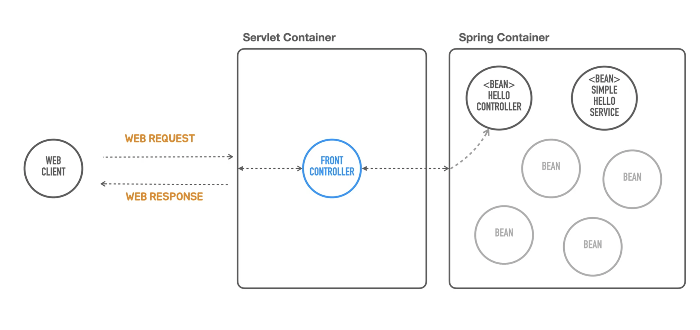

- Hello라는 인삿말을 제공하는 서비스를 하나 더 두어서 HelloController의 책임을 줄여보자.
    
    > 웹Controller : 웹 클라이언트의 요청사항을 검증하고 비지니스로직을 제공해주는 다른 오브젝트에게 요청을 보낸 후 결과를 돌려받은 다음에 웹 클라이언트에게 어떤 형식으로 돌려줄 것인가만 결정하는 역할을 하면된다.
    > 
- SimpleHelloService 생성
    
    ```java
    package tobyspring.helloboot;
    
    public class SimpleHelloService {
    
      String sayHello(String name) {
        return "Hello " + name;
      }
    
    }
    ```
    
- HelloController 리팩토링
    
    ```java
    package tobyspring.helloboot;
    
    import java.util.Objects;
    
    public class HelloController {
    
      public String hello(String name) {
        SimpleHelloService helloService = new SimpleHelloService();
    
        return helloService.sayHello(Objects.requireNonNull(name));
      }
    }
    ```
    
    - 컨트롤러는 요청사항을 검증할 책임이 있음.
        - `Objects.requireNonNull` : null이라면 예외를 던지는 Objects의 static메서드 사용
    - 응답 결과를 생성하는 책임을 `SimpleHelloService`에게 위임.

---

### Dependency Injection

Spring IoC/DI Container

- 현재 코드의 의존관계
    - SimpleHelloService가 변경이 되면 HelloController가 영향을 받는다.
        - Runtime에서 동작하는 기능상 영향
        - 또는 소스코드를 고쳐야지만 컴파일 되고 동작하는 수준의 영향
    
    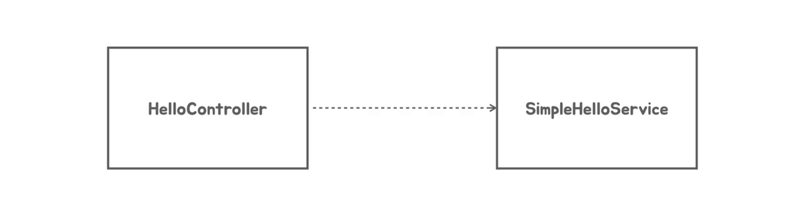    

- 만약 ComplexHelloService로 변경하고 싶다면?
    - 내 코드를 고쳐야하는 부담이 있다.
    
    ```java
    // SimpleHelloService helloService = new SimpleHelloService();
    ComplexHelloService helloService = new ComplexHelloService();
    ```
    

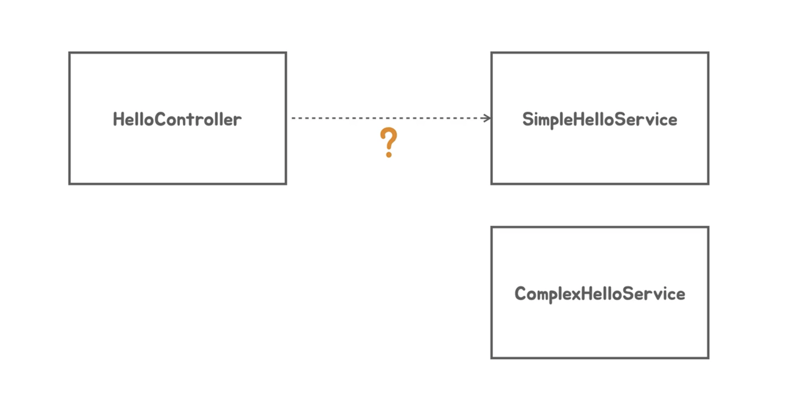

- 해결법 : HelloService인터페이스에 의존하도록 만든다.
    - 이 인터페이스를 구현하는 여러 클래스를 만들어두면, HelloController는 어떤 특정클래스에 의존하고있지 않기때문에 코드를 변경하지 않고 `sayhello`라는 메서드의 기능을 바꿀 수 있다.
    
    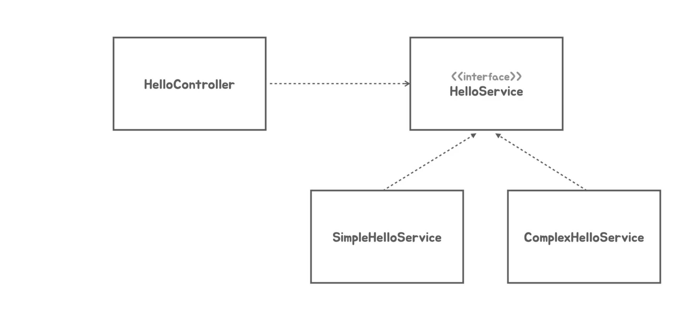    

- 하지만 소스코드 레벨에서 의존을 하고 있지 않더라도, 런타임에는 HelloService인터페이스를 구현한 클래스의 오브젝트에게 요청을 보내야한다.
    - 어느 클래스의 오브젝트를 사용할 것인가가 결정이 되어있어야한다.
    - 만약 SimpleHelloService를 사용하기로 결정했다면, 이 둘사이의 연관관계를 만들어줘야한다.
    - 이 작업을 해주는 과정을 **Dependecy Injection** 이라 한다. → 제 3의 존재(Assembler)가 필요하다.
- **Assembler**
    - HelloController가 HelloService인터페이스를 구현한 오브젝트를 사용할 수 있게끔 **외부에서 주입**을 해주는 역할을 한다.
    - 원래는 직접 의존관계가 없는 클래스들을 가져다가 서로 관계를 연결시켜주고 사용할 수 있도록 만들어준다.
    
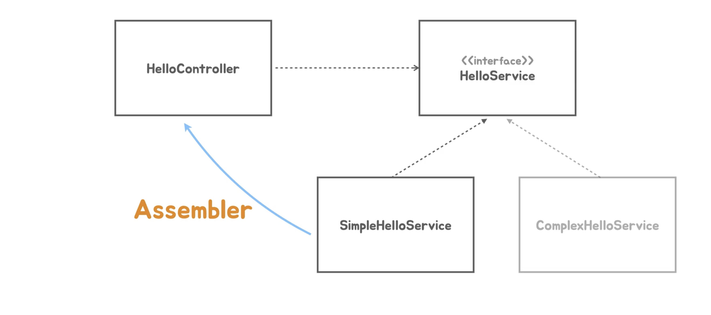

- Assembler ⇒ **SpringContainer**
    - 메타정보를 주면 클래스의 싱글톤 오브젝트를 만드는데, 그게 전부가 아니라 의존 오브젝트였다면 주입해주는 작업까지 수행한다.
    - 즉 HelloController를 만들고나서 SimpleHelloService를 사용하기로 했다면 SimpleHelloService도 스프링컨테이너가 관리하는 빈으로 등록하고 사용할 수 있도록 주입을 해준다.
    - **주입을 해준다** : SimpleHelloService오브젝트 레퍼런스를 넘겨준다. 아래와 같이 다양한 방법이 존재.
        - 생성자 파라미터
            - 가장 대표적이고 쉬운방법.
            - HelloController생성자 파라미터로 SimpleHelloService의 오브젝트를 주입해준다.
                - 물론 파라미터의 타입은 HelloService Interface이다.
        - 팩토리 메서드
            - 팩토리 메서드로 빈을 만들도록 하면서, 여기에 파라미터로 넘기는 방법.
        - Setter 메서드
            - HelloController의 프로퍼티를 정의해서 Setter메서드를 통해 사용해야할 오브젝트를 주입해준다.
    
    → 결론적으로 위의 작업들을 SpringContainer가 수행해준다.
    
    → 우리가 Springcontainer를 사용해야하는 가장 큰 이유.

    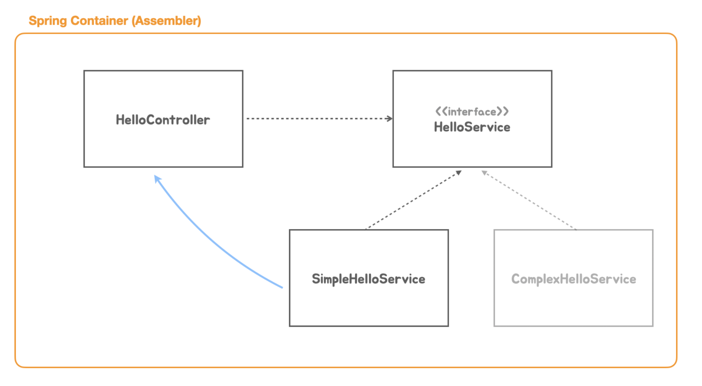

---

### 의존 오브젝트 DI 적용

- SimpleHelloService를 빈으로 등록하고 SpringContainer가 어셈블러로서 SimpleHelloService빈을 HelloController에 DI해주는 작업을 수행해보자.

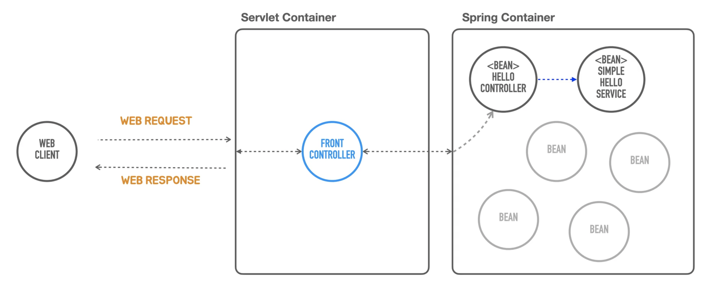

- HelloService Interface생성

```java
package tobyspring.helloboot;

public interface HelloService {

  String sayHello(String name);
}
```

- SimpleHelloService를 Interface구현체로 리팩토링

```java
package tobyspring.helloboot;

public class SimpleHelloService implements HelloService {

  @Override
  public String sayHello(String name) {
    return "Hello " + name;
  }

}
```

- HelloService를 HelloController에 주입하기 위해 생성자 파라미터로 만든다.

```java
package tobyspring.helloboot;

import java.util.Objects;

public class HelloController {

  private final HelloService helloService;

  public HelloController(HelloService helloService) {
    this.helloService = helloService;
  }

  public String hello(String name) {
    return helloService.sayHello(Objects.requireNonNull(name));
  }
}
```

- SpringContainer에 SimpleHelloService클래스를 등록해준다.

```java
package tobyspring.helloboot;

import java.io.IOException;
import javax.servlet.ServletException;
import javax.servlet.http.HttpServlet;
import javax.servlet.http.HttpServletRequest;
import javax.servlet.http.HttpServletResponse;
import org.springframework.boot.web.embedded.tomcat.TomcatServletWebServerFactory;
import org.springframework.boot.web.server.WebServer;
import org.springframework.boot.web.servlet.server.ServletWebServerFactory;
import org.springframework.context.support.GenericApplicationContext;
import org.springframework.http.HttpMethod;
import org.springframework.http.HttpStatus;
import org.springframework.http.MediaType;

public class HellobootApplication {

  public static void main(String[] args) {
    GenericApplicationContext applicationContext = new GenericApplicationContext();
    applicationContext.registerBean(HelloController.class);
    applicationContext.registerBean(SimpleHelloService.class);
    applicationContext.refresh();

    ServletWebServerFactory serverFactory = new TomcatServletWebServerFactory();
    WebServer webServer = serverFactory.getWebServer(servletContext -> {

      servletContext.addServlet("frontcontroller", new HttpServlet() {
        @Override
        protected void service(HttpServletRequest req, HttpServletResponse resp)
            throws ServletException, IOException {
          // 인증, 보안, 다국어, 공통 기능
          if (req.getRequestURI().equals("/hello") && req.getMethod()
              .equals(HttpMethod.GET.name())) {
            String name = req.getParameter("name");

            HelloController helloController = applicationContext.getBean(HelloController.class);
            String ret = helloController.hello(name);

            resp.setContentType(MediaType.TEXT_PLAIN_VALUE);
            resp.getWriter().println(ret);
          } else {
            resp.setStatus(HttpStatus.NOT_FOUND.value());
          }
        }
      }).addMapping("/*");
    });
    webServer.start();
  }

}
```

- HelloController의 경우는 applicationContext.getBean통해 직접 객체를 가져와야했다.
- 하지만 SimpleHelloService의 경우 HelloController객체 생성 시 컨테이너에 등록되어있는 모든 정보를 뒤져서 HelloSerivce Interface를 구현한 클래스가 있는지 찾은 후 알아서 생성자에 파라미터로 주입하기 때문에 굳이 가져올 필요가 없다.

> 과거에는 xml파일에 등록해서 전부 명시해줘야했지만 현재는 컨테이너가 알아서 해준다.
> 

> 빈 등록시 SimpleHelloService를 먼저 생성해줘야하는거 아닌가?라는 생각이 들 수 있지만 등록 순서는 상관없다. 이것도 컨테이너가 알아서 해준다.
> 

---

### DispatcherServlet으로 전환

- 스프링을 적용 했지만 점점 코드가 복잡해지는 것 같다.
- ServletContainer를 다루는 작업들을 하지 않도록 개발을 하고싶다. → Containerless
    - 기존엔 매핑과 바인딩 작업을 프론트컨트롤러에서 하드코딩으로 해줬다.
- 이것을 Spring의 Dispatcher Servlet을 적용해보자.

```java
package tobyspring.helloboot;

import org.springframework.boot.web.embedded.tomcat.TomcatServletWebServerFactory;
import org.springframework.boot.web.server.WebServer;
import org.springframework.boot.web.servlet.server.ServletWebServerFactory;
import org.springframework.web.context.support.GenericWebApplicationContext;
import org.springframework.web.servlet.DispatcherServlet;

public class HellobootApplication {

  public static void main(String[] args) {
    GenericWebApplicationContext applicationContext = new GenericWebApplicationContext();
    applicationContext.registerBean(HelloController.class);
    applicationContext.registerBean(SimpleHelloService.class);
    applicationContext.refresh();

    ServletWebServerFactory serverFactory = new TomcatServletWebServerFactory();
    WebServer webServer = serverFactory.getWebServer(servletContext -> {
      servletContext.addServlet("dispatcherServlet",
          new DispatcherServlet(applicationContext)
      ).addMapping("/*");
    });
    webServer.start();
  }

}
```

- 기존의 프론트컨트롤러 코드는 다 날리고 `DispatcherServlet` 객체에 applicationContext를 주입하여 서블릿컨테이너에 등록해주었다.
    - 요청을 Dispatch(위임)할 스프링 컨테이너를 전달해준것.
    - `DispatcherServlet`이 사용하는 스프링 컨테이너는 `GenericWebApplicationContext`를 이용한다.
- 하지만 어떤 요청이 들어왔을 때 어떤 오브젝트가 무엇을 처리를 해줘야하는지를 아무것도 정의해주지 않았기때문에 테스트하면 404에러가 난다.
    
    `http -v ":8080/hello?name=Spring”`
    

> 초기엔 xml로 이러한 정보를 명시함. 그 이후 많은 방법들이 등장하였고 요청을 직접 처리하는 클래스에 정보를 명시하는 방법이 가장 각광을 받았다.
> 

---

### 애노테이션 매핑 정보 사용

- 서블릿컨테이너 코드 대신 컨트롤러 클래스에 애노테이션으로 매핑정보를 집어넣는 방법.

<br>

**Dispatcher Servlet**

1. `@RequestMapping` 등 웹 요청을 처리할 수 있는 Mapping정보를 가지고 있는 빈을 스프링컨테이너에서 찾아서 그안에 요청정보들을 추출하여 매핑테이블을 만든다.
    
    > 하지만 메서드레벨만 Mapping정보를 명시해놓으면 DispatcherServlet은 찾지못하기 때문에 클래스 레벨에 명시를 해줘야 메서드레벨까지 정보를 확인한다.
    > 
2. 그 후 웹요청이 들어오면 테이블을 참고해서 담당할 빈오브젝트와 메서드를 확인한다.

<br>

**HelloController리팩토링**

```java
package tobyspring.helloboot;

import java.util.Objects;
import org.springframework.web.bind.annotation.GetMapping;
import org.springframework.web.bind.annotation.RequestMapping;

@RequestMapping("/hello")
public class HelloController {

  private final HelloService helloService;

  public HelloController(HelloService helloService) {
    this.helloService = helloService;
  }

  @GetMapping
  public String hello(String name) {
    return helloService.sayHello(Objects.requireNonNull(name));
  }
}
```

하지만 이렇게 수정해도 404에러 발생한다. (`http -v ":8080/hello?name=Spring”`)

<br>

**추가적으로 필요한 것**

- 사실 매핑은 성공적으로 된 것이다. 하지만 String을 return했을 시 DispatcherServlet은 기본적으로 문자열에 해당하는 이름을 가진 *html템플릿을 찾아 뷰를 리턴해줘라* 라고 이해한다.
    - ex) JSP, ThymeLeaf
- DispatcherServlet이 뷰를 못찾았기 때문에 에러를 낸 것.

→ 따라서 메서드 리턴값인 String을 응답 바디에 넣어 동작하게 하기위해서 `@ResponseBody`를 추가해준다.

```java
package tobyspring.helloboot;

import java.util.Objects;
import org.springframework.web.bind.annotation.GetMapping;
import org.springframework.web.bind.annotation.RequestMapping;
import org.springframework.web.bind.annotation.ResponseBody;

@RequestMapping("/hello")
public class HelloController {

  private final HelloService helloService;

  public HelloController(HelloService helloService) {
    this.helloService = helloService;
  }

  @GetMapping
  @ResponseBody
  public String hello(String name) {
    return helloService.sayHello(Objects.requireNonNull(name));
  }
}
```

처음엔 `@ResponseBody`를 안썼는데 어떻게 정상적으로 동작한걸까?

> `@RestController`라는 애노테이션을 클래스레벨에 붙이면 그안에 모든 메서드는 특별한 지정을 하지 않는 한 `@ResponseBody`가 붙어있다고 가정한다.
> 

---

### 스프링 컨테이너로 통합

**기존 코드**

- 스프링컨테이너를 생성하고 빈을 등록하여 초기화 해주는 작업
- 서블릿컨테이너를 코드에서 생성하는 작업
- 프론트컨트롤러인 Dispatcher서블릿에 스프링컨테이너를 주입하여 서블릿컨테이너에 등록하는 작업

<br>

**리팩토링**

- 스프링컨테이너를 초기화하는 작업에서 서블릿 컨테이너생성 및 서블릿등록까지 함께 하도록
    
    → 왜하는가? 스프링부트가 이렇게한다.
    
- 스프링컨테이너의 초기화 작업은 `applicationContext.refresh();` 에서 이루어진다.
    - 안에 코드를 살펴보면 전형적인 **템플릿 메서드 패턴**으로 만들어져있다.
    - 템플릿 메서드 패턴을 사용하면 그안에 여러가지 hook메서드를 주입해넣기도한다.
        
        > 템플릿 메서드 : 공통 로직이 들어가며 서브클래스마다 달라질 수 있는 부분은 추상메서드로 정의함.
        hook 메서드 : 선택적으로 구현해도되는 메서드. (추상메서드X)
        > 
    - 템플릿 메서드안에서 일정한 순서에의해 작업들이 호출되는데, 서브클래스는 그 중 특정 작업을 오버라이딩하는 방법을 통해 기능을 유연하게 확장할 수 있다.
- 그 특정 hook메서드 이름 = `onRefresh`
    - 스프링 컨테이너를 초기화하는 중에 부가적으로 어떤 작업을 수행할 필요가 있다면, 이 메서드를 사용하라고 만들어놓은 hook메서드.
- 따라서 이 `GenericWebApplicationContext`를 확장하는 익명클래스를 만들어 `onRefresh`메서드를 재정의하자.

```java
package tobyspring.helloboot;

import org.springframework.boot.web.embedded.tomcat.TomcatServletWebServerFactory;
import org.springframework.boot.web.server.WebServer;
import org.springframework.boot.web.servlet.server.ServletWebServerFactory;
import org.springframework.web.context.support.GenericWebApplicationContext;
import org.springframework.web.servlet.DispatcherServlet;

public class HellobootApplication {

  public static void main(String[] args) {
    GenericWebApplicationContext applicationContext = new GenericWebApplicationContext() {
      @Override
      protected void onRefresh() {
        super.onRefresh();

        ServletWebServerFactory serverFactory = new TomcatServletWebServerFactory();
        WebServer webServer = serverFactory.getWebServer(servletContext -> {
          servletContext.addServlet("dispatcherServlet",
              new DispatcherServlet(this)
          ).addMapping("/*");
        });
        webServer.start();
      }
    };
    applicationContext.registerBean(HelloController.class);
    applicationContext.registerBean(SimpleHelloService.class);
    applicationContext.refresh();
  }

}
```

- 단순하게 서블릿 컨테이너를 생성 및 등록해주는 과정을 `onRefresh` 메서드로 옮겼다.
    - 자기자신을 주입하는 것이기 때문에 `applicationContext` → `this`

---

### 자바코드 구성정보 사용

- 스프링컨테이너가 사용하는 구성정보를 제공하는 방법
    - 외부설정파일
    - 팩토리 메서드 (특별한 방법)
        - 팩토리 메서드 : 어떤 오브젝트를 생성하고있는 로직을 담고있는 메서드
        - 팩토리 메서드안에서 bean 생성 및 의존관계주입 후 스프링컨테이너에게 bean으로 등록해서 사용하라고 알려주는 작업까지 수행
- 그렇다면 서블릿컨테이너는 오브젝트 직접 생성해서 넣어주지 않아도 됐는데 왜 스프링컨테이너에서는 이런방식을 쓰는걸까?
    - 일반적으로 이 방식을 항상 써야하는 것은 아님.
    - 복잡한 설정정보를 사용해야하는 경우 이를 나열하는 대신에 자바코드로 만들면 훨씬 간결해지고 이해하기 쉽기 때문에 활용.

```java
package tobyspring.helloboot;

import org.springframework.boot.web.embedded.tomcat.TomcatServletWebServerFactory;
import org.springframework.boot.web.server.WebServer;
import org.springframework.boot.web.servlet.server.ServletWebServerFactory;
import org.springframework.context.annotation.Bean;
import org.springframework.context.annotation.Configuration;
import org.springframework.web.context.support.AnnotationConfigWebApplicationContext;
import org.springframework.web.servlet.DispatcherServlet;

@Configuration
public class HellobootApplication {

  @Bean
  public HelloController helloController(HelloService helloService) {
    return new HelloController(helloService);
  }

  @Bean
  public HelloService helloService() {
    return new SimpleHelloService();
  }

  public static void main(String[] args) {
    AnnotationConfigWebApplicationContext applicationContext = new AnnotationConfigWebApplicationContext() {
      @Override
      protected void onRefresh() {
        super.onRefresh();

        ServletWebServerFactory serverFactory = new TomcatServletWebServerFactory();
        WebServer webServer = serverFactory.getWebServer(servletContext -> {
          servletContext.addServlet("dispatcherServlet",
              new DispatcherServlet(this)
          ).addMapping("/*");
        });
        webServer.start();
      }
    };
    applicationContext.register(HellobootApplication.class);
    applicationContext.refresh();
  }

}

```

- `@Bean` : Bean 오브젝트를 만들기위해 쓰이는 팩토리 메서드라는 것을 명시.
- `@Configuration` : 구성정보를 가지고 있는 클래스라는 것을 명시.
    - 이 안에 Bean애노테이션이 붙은 팩토리 메서드가 있겠구나. 이를 이용해서 Bean오브젝트를 만들면 되겠구나 라고 인식.
- 기존의 `GenericWebApplicationContext`은 자바로 만든 Config정보를 읽을 수 없기 때문에 `AnnotationConfigWebApplicationContext` 로 변경해준다.

> 구성정보를 바꾸어보니 코드가 더 늘어난것처럼 보인다. 사실 단순하게 오브젝트를 생성하는 방식을 굳이 자바Config로 사용할 필요는 없다.
> 

> 가장 중요한 사실은 `@Configuration` 이 붙은 클래스가 applicationContext에 처음 등록된다는 것.
왜냐하면 이 `@Configuration`클래스는 bean 팩토리 메서드 가지는 것 그 이상으로 전체애플리케이션을 구성하는데 필요한 중요 정보들을 넣을 수 있기 때문에.
> 

---

### @Component 스캔

빈 클래스에 `@Component` 애노테이션을 붙여주고, `@Configuration`클래스에 `@ComponentScan`어노테이션을 붙여준다.

→ 자동으로 `@Configuration`클래스가 있는 패키지부터 시작해서 하위의 `@Component`가 붙은 모든 클래스들을 스프링컨테이너 빈으로 등록해준다.

```java
@Configuration
@ComponentScan
public class HellobootApplication {
...
```

```java
@RequestMapping("/hello")
@Component
public class HelloController {
...
```

```java
@Component
public class SimpleHelloService implements HelloService {
...
```

**장점**

- 새로운 빈을 만들어서 추가할 때 구성정보를 다시 등록해줄 필요가 없이 간단하게 `@Component` 애노테이션만 붙여주면된다. → 편리하기 때문에 많이 사용

**단점**

- 빈으로 등록되는 클래스가 많아질 경우, 애플리케이션을 실행 했을 때 정확히 어떤 클래스가 등록되는가를 찾아보려면 굉장히 번거롭다.

> 이렇게 장단점이 있지만, 이 방식이 거의 표준처럼 사용이 되며 패키지구성을 잘하고 모듈을 잘 나눠서 개발하면 어떤 클래스가 등록되는지 어렵지 않게 파악을 할 수 있기 때문에 단점을 상쇄할 수 있다.
> 

**`@Component`의 특징**

- 이 애노테이션을 직접 빈클래스로 사용할 클래스에 붙여도되지만 이 애노테이션을 메타애노테이션으로 가지고있는 애노테이션에 붙여도 @Component라는 애노테이션이 붙은것과 같은 효과를 낸다.
- 메타애노테이션 : 애노테이션 위에 붙은 애노테이션
    - 보통 애노테이션은 클래스나 메서드 앞에 붙는다. 그런데 애노테이션도 자바코드로 만들어진 것이기 때문에 애노테이션 위에 또 애노테이션을 붙일 수 있다.

<br>

**예시 (나만의 커스텀 애노테이션 생성)**

```java
package tobyspring.helloboot;

import java.lang.annotation.ElementType;
import java.lang.annotation.Retention;
import java.lang.annotation.RetentionPolicy;
import java.lang.annotation.Target;
import org.springframework.stereotype.Component;

@Retention(RetentionPolicy.RUNTIME) // 언제까지 살아있을 것인가.
@Target(ElementType.TYPE) // 애노테이션을 적용할 대상을 지정.
@Component // 메타애노테이션에 @Component붙이기
public @interface MyComponent {

}
```

```java
@RequestMapping("/hello")
@MyComponent
public class HelloController {
```

→ 정상동작 확인 가능

<br>

**왜 쓰는걸까요?**

어느 계층에서 어떤 역할을 하는 컴포넌트다 라는 것을 애노테이션을 통해 표현하고 싶은 경우 `@Component` 애노테이션을 메타애노테이션으로 가진 또 다른 애노테이션을 만들어서 쓸 수 있다.

- 하지만 이미 스프링이 미리 만들어준게 몇개 있음 → **스테레오타입 애노테이션**
- `@Controller`, `@Service` 등
    - `@Controller` : 빈에 등록되는 Object중 웹의 컨트롤러로 사용되어지는 빈 Object다 라는 것을 표현
        
        ```java
        @Target(ElementType.TYPE)
        @Retention(RetentionPolicy.RUNTIME)
        @Documented
        @Component
        public @interface Controller {
        ```
        
    - `@RestController` :  응답 결과를 바디에 담아 리턴하는 웹 컨트롤러로 사용되어지는 빈 Object
        
        ```java
        @Target(ElementType.TYPE)
        @Retention(RetentionPolicy.RUNTIME)
        @Documented
        @Controller
        @ResponseBody
        public @interface RestController {
        ```
        
    
    > `@Controller`, `@RestController`사용하면 좋은 점
    클래스레벨에 `@RequestMapping`을 붙이지 않아도 DispatcherServlet이 안에 Mapping정보가 담겨있다는 것을 판단하고 메서드를 탐색한다.
    > 

<br>

**스테레오 타입** **적용**

```java
package tobyspring.helloboot;

import java.util.Objects;
import org.springframework.web.bind.annotation.GetMapping;
import org.springframework.web.bind.annotation.RestController;

@RestController
public class HelloController {

  private final HelloService helloService;

  public HelloController(HelloService helloService) {
    this.helloService = helloService;
  }

  @GetMapping("/hello")
  public String hello(String name) {
    return helloService.sayHello(Objects.requireNonNull(name));
  }
}
```

```java
package tobyspring.helloboot;

import org.springframework.stereotype.Service;

@Service
public class SimpleHelloService implements HelloService {

  @Override
  public String sayHello(String name) {
    return "Hello " + name;
  }

}
```

---

### Bean의 생명주기 메소드

- `ServletWebServerFactory`
- `DispatcherServlet`

이들은 애플리케이션의 기능을 제공하기 위해 만들어지는 object는 아니지만, 없다면 애플리케이션은 시작할 수 없다.

<br>

**만약 이 두개의 Object도 빈으로 등록한다면?**

- 스프링컨테이너가 관리하게 됨으로 나중에 유연한 구성이 가능해진다.

```java
package tobyspring.helloboot;

import org.springframework.boot.web.embedded.tomcat.TomcatServletWebServerFactory;
import org.springframework.boot.web.server.WebServer;
import org.springframework.boot.web.servlet.server.ServletWebServerFactory;
import org.springframework.context.annotation.Bean;
import org.springframework.context.annotation.ComponentScan;
import org.springframework.context.annotation.Configuration;
import org.springframework.web.context.support.AnnotationConfigWebApplicationContext;
import org.springframework.web.servlet.DispatcherServlet;

@Configuration
@ComponentScan
public class HellobootApplication {

  @Bean
  public ServletWebServerFactory servletWebServerFactory() {
    return new TomcatServletWebServerFactory();
  }

  @Bean
  public DispatcherServlet dispatcherServlet() {
    return new DispatcherServlet();
  }

  public static void main(String[] args) {
    AnnotationConfigWebApplicationContext applicationContext = new AnnotationConfigWebApplicationContext() {
      @Override
      protected void onRefresh() {
        super.onRefresh();

        ServletWebServerFactory serverFactory = this.getBean(ServletWebServerFactory.class);
        DispatcherServlet dispatcherServlet = this.getBean(DispatcherServlet.class);
        //dispatcherServlet.setApplicationContext(this);  

        WebServer webServer = serverFactory.getWebServer(servletContext -> {
          servletContext.addServlet("dispatcherServlet", dispatcherServlet
          ).addMapping("/*");
        });
        webServer.start();
      }
    };
    applicationContext.register(HellobootApplication.class);
    applicationContext.refresh();
  }

}
```

- `dispatcherServlet.setApplicationContext(this);`메서드가 없어도 잘 동작한다.
    - applicationContext가 정상적으로 주입되었다.
- 이해하려면 **bean life사이클**을 봐야한다.

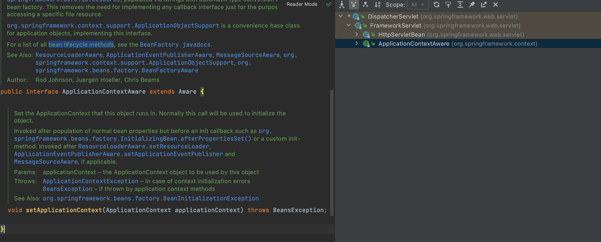

> control + h : 하이라키구조 단축키

- DispatcherServlet의 하이라키구조를 보면 `ApplicationContextAware` Interface를 구현하고있다.
- 들어가면 `setApplicationContext`라는 메서드를 정의하고 있다.
    - 설명을 읽어보면 빈을 컨테이너가 등록하고 관리하는 중에 컨테이너가 관리하는 Object를 Bean에다가 주입해주는 **lifecycle method**라는 것을 알 수있다.
    - 이 인터페이스를 구현한 어떤 클래스가 Bean으로 등록이 되면 스프링컨테이너는 인터페이스의 setter메서드를 통해 주입을 해준다.
    - 스프링컨테이너는 DispatcherServlet이 등록이 되는 시점에 ApplicationContext를 주입해줘야겠다 판단을 하고 자신을 집어넣어 준것

<br>

**HelloController도 ApplicationContextAware를 구현하도록 하여 ApplicationContext출력해보자.**

```java
package tobyspring.helloboot;

import java.util.Objects;
import org.springframework.beans.BeansException;
import org.springframework.context.ApplicationContext;
import org.springframework.context.ApplicationContextAware;
import org.springframework.web.bind.annotation.GetMapping;
import org.springframework.web.bind.annotation.RestController;

@RestController
public class HelloController implements ApplicationContextAware {

  private final HelloService helloService;
	private ApplicationContext applicationContext;

  public HelloController(HelloService helloService) {
    this.helloService = helloService;
  }

  @GetMapping("/hello")
  public String hello(String name) {
    return helloService.sayHello(Objects.requireNonNull(name));
  }

  @Override
  public void setApplicationContext(ApplicationContext applicationContext) throws BeansException {
		this.applicationContext = applicationContext;
    System.out.println(applicationContext);
  }
}
```

- 출력확인 완료

```bash
Root WebApplicationContext, started on Sun Mar 05 02:13:52 KST 2023
```
<br>

**생성자로 주입받는것도 가능**

```java
package tobyspring.helloboot;

import java.util.Objects;
import org.springframework.beans.BeansException;
import org.springframework.context.ApplicationContext;
import org.springframework.context.ApplicationContextAware;
import org.springframework.web.bind.annotation.GetMapping;
import org.springframework.web.bind.annotation.RestController;

@RestController
public class HelloController{

  private final HelloService helloService;
  private final ApplicationContext applicationContext;

  public HelloController(HelloService helloService, ApplicationContext applicationContext) {
    this.helloService = helloService;
    this.applicationContext = applicationContext;

    System.out.println(applicationContext);
  }

  @GetMapping("/hello")
  public String hello(String name) {
    return helloService.sayHello(Objects.requireNonNull(name));
  }

}
```

```bash
Root WebApplicationContext, started on Sun Mar 05 02:16:43 KST 2023
```

---

### SpringBootApplication

- main메서드 안에 웹컨테이너 및 스프링컨테이너를 생성하는 코드를 추출하여 재사용할 수 있도록 만들어주자.

```java
private static void run(Class<?>applicationClass, String... args) {
    AnnotationConfigWebApplicationContext applicationContext = new AnnotationConfigWebApplicationContext() {
      @Override
      protected void onRefresh() {
        super.onRefresh();

        ServletWebServerFactory serverFactory = this.getBean(ServletWebServerFactory.class);
        DispatcherServlet dispatcherServlet = this.getBean(DispatcherServlet.class);

        WebServer webServer = serverFactory.getWebServer(servletContext -> {
          servletContext.addServlet("dispatcherServlet", dispatcherServlet
          ).addMapping("/*");
        });
        webServer.start();
      }
    };
    applicationContext.register(applicationClass);
    applicationContext.refresh();
  }
```

> 이 때 메인메서드를 가지고 있는 클래스와 main메서드의 args는 변할 수 있기 때문에 변수로 받아준다.
> 

**이 클래스는 어떤 클래스?**

- @Configuration 이 붙은 클래스
- @ComponentScan과 팩토리메서드를 가지고 스프링컨테이너에게 어플리케이션 구성을 어떻게 할 것인가 정보를 알려주는 클래스

<br>

**메서드를 MySpringApplication클래스로 빼주자**

- 다른 어떤 main이 되는 클래스에서도 이 메서드를 재활용 할 수 있어야함.
    - 서블릿 컨테이너를 자동으로 띄워주고 스프링컨테이너에서 필요한 정보를 받아 빈을 등록하고 초기화해주는 작업

```java
package tobyspring.helloboot;

import org.springframework.boot.web.server.WebServer;
import org.springframework.boot.web.servlet.server.ServletWebServerFactory;
import org.springframework.web.context.support.AnnotationConfigWebApplicationContext;
import org.springframework.web.servlet.DispatcherServlet;

public class MySpringApplication {

  public static void run(Class<?> applicationClass, String... args) {
    AnnotationConfigWebApplicationContext applicationContext = new AnnotationConfigWebApplicationContext() {
      @Override
      protected void onRefresh() {
        super.onRefresh();

        ServletWebServerFactory serverFactory = this.getBean(ServletWebServerFactory.class);
        DispatcherServlet dispatcherServlet = this.getBean(DispatcherServlet.class);

        WebServer webServer = serverFactory.getWebServer(servletContext -> {
          servletContext.addServlet("dispatcherServlet", dispatcherServlet
          ).addMapping("/*");
        });
        webServer.start();
      }
    };
    applicationContext.register(applicationClass);
    applicationContext.refresh();
  }
}
```

```java
package tobyspring.helloboot;

import org.springframework.boot.web.embedded.tomcat.TomcatServletWebServerFactory;
import org.springframework.boot.web.servlet.server.ServletWebServerFactory;
import org.springframework.context.annotation.Bean;
import org.springframework.context.annotation.ComponentScan;
import org.springframework.context.annotation.Configuration;
import org.springframework.web.servlet.DispatcherServlet;

@Configuration
@ComponentScan
public class HellobootApplication {

  @Bean
  public ServletWebServerFactory servletWebServerFactory() {
    return new TomcatServletWebServerFactory();
  }

  @Bean
  public DispatcherServlet dispatcherServlet() {
    return new DispatcherServlet();
  }

  public static void main(String[] args) {
    MySpringApplication.run(HellobootApplication.class, args);
  }
}
```

> 스프링부트 어플리케이션을 처음 만들었을 때 형태와 똑같다.
> 
- 물론 윗부분의 팩터리메서드로 서블릿을 등록해주는 부분과 애노테이션은 다르다.
- @Configuration + @ComponentScan을 제거하는 부분은 후반부에 나온다.

<br>

**스프링부트에서 제공해주는 run메서드 사용**

MySpringApplication → SpringApplication

- 똑같이 잘 동작한다.

```java
package tobyspring.helloboot;

import org.springframework.boot.SpringApplication;
import org.springframework.boot.autoconfigure.SpringBootApplication;
import org.springframework.boot.web.embedded.tomcat.TomcatServletWebServerFactory;
import org.springframework.boot.web.servlet.server.ServletWebServerFactory;
import org.springframework.context.annotation.Bean;
import org.springframework.context.annotation.ComponentScan;
import org.springframework.context.annotation.Configuration;
import org.springframework.web.servlet.DispatcherServlet;

@Configuration
@ComponentScan
public class HellobootApplication {

  @Bean
  public ServletWebServerFactory servletWebServerFactory() {
    return new TomcatServletWebServerFactory();
  }

  @Bean
  public DispatcherServlet dispatcherServlet() {
    return new DispatcherServlet();
  }

  public static void main(String[] args) {
    SpringApplication.run(HellobootApplication.class, args);
  }
}
```

> 현재는 위에 웹서버팩토리, 디스패처서블릿을 등록하는 팩토리메서드를 제거하면 에러가 난다.
→ SpringBoot처음 시작할 땐 없어도 잘 됐는데 왜일까?
>
