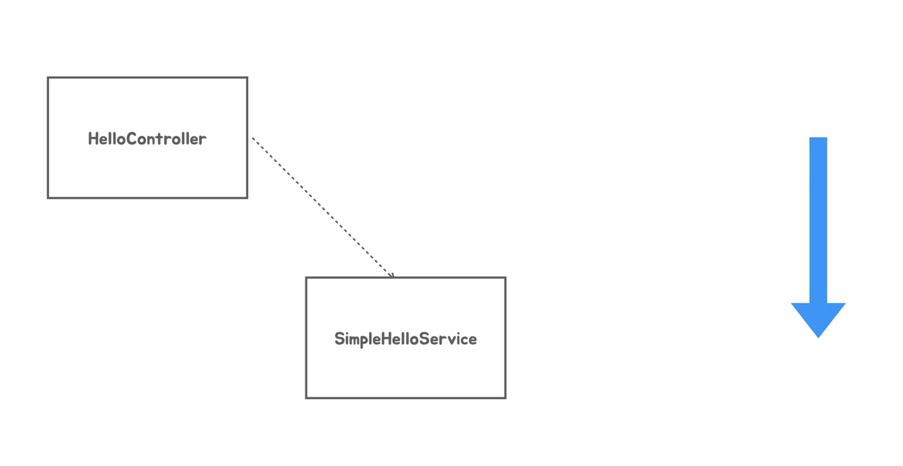
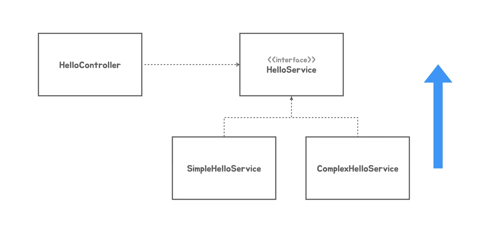
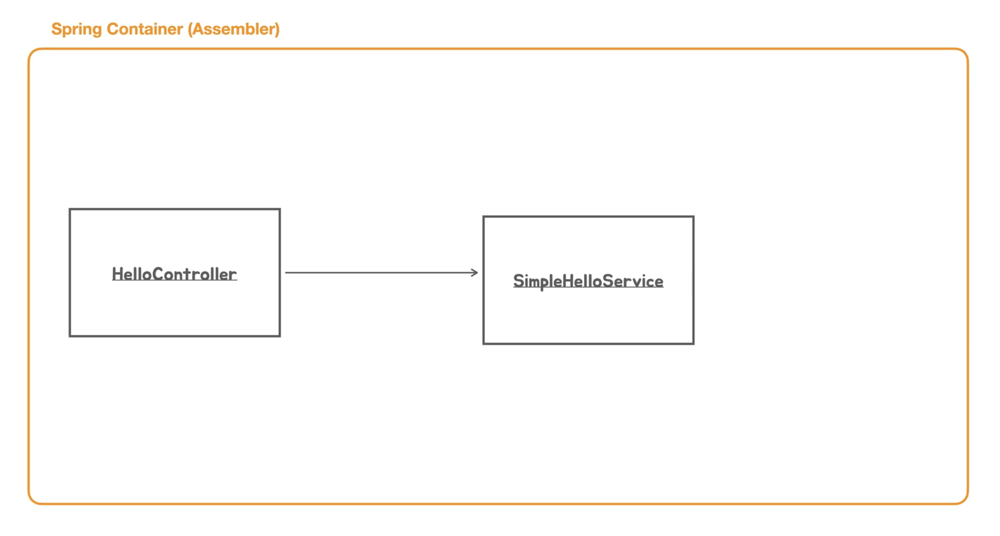
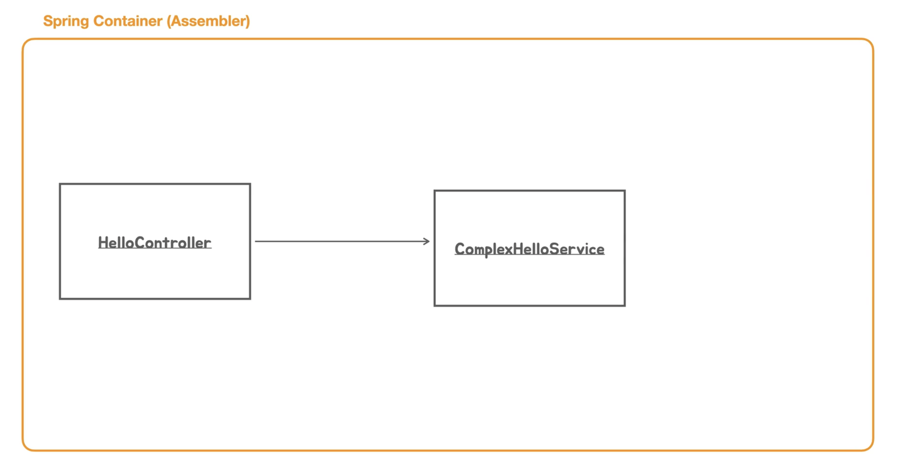
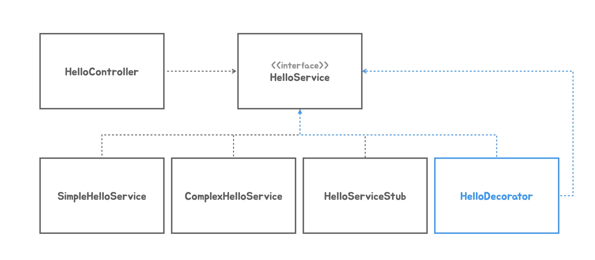
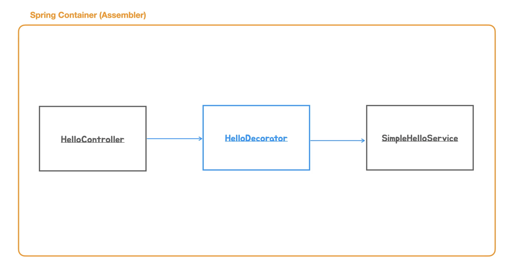
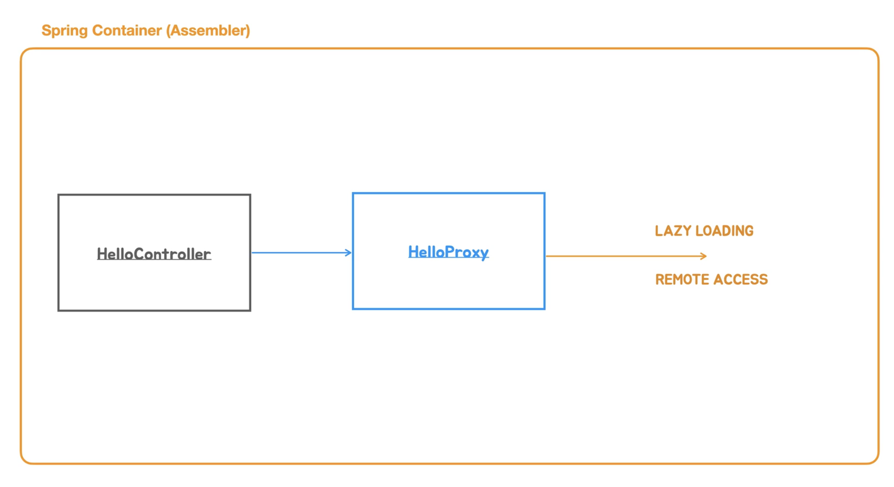
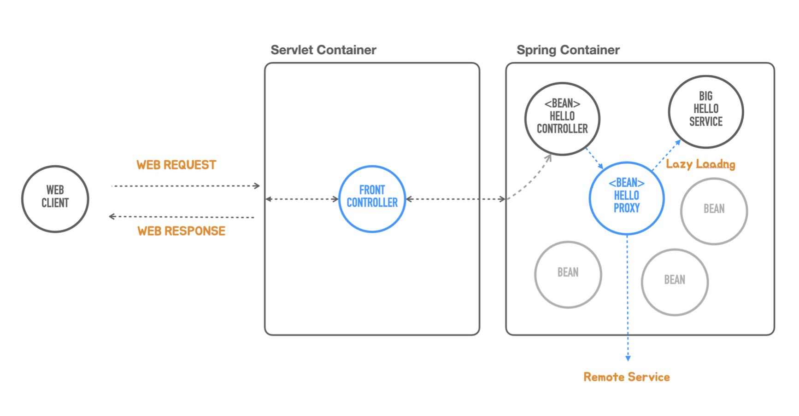

# [Section5] DI와 테스트, 디자인 패턴

기존엔 서버에 http 요청을 직접보내서, 응답을 눈으로 확인하는 httpie라는 툴을 이용해서 테스트를 했다.

```java
http localhost:8080/hello?name=Spring
```

- 요청을 매번 바꿀게 아니라면 편하게 쓸 수 있다.
- 하지만 매우 번거롭고, 사람이 검증하는거라 일일히 체크하지 않으면 기능이 잘 못 동작했는데 놓칠 수 도있다.

따라서 동작을 테스트하기 위해 **TestCode**를 사용하자.

### 테스트 코드를 이용한 테스트

- 개발자 테스트 : 개발자가 자신이 작성한 코드가 잘 동작하는지 빠르게 테스트 가능
- RestTemplate : 스프링에서 만든 클래스. api요청을 호출해서 응답을 가져올 수 있다.
    - 하지만 테스트 목적으로 쓰기에는 살짝 불편하다.
    - 정상적으로 결과를 가져올 때는 응답을 잘 돌려주지만, 서버에 문제가 있어 400~500에러가 날 경우 예외를 던진다.
- TestRestTemplate : 응답 자체를 순수하게 가져와서 상태코드, content-type 등을 체크할 수 있다.

> 예외를 잡아서 검증하는 방법도 있지만 TestRestTemplate을 쓰자
> 

1. `org.junit.Assert.*;`
2. `import org.assertj.core.api.Assertions;`
3. `import static org.junit.jupiter.api.Assertions.*;`

```java
package tobyspring.helloboot;

import org.assertj.core.api.Assertions;
import org.junit.jupiter.api.Test;
import org.springframework.boot.test.web.client.TestRestTemplate;
import org.springframework.http.HttpHeaders;
import org.springframework.http.HttpStatus;
import org.springframework.http.MediaType;
import org.springframework.http.ResponseEntity;

public class HelloApiTest {

  @Test
  void helloApi() {
    TestRestTemplate rest = new TestRestTemplate();

    // getForEntity(url, responseType, urlVariables)
    ResponseEntity<String> res = rest
        .getForEntity("http://localhost:8080/hello?name={name}", String.class, "Spring");

    // status code 200
    Assertions.assertThat(res.getStatusCode()).isEqualTo(HttpStatus.OK);

    // header(content-type) text/plain
    Assertions.assertThat(res.getHeaders().getFirst(HttpHeaders.CONTENT_TYPE))
        .startsWith(MediaType.TEXT_PLAIN_VALUE);

    // body Hello Spring
    Assertions.assertThat(res.getBody()).isEqualTo("Hello Spring");

  }
}
```

> `getHeaders()` 메서드는 응답값이 List이기 때문에 그중 첫번 째 Header를 가져와서 비교해준다.
> 

> `text/plain;charset=ISO-8859-1` : 바디가 영어로 올때는 인코딩 값이 상관없어서 앞부분만 테스트해주었지만, 한글이 들어갈 땐 인코딩값이 중요하다.
> 

> 메시지바디의 경우 응답값을 `String`으로 지정해놨기 때문에 `String`으로 비교해주면 된다.
> 

> 위 테스트는 서버가 돌아가는 동안 `HelloController`와 의존하고 있는 `SimpleHelloService` 가 전부 정상적으로 동작하는지 검증한 것
→ 네트워크 구간을 통해서 요청을 보내고 응답을 파싱하는 등 많은 과정이 필요함. 591ms
> 

---

### DI와 단위 테스트

- 서버를 실행시킬 필요없이 자바코드로만 테스트 가능하다.
- 테스트 하고싶은 클래스만 선택하여 집중테스트를 수행할 수 있다.
- **고립된 테스트가 가능하다.**

**SimpleHelloService Test**

- 메서드를 하나 가지고 있는 평범한 자바 클래스
- 의존 객체가 없는 코드인 SimpleHelloService는 인스턴스를 만들어 메서드 하나만 호출하면 된다

→ 간결한 과정을 거치기 때문에 속도가 굉장히 빠르다. 112ms

```java
package tobyspring.helloboot;

import org.assertj.core.api.Assertions;
import org.junit.jupiter.api.Test;

public class HelloServiceTest {

  @Test
  void simpleHelloService() {
    SimpleHelloService helloService = new SimpleHelloService();

    String ret = helloService.sayHello("Test");

    Assertions.assertThat(ret).isEqualTo("Hello Test");
  }

}
```

**HelloControllerTest**

- HelloController에 집중해서 테스트하고 싶지만 의존관계를 가지고있는 HelloService도 한번은 실행을 시켜줘야한다.
    - 하지만 HelloService 객체에서 안에서 무슨일이 일어날지 모른다. 만약 문제가 생긴다면 HelloControllerTest가 실패한다.
- 이런 걱정을 하지 않기 위해서는 **의존오브젝트로부터 고립**을 시켜줘야한다.
    - **Dependency Injection** 방식을 잘 활용하면 된다.
        
        ```java
        @RestController
        public class HelloController {
        
          private final HelloService helloService;
        
          public HelloController(HelloService helloService) {
            this.helloService = helloService;
          }
        
          @GetMapping("/hello")
          public String hello(String name) {
            return helloService.sayHello(Objects.requireNonNull(name));
          }
        
        }
        ```
        
- 테스트코드
    - SpringContainer를 띄우지 않았기 때문에, 생성자 파라미터에 HelloService구현체를 테스트 용으로 만들어서 직접 주입해줘야한다. → 이 과정을 스텁(stub)이라고 표현
        - 이것도 일종의 주입이기 때문에 수동DI라고도 부른다.
        - 어셈블러역할을 테스트코드가 해준 것.
        
        ```java
        HelloController helloController = new HelloController(name -> name);
        ```
        
    - 실패하는 과정에 대해서도 테스트 코드를 작성한다.
        - 이때 기존 HelloController의 `hello`메서드를 null체크 및 빈문자열 체크까지 하도록 수정해주고 더 적합한 예외를 던져준다.
            
            ```java
            @GetMapping("/hello")
            public String hello(String name) {
              if (name == null || name.trim().length() == 0) {
                throw new IllegalArgumentException();
              }
            
              return helloService.sayHello(name);
            }
            ```
            
    - 전체 코드
        
        ```java
        package tobyspring.helloboot;
        
        import org.assertj.core.api.Assertions;
        import org.junit.jupiter.api.Test;
        
        public class HelloControllerTest {
        
          @Test
          void helloController() {
            HelloController helloController = new HelloController(name -> name);
        
            String ret = helloController.hello("Test");
        
            Assertions.assertThat(ret).isEqualTo("Test");
          }
        
          @Test
          void failsHelloController() {
            HelloController helloController = new HelloController(name -> name);
        		
        		// 예외가 던져지는 코드를 람다식으로 넣어준다.
            Assertions.assertThatThrownBy(() -> {
              helloController.hello(null);
            }).isInstanceOf(IllegalArgumentException.class);
        
            Assertions.assertThatThrownBy(() -> {
              helloController.hello("");
            }).isInstanceOf(IllegalArgumentException.class);
          }
        
        }
        ```
        

**단위테스트**

- 지금까지 만든 테스트를 모두 단위테스트라고 한다.
    - 하지만 느슨하게 정의된 용어이기 때문에 hello api를 전체 단위로 볼껀데?라고하면 이 전체가 단위테스트가 될 수 있다.
- 통상적으로 환경에 의존하지 않고 (ex. 서버, 스프링컨테이너 없이) 하나의 대상 하나의 클래스 수준으로 빠르게 진행할 수 있도록 테스트 하는 것을 흔히들 **단위테스트**라고 부른다.
- 장점
    - 수행속도가 빠르다
    - 더 많이 더 자주 테스트 할 수 있다

**추가** 

- 궁극적으로 웹을 통해서 요청을 보내고 응답을 받는 것이기 때문에 웹으로 돌아가는 것도 테스트할 필요가 있다.
- api테스트 레벨에서 http요청을 직접 보내는 경우에도 이런 예외적인 상황에 대한 테스트를 만들어보자면.

```java
@Test
void failhelloApi() {
  TestRestTemplate rest = new TestRestTemplate();

  ResponseEntity<String> res = rest
      .getForEntity("http://localhost:8080/hello?name=", String.class);

  Assertions.assertThat(res.getStatusCode()).isEqualTo(HttpStatus.INTERNAL_SERVER_ERROR);
}
```

- 내부에서 예외를 던지기 때문에 서버에러인 500번대로 테스트 가능하다.
- 하지만 이런 경우 500에러보단 400번대 에러가 적합하다.
    - 500번대 에러 : 서버에 심각한 상황이 발생했거나 프로그램에 버그가 있어서 발생하는 경우에 주로 사용함
    - 400번대 에러 : 웹클라이언트가 요청정보를 잘못줬다거나 보안상에 문제가 있을 경우 사용함

> 이 응답코드를 만들어주려면 spring의 DispatcherServlet에 알려줘야함.
> 

---

### DI를 이용한 Decorator, Proxy패턴

**DI적용 전**



- HelloController가 SimpleHelloService를 직접의존하고 있는 형태
- SimpleHelloService의 변경이 HelloController에도 직접적으로 영향을 미친다.
- 의존관계 방향을 아래로

**DI적용 후**



- HelloController는 추상화된 HelloServie만 의존하고, 밑에 구현서비스들이 HelloService인터페이스를 구현하도록 만듬
- 의존관계 방향을 위로

**DI의 장점**

- HelloController의 코드를 전혀 고치지 않고 HelloService인터페이스를 구현한 클래스를 교체해가면서 다양하게 적용하는게 가능하다.
    - 이런작업을 해줄 때 필요한게 **DI**
    - HelloController는 구현클래스에 직접의존하지는 않았지만 Runtime시에는 구현클래스를 사용할 수 밖에 없다. (사실은 의존을 하는 것)
    - 이 의존관계는 Spring Container(Assembler)가 주입해준다.
        - 주입방법 : 생성자, setter, 팩토리메서드 등
    
                

- 동적이기 때문에 Spring Container(Assembler)의 도움을 받아 자유롭게 바꿀 수 있다.
    - HelloController가 의존하고 있는 것은 ComplexHelloService다라고 정보를 제공하면됨.
    
        

**Decorator 패턴**



- HelloDecorator는 HelloService를 구현하는 동시에 의존하고 있는 관계이다.
    - 마치 HelloController처럼
    - 즉, HelloService를 구현한 오브젝트를 호출할 수 있다는 것

**사용 목적과 방법**



- 목적 : 기존 오브젝트의 코드를 수정하지 않고 Decorator패턴과 DI 구조를 이용하면 동적으로 새로운 기능을 추가할 수 있다.
    - 원래 HelloController는 메인이 되는 중요한 로직을 가지고있는 SimpleHelloService만 의존하고 있었다.
    - 하지만 이 코드들을 건들이지 않고 어떤 책임, 어떤 기능을 추가하고 싶을 때 HelloDecorator를 중간에 삽입해 줄 수 있다.
- 방법 : HelloController가 SimpleHelloService를 직접의존하는게 아니라 중간에 HelloDecorator를 한번 의존하고 HelloDecorator가 다시 SimpleHelloService를 의존하도록 Spring Container(Assembler)에게 구성정보를 제공하면 된다.

> 하나가 아니라 여러개의 데코레이터를 사용할 수 있다.
> 

**AutoWiring**


- 이 때까지 작성한 코드를 보면 SimpleHelloService를 사용하라고 명시해준적은 없지만 자동으로 SimpleHelloService가 주입이 되었다.
- 이유 : SpringContainer는 등록된 BeanObject중에 HelloSrivce인터페이스 구현체가 있는지 찾아본다. 그리고 만약 단 1개의 BeanObject만 존재할 경우 의존대상이라 여긴다.
    - 즉 **단일 주입 후보**를 찾게 되면 이를 **자동으로 주입**한다. → **AutoWiring**

> 과거엔 `@Autowired` 라는 애노테이션이 필요했다.
> 
> 
> ```java
> @Autowired
> public HelloController(HelloService helloService) {
>   this.helloService = helloService;
> }
> ```
> 
> 하지만 Spring 4.3버전부터 `@Autowired`생략하여도 클래스의 생성자가 1개라면 파라미터타입과 일치하는 빈을 찾아서 주입해주는 Autowiring을 자동으로 적용해준다.
> 

**데코레이터를 적용하게 되면?**

- 2개의 HelloService구현체가 빈으로 등록되는 것
- HelloController → HelloDecorator → HelloSimpleService를 의존하도록 구성해줘야한다.
    - 방법1 : 명시적으로 설정파일(xml)을 만든다.
    - 방법2 : 팩토리메서드로 자바코드에 의한 구성정보를 직접 만든다.
    - 방법3 : 후보가 두개인 경우 우선순위를 지정한다. `@Primary`

**예제**

```java
package tobyspring.helloboot;

import org.springframework.context.annotation.Primary;
import org.springframework.stereotype.Service;

@Service // 컴포넌트 스캐너가 사용할 수 있도록
@Primary // 여러 DI 후보 오브젝트가 있을 경우 우선적으로 주입할 수 있게하는 식별자
public class HelloDecorator implements HelloService {

  private final HelloService helloService;
	
	// 생성자를 통해 또 주입을 받고록 한다.
  public HelloDecorator(HelloService helloService) {
    this.helloService = helloService;
  }

  @Override
  public String sayHello(String name) {
		// *표시 장식 기능을 추가한다.
    return "*" + helloService.sayHello(name) + "*";
  }
}
```

> HelloController에 HelloDecorator가 주입된 후에는 후보가 하나 남기 때문에 SimpleHelloService가 HelloDecorator에 주입된다.
> 

**테스트코드**

```java
public class HelloApiTest {

  @Test
  void helloApi() {
    TestRestTemplate rest = new TestRestTemplate();

    ResponseEntity<String> res = rest
        .getForEntity("http://localhost:8080/hello?name={name}", String.class, "Spring");

    Assertions.assertThat(res.getStatusCode()).isEqualTo(HttpStatus.OK);

    Assertions.assertThat(res.getHeaders().getFirst(HttpHeaders.CONTENT_TYPE))
        .startsWith(MediaType.TEXT_PLAIN_VALUE);

    Assertions.assertThat(res.getBody()).isEqualTo("*Hello Spring*"); 
  }
	...

}
```

```java
public class HelloServiceTest {

  ...
  @Test
  void helloDecorator() {
    HelloDecorator decorator = new HelloDecorator(name -> name);

    String ret = decorator.sayHello("Test");

    Assertions.assertThat(ret).isEqualTo("*Test*");
  }

}
```

> 부가기능이 잘 적용이 됐는가 테스트를 해준다.
> 

> 추가 : 하나가 아니라 여러개의 데코레이터를 사용할 수 있다.
이 경우엔 Primary방식보단 Java코드로 명시적으로 정의해주는게 더 나은 방법일 수 있다.
> 

**ProxyPattern**

- 실체가 존재하지만 실체 대신 대리자를 통해 접근하는 것
    - 대리자를 통해 부가효과를 가질 수 있음.
- Lazy Loading
    - 실제 로직을 가지고 있는 오브젝트가 굉장히 크고 비쌀 경우
        - 만드는데 시간도 오래걸리고 메모리도 많이 점유할 경우
    - 이 오브젝트를 굳이 서버가 시작할 때 미리 만들어 둘 필요가 없다.
    - 정말 필요로하는 시점에 클라이언트의 첫번 째 요청이 들어오면 오브젝트를 만들어 최대한 지연시켜서 가져온다
- Remote Access
    - 클라이언트는 local에 오브젝트가 구현되어있다 생각했지만 사실 api를 타고 네트워크 너머 서버에 존재하는 오브젝트를 사용하는 경우
    - 클라이언트는 인터페이스를 통해 local에 있는 오브젝트를 사용하는 느낌으로 호출하면 Proxy가 api호출을 통해 remote에 있는 오브젝트를 수행시켜 결과를 받아 반환해주는 역할을 한다.
    


결론 : HelloController는 LazyLoading으로 오브젝트가 생성되는지 또는 remote에 있는 오브젝트를 호출하는 지 모른다. 



- 방식 바뀐다 하더라도 HelloController에 영향이 없게끔 Proxy가 대리자 역할을 해준다.
- 그외에도 보안이나 access controll에 사용된다.

<aside>
💡 실제로 우리가 만드는 Spring Application이나 JPA등에서도 Proxy를 굉장히 많이 사용한다.

</aside>
<br>
<aside>
💡 DI가 가능한 구조로 설계해두면 위와같은 다양한 종류의 유연함을 코드에 제공해줄 수 있다.

</aside>