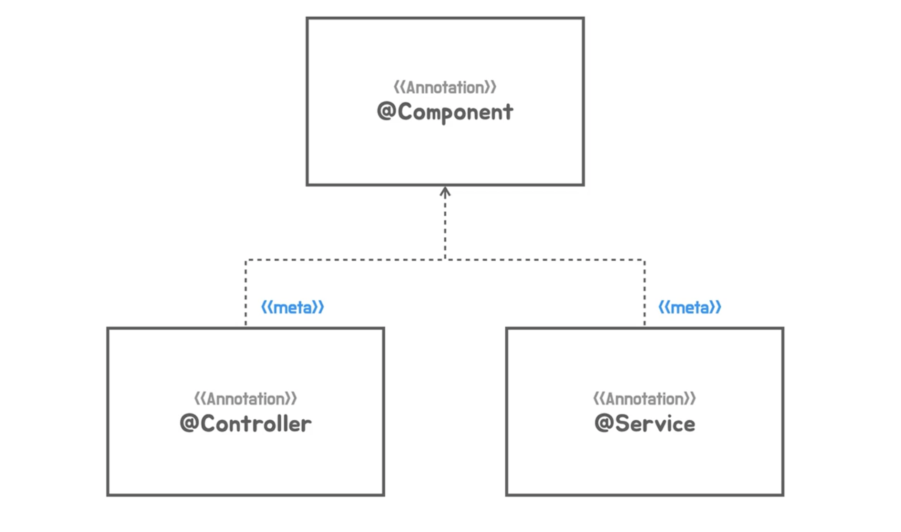
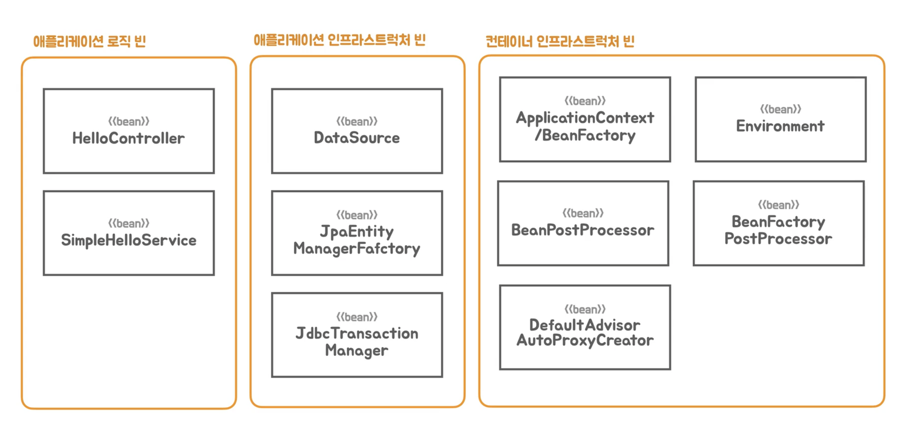
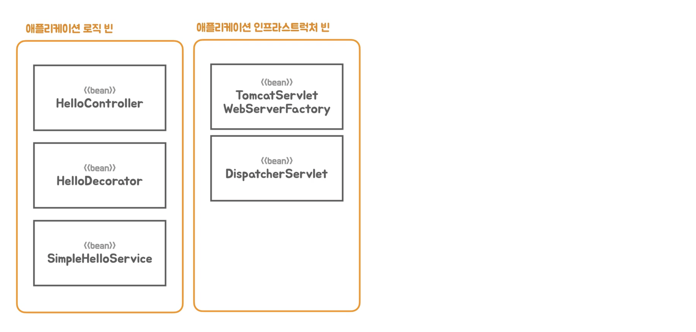
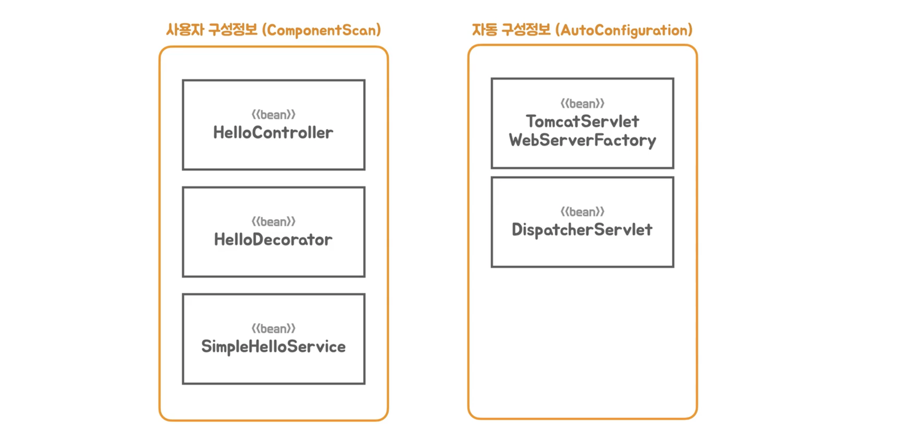
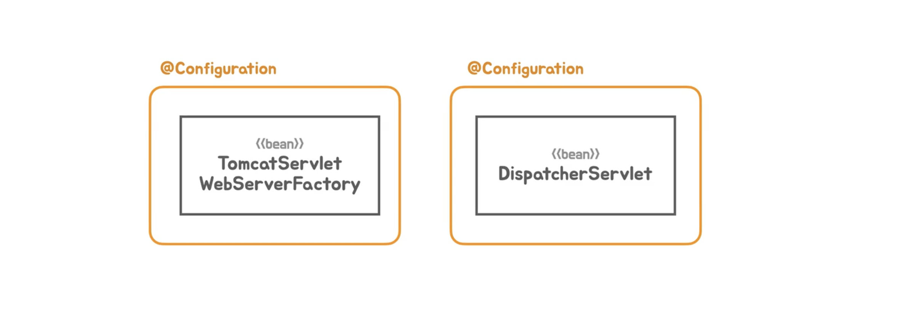
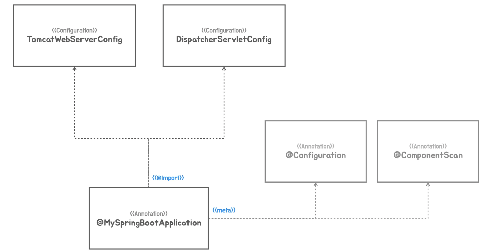
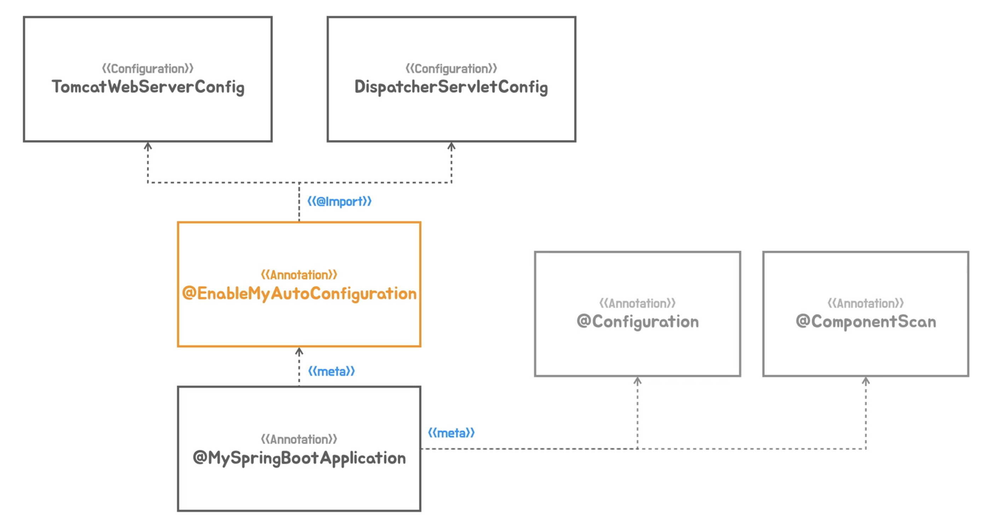
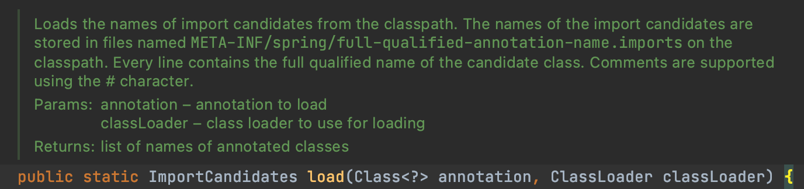
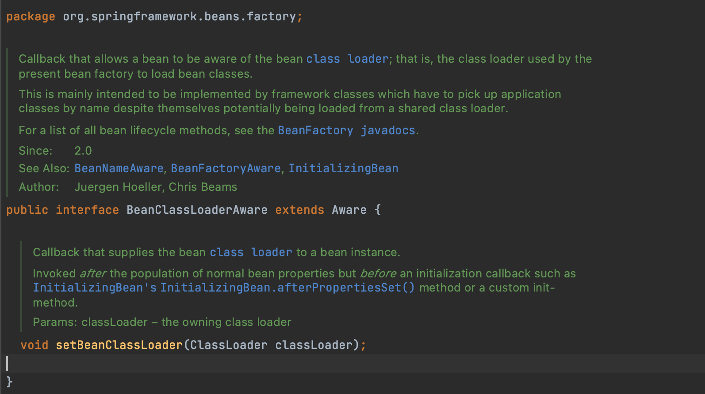
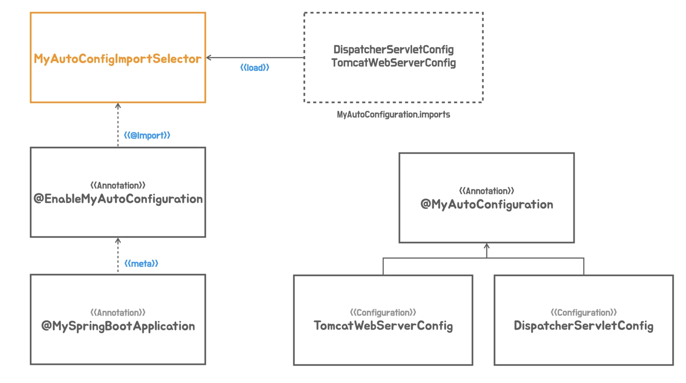

# [Section6] 자동 구성 기반 애플리케이션

@AutoConfiguration

- 원래 Spring에 있는 기술을 Boot가 효과적으로 활용하는 방법을 제공해줌.

### 메타 애노테이션과 합성 애노테이션

**Meta-annotation**



- 애노테이션에 적용한 애노테이션을 메타 애노테이션이라고 한다.
    
    ```java
    @Target(ElementType.TYPE)
    @Retention(RetentionPolicy.RUNTIME)
    @Documented
    @Component // 메타 애노테이션
    public @interface Service {
    	...
    }
    ```
    
- 장점
    1. 메타 애노테이션이붙은 애노테이션을 사용하면 메타 애노테이션이 적용된 것과 기능적인 차이가 없다.
        - @Component를 붙이는 것과 @Service를 붙이는 것이 Component Scanner가 바라볼 때 동일하다.
    2. 다른이름을 부여하면 코드를 읽을 때 추가적인 정보를 알 수 있다.
        - *Spring의 Bean으로 등록되는구나*  + *비지니스 로직을 담당하는 Service역할을 하는구나*
    3. 부가적인 효과를 기대할 수 있다.
        - @Controller애노테이션이 붙으면 DispatcherServlet이 WebController로 사용되어 지는 구나를 인식하고 애노테이션을 사용한 매핑정보(RequestMapping, GetMapping 등)을 찾는다.
    4. 애노테이션을 새롭게 만들면 메타애노테이션에 없었던 새로운 엘리먼트를 추가할 수 있다.
        - 애노테이션의 기능을 확장할 수 있다.
- 메타애노테이션을 상속이라는 개념과 혼동하면안된다. (상속이라는 개념은 없다.)
    - 모든 애노테이션이 전부 메타애노테이션이 될 수 없다.
    - 애노테이션에는 retention과 타깃정보를 줘야하는데 타깃에 *`ANNOTATION_TYPE`* 을 가지고 있어야만 메타애노테이션이 될 수 있다.
        - 타킷 : 애노테이션이 적용될 수 있는 위치

**예제**

메타애노테이션 만들어보기

```java
@Retention(RetentionPolicy.RUNTIME)
@Target(ElementType.METHOD)
@UnitTest // 메타 애노테이션
@interface FastUnitTest{
}

@Retention(RetentionPolicy.RUNTIME)
@Target({ElementType.METHOD, ElementType.ANNOTATION_TYPE})
@Test // 메타 애노테이션
@interface UnitTest{
}

public class HelloApiTest {

  @FastUnitTest
  void helloApi() {
    ...
  }
	...
}
```

**Composed-annotation**


- 메타애노테이션을 1개 이상 적용해서 만든 애노테이션을 합성애노테이션이라고 부른다.
    - 합성애노테이션을 사용하면 여러개의 메타애노테이션들이 적용되어있는 것과 동일한 효과를 가진다.

```java
@Target(ElementType.TYPE)
@Retention(RetentionPolicy.RUNTIME)
@Documented
@Controller
@ResponseBody
public @interface RestController {
	...
}
```

> `@RestController` = `@Controller` + `@ResponseBody`
> 

---

### 합성 애노테이션의 적용

**기존코드**

```java
@Configuration
@ComponentScan
public class HellobootApplication {

  @Bean
  public ServletWebServerFactory servletWebServerFactory() {
    return new TomcatServletWebServerFactory();
  }

  @Bean
  public DispatcherServlet dispatcherServlet() {
    return new DispatcherServlet();
  }

  public static void main(String[] args) {
    SpringApplication.run(HellobootApplication.class, args);
  }
}
```

**스프링부트코드**

```java
package tobyspring.helloboot;

import org.springframework.boot.SpringApplication;

@SpringBootAnnotaion
public class HellobootApplication {

  public static void main(String[] args) {
    SpringApplication.run(HellobootApplication.class, args);
  }
}
```

- 애노테이션도 하나고 서블릿컨테이너와 디스패처서블릿을 만들어주는 팩토리 메서드도 없다.
- 스프링부트와 비슷하게 만들어보자.

**합성 애노테이션 생성**

```java
package tobyspring.helloboot;

import java.lang.annotation.ElementType;
import java.lang.annotation.Retention;
import java.lang.annotation.RetentionPolicy;
import java.lang.annotation.Target;
import org.springframework.context.annotation.ComponentScan;
import org.springframework.context.annotation.Configuration;

@Retention(RetentionPolicy.RUNTIME)
@Target(ElementType.TYPE)
@Configuration // 메타 애노테이션
@ComponentScan // 메타 애노테이션
public @interface MySpringBootAnnotaion {

}
```

- `@Retention` : default값은 class이다. 따라서 지정을 안해줄 경우 애노테이션정보가 complie된 클래스 정보까지는 살아있고 runtime에 메모리로 로딩할 경우 정보가 사라진다.
- `@Target` : HellobootApplication클래스에 지정해야하기 때문에 Type으로 지정한다.
    - Type = { Class, Interface, Enum}

**서블릿관련 빈구성정보 등록**

```java
package tobyspring.helloboot;

import org.springframework.boot.web.embedded.tomcat.TomcatServletWebServerFactory;
import org.springframework.boot.web.servlet.server.ServletWebServerFactory;
import org.springframework.context.annotation.Bean;
import org.springframework.context.annotation.Configuration;
import org.springframework.web.servlet.DispatcherServlet;

@Configuration
public class Config {
  @Bean
  public ServletWebServerFactory servletWebServerFactory() {
    return new TomcatServletWebServerFactory();
  }

  @Bean
  public DispatcherServlet dispatcherServlet() {
    return new DispatcherServlet();
  }
}
```

- `@Componet`로 지정해서 스캔되도록 하면되지만, 사실 `@Configuration` 도 `@Componet`를 메타 애노테이션을 가지고있다.
    
    ```java
    @Target(ElementType.TYPE)
    @Retention(RetentionPolicy.RUNTIME)
    @Documented
    @Component
    public @interface Configuration {
    	...
    }
    ```
    
- 따라서 설정 클래스라는 명확한 정보를 제공하기 위해 `@Configuration`를 사용하자.

**결과**

```java
package tobyspring.helloboot;

import org.springframework.boot.SpringApplication;

@MySpringBootAnnotaion
public class HellobootApplication {

  public static void main(String[] args) {
    SpringApplication.run(HellobootApplication.class, args);
  }
}
```

---

### 빈 오브젝트의 역할과 구분

**스프링컨테이너에 올라가는 빈 구분법**



- 애플리케이션 빈
    - 개발자가 어떤 빈을 사용하겠다 명시적으로 구성정보를 제공하고 제공된 Configuration 메타 데이터를 이용해서 SpringContainer가 빈으로 등록한 빈
    - 애플리케이션 로직 빈 : 애플리케이션의 기능, 비지니스로직, 도메인로직을 담고있는 빈
        - 개발자가 직접 작성하는 빈
    - 애플리케이션 인프라스트럭쳐 빈 : 애플리케이션 동작에 필요한 기술과 관련된 빈.
        - 개발자가 직접 작성하진 않으나 명시적으로 구성정보를 제공해야 애플리케이션이 정상 작동하는
- 컨테이너 인프라스트럭처 빈
    - SpringContainer자신이거나 SpringContainer가 기능을 확장하면서 추가해온 것들을 빈으로 등록해서 사용하는 빈
    - 즉, SpringContainer의 기능을 확장해서 빈의 등록, 생성, 초기화, 관계설정 등 lifecycle을 관리하는 작업에 참여하는 빈
    - 이는 개발자가 등록하는게 아닌 SpringContainer가 자동으로 등록한다.
    
    > BeanPostProcessor / BeanFactoryPostProcessor
    > 
    > - SpringContainer의 기능을 확장하는 처리자 (SpringContainer의 기능)
    >     - Spring3.0이후 자바코드로 구성정보를 등록하는 기능도 이 처리자를 통해 만들어짐
    > - 이 처리자들 또한 빈으로 등록되어있기 때문에 확장기능을 사용할 수 있는 것
  


- TomcatServletWebServerFactory와 DispatcherServlet은 애플리케이션 인프라스트럭처 빈이다.
    - SpringMVC에서 DispatcherServlet은 SpringContainer에 직접 서블릿으로 등록해서 썼지만, 서블릿 컨테이너는 따로 설치해서 실행했기 때문에 TomcatServletWebServerFactory는 빈으로 등록될 필요가 없었음.
    - 하지만 SpringBoot는 독립 실행형 애플리케이션이기 때문에 이 두가지가 무조건 Bean으로 등록이 되어야하고 애플리케이션 정상동작에 필요하다.
  


- 좌측은 사용자 구성정보를 이용해서 등록하는 빈
- 우측은 자동 구성정보로 구성정보가 만들어지는 종류의 빈 (AutoConfiguraion)

**AutoConfiguraion**



- 기능으로 구분을 하여 빈을 생성하는 Configuration클래스를 따로 구성한다.
- 스프링컨테이너가 어플리케이션 필요에 따라 필요한 Configuration을 골라서 자동으로 구성해준다.

---

### 인프라 빈 구성 정보의 분리

1. 애플리케이션 로직빈과 분리된 패키지에 애플리케이션 인스트럭쳐 빈을 등록한다. 
- 추후 자동구성의 대상으로 삼기위해 `autoconfig` 라는 패키지로 분리한다.
- 이 때 기능으로 클래스를 구분하여 Bean을 등록한다.

```java
package tobyspring.config.autoconfig;

import org.springframework.context.annotation.Bean;
import org.springframework.context.annotation.Configuration;
import org.springframework.web.servlet.DispatcherServlet;

@Configuration
public class DispatcherServletConfig {

  @Bean
  public DispatcherServlet dispatcherServlet() {
    return new DispatcherServlet();
  }
}
```

```java
package tobyspring.config.autoconfig;

import org.springframework.boot.web.embedded.tomcat.TomcatServletWebServerFactory;
import org.springframework.boot.web.servlet.server.ServletWebServerFactory;
import org.springframework.context.annotation.Bean;
import org.springframework.context.annotation.Configuration;

@Configuration
public class TomcatWebServerConfig {

  @Bean
  public ServletWebServerFactory servletWebServerFactory() {
    return new TomcatServletWebServerFactory();
  }
}
```

2. `@Import` 애노테이션을 사용하여 분리된 패키지의 컴포넌트들을 스캔에 포함시킨다.

- `@Import` : 컴포넌트 애노테이션이 붙은 클래스들을 구성정보에 직접 추가하는 애노테이션. 스캔대상은 아니지만 이를 통해 추가할 수 있다.

```java
@Retention(RetentionPolicy.RUNTIME)
@Target(ElementType.TYPE)
@Configuration
@ComponentScan
@Import({TomcatWebServerConfig.class, DispatcherServletConfig.class})
public @interface MySpringBootApplication {

}
```



3. `@EnableMyAutoConfiguration` 생성
- autoconfig의 빈이 늘어날 때 마다 `@MySpringBootApplication`의 Import문이 점점 늘어날 것이다.
- 최상위 레벨에 애너테이션의 정보들이 나열되는 것을 피하기 위해 새로운 애너테이션을 생성해준다.
    - 현재는 하드코딩되어 있다.

```java
package tobyspring.config;

import java.lang.annotation.ElementType;
import java.lang.annotation.Retention;
import java.lang.annotation.RetentionPolicy;
import java.lang.annotation.Target;
import org.springframework.context.annotation.ComponentScan;
import org.springframework.context.annotation.Configuration;

@Retention(RetentionPolicy.RUNTIME)
@Target(ElementType.TYPE)
@Configuration
@ComponentScan
@EnableMyAutoConfiguration
public @interface MySpringBootApplication {

}
```

```java
package tobyspring.config;

import java.lang.annotation.ElementType;
import java.lang.annotation.Retention;
import java.lang.annotation.RetentionPolicy;
import java.lang.annotation.Target;
import org.springframework.context.annotation.Import;
import tobyspring.config.autoconfig.DispatcherServletConfig;
import tobyspring.config.autoconfig.TomcatWebServerConfig;

@Retention(RetentionPolicy.RUNTIME)
@Target(ElementType.TYPE)
@Import({TomcatWebServerConfig.class, DispatcherServletConfig.class})
public @interface EnableMyAutoConfiguration {

}
```



---

### 동적인 자동 구성 정보 등록

- 동적으로 구성정보를 등록하기 위해선 @Import만으로는 안된다. (하드코딩)
- `selectImports` 메서드를 사용하자.
    
    ```java
    package org.springframework.context.annotation;
    
    import java.util.function.Predicate;
    
    import org.springframework.core.type.AnnotationMetadata;
    import org.springframework.lang.Nullable;
    
    public interface ImportSelector {
    
    	/**
    	 * Select and return the names of which class(es) should be imported based on
    	 * the {@link AnnotationMetadata} of the importing @{@link Configuration} class.
    	 * @return the class names, or an empty array if none
    	 */
    	String[] selectImports(AnnotationMetadata importingClassMetadata);
    
    	...
    
    }
    ```
    
    - AnnotationMetadata를 전달 받고, Import할 @Configuration클래스이름을 String으로 만들어 반환한다.
    - 코드안에 직접 클래스이름이 박히는게 아닌, 외부에서 동적으로 클래스 이름들을 선택해서 가져올 수 있다.
        - 데이터베이스에서 정보를 읽어올 수 도 있고 외부 설정파일을 사용할 수 도있음.
        - 혹은 코드에 의해 동적으로 선택해서 가져올 수 있음.
    
    **예제**
    
    ```java
    package tobyspring.config;
    
    import org.springframework.context.annotation.DeferredImportSelector;
    import org.springframework.core.type.AnnotationMetadata;
    
    public class MyAutoConfiImportSelector implements DeferredImportSelector {
    
      @Override
      public String[] selectImports(AnnotationMetadata importingClassMetadata) {
        return new String[]{
            "tobyspring.config.autoconfig.DispatcherServletConfig",
            "tobyspring.config.autoconfig.TomcatWebServerConfig"
        };
      }
    }
    ```
    
    > 실제 코드에선 ImportSelector말고 DeferredImportSelector를 사용했다.
    > 
    
    ```java
    package tobyspring.config;
    
    import java.lang.annotation.ElementType;
    import java.lang.annotation.Retention;
    import java.lang.annotation.RetentionPolicy;
    import java.lang.annotation.Target;
    import org.springframework.context.annotation.Import;
    
    @Retention(RetentionPolicy.RUNTIME)
    @Target(ElementType.TYPE)
    @Import(MyAutoConfiImportSelector.class) // Import에 클래스 정보를 줌.
    public @interface EnableMyAutoConfiguration {
    
    }
    ```
    

---

### 자동 구성 정보 파일 분리

- 자동 구성 정보를 외부 파일에서 규격화된 방식으로 가져오도록 분리한다.
- 추후 스프링 자동 구성 클래스 지정을 위한 `@MyAutoConfiguration` 이라는 애노테이션을 만들고
    
    ```java
    package tobyspring.config;
    
    import java.lang.annotation.ElementType;
    import java.lang.annotation.Retention;
    import java.lang.annotation.RetentionPolicy;
    import java.lang.annotation.Target;
    import org.springframework.context.annotation.Configuration;
    
    @Retention(RetentionPolicy.RUNTIME)
    @Target(ElementType.TYPE)
    @Configuration
    public @interface MyAutoConfiguration {
    
    }
    ```
    
- `ImportCandidates.load` 메서드 사용하여 외부파일을 읽어온다.
    - 자동 구성정보 **후보**들을 읽어온다.
      - 파일에 configuration 클래스를 넣어놨다고 해서 전부 구성정보로 쓰는 것이 아니다.
      - 후보로 잡고 나중에 결정할 수 있다.
  
        

    - META-INF/spring/tobyspring.config.MyAutoConfiguration.imports
        
        ```
        tobyspring.config.autoconfig.TomcatWebServerConfig
        tobyspring.config.autoconfig.DispatcherServletConfig
        ```
        
        > 컨테이너에 등록시킬 클래스 이름을 작성해놓는다.
        > 
        

**MyAutoConfiImportSelector 수정**

```java
public class MyAutoConfiImportSelector implements DeferredImportSelector {

  private final ClassLoader classLoader;

  public MyAutoConfiImportSelector(ClassLoader classLoader) {
    this.classLoader = classLoader;
  }

  @Override
  public String[] selectImports(AnnotationMetadata importingClassMetadata) {
    List<String> autoConfigs = new ArrayList<>();

    ImportCandidates.load(MyAutoConfiguration.class, classLoader).forEach(autoConfigs::add);

    return autoConfigs.toArray(new String[0]);
  }
}
```

- classLoader빈을 SpringContainer에게 자동으로 주입받도록 **생성자**를 만들어준다.
- section4에서 봤던 `BeanClassLoaderAware`를 구현하는 방법도 있음
    - 하지만 요즘 대세는 setter보단 **생성자**
  
    

> ArrayList → arr 바꾸는 여러가지 방법
> 
> - autoConfigs.stream().toArray(String[]::new);
> - Arrays.copyOf(autoConfigs.toArray(), autoConfigs.size(), String[].class);

---

### 자동 구성 애노테이션 적용

`@Configuration` → `@MyAutoConfiguration`

- 애플리케이션 인프라스트럭쳐 빈의 Configuration애너테이션을 MyAutoConfiguration으로 바꾼다.
    - MyAutoConfiguration은 Configuration를 메타 애너테이션으로 가지고있음.
- Configuration를 계속 사용해도 impors파일에 등록되어 있기 때문에 기능상 정상동작하지만, 개발자에게 자동구성클래스라는 것을 알리기 위해 MyAutoConfiguration을 사용한다. (관례)

```java
package tobyspring.config.autoconfig;

import org.springframework.boot.web.embedded.tomcat.TomcatServletWebServerFactory;
import org.springframework.boot.web.servlet.server.ServletWebServerFactory;
import org.springframework.context.annotation.Bean;
import tobyspring.config.MyAutoConfiguration;

@MyAutoConfiguration
public class TomcatWebServerConfig {

  @Bean
  public ServletWebServerFactory servletWebServerFactory() {
    return new TomcatServletWebServerFactory();
  }
}
```

```java
package tobyspring.config.autoconfig;

import org.springframework.context.annotation.Bean;
import org.springframework.web.servlet.DispatcherServlet;
import tobyspring.config.MyAutoConfiguration;

@MyAutoConfiguration
public class DispatcherServletConfig {

  @Bean
  public DispatcherServlet dispatcherServlet() {
    return new DispatcherServlet();
  }
}
```

**proxyBeanMethods = false**

- 자동구성애너테이션의 proxyBeanMethods를 false로 만든다.
    - default는 true.
    - 등록된 @Bean메서드들이 의존하는@Bean메서드가 없기 때문에 꺼도 된다 → 비용절감

```java
package tobyspring.config;

import java.lang.annotation.ElementType;
import java.lang.annotation.Retention;
import java.lang.annotation.RetentionPolicy;
import java.lang.annotation.Target;
import org.springframework.context.annotation.Configuration;

@Retention(RetentionPolicy.RUNTIME)
@Target(ElementType.TYPE)
@Configuration(proxyBeanMethods = false)
public @interface MyAutoConfiguration {

}

```

**구조 도식화**



- `@EnableMyAutoConfiguration`에서 configuration 클래스를 직접 import하는 대신에 `ImportSelector`를 적용함.
- `ImportSelector` 는 `@MyAutoConfiguration`과 이름이 같은 imports 파일에서 configuration 클래스 이름 목록을 load하여 Import되도록한다.
- `@MyAutoConfiguration` 는 애플리케이션 인프라스트럭쳐 빈의 @Configuration 대신 쓰임.

---

### @Configuration과 proxyBeanMethods

학습테스트코드

- 새로운 기술을 익힐 때 테스트코드를 만들어서 확인해보면 사용법을 이해하고 연습할 수 있음

**테스트할 static클래스 만들기**

```java
@Configuration
static class MyConfig {
  @Bean
  Common common(){
    return new Common();
  }

  @Bean
  Bean1 bean1(){
    return new Bean1(common());
  }

  @Bean
  Bean2 bean2(){
    return new Bean2(common());
  }
}

static class Bean1{
  private final Common common;

  Bean1(Common common){
    this.common = common;
  }
}

static class Bean2{
  private final Common common;

  Bean2(Common common){
    this.common = common;
  }
}

static class Common {
}
```

`@Configuration`클래스 특징

- `@Bean`애노테이션이 붙은 메서드를 많이 가지고 있다.
- 각각의 메서드들이 자바코드에 의해 빈 오브젝트를 직접 생성하고 관계를 맺음. → 팩토리 메서드 패턴
- 스프링에 등록되는 오브젝트들은 싱글톤으로 등록된다.
    
    > 싱클톤이란?
    > 
    > 
    > ```
    > Bean1 <-- Common
    > Bean2 <-- Common
    > ```
    > 
    > - Bean1, Bean2가 의존하는 Common오브젝트가 동일하다.
- 하지만 자바코드에 의해서는 이렇게 만들기 어렵다. 아래 테스트를 돌려보면 Common오브젝트가 같지 않다.
    
    ```java
    @Test
    void configuration(){
      MyConfig myConfig = new MyConfig();
      Bean1 bean1 = myConfig.bean1();
      Bean2 bean2 = myConfig.bean2();
      Assertions.assertThat(bean1.common).isNotEqualTo(bean2.common);
    }
    ```
    

**스프링 컨테이너의 구성정보로 MyConfig등록하기**

```java
@Test
void springConfiguration(){
  AnnotationConfigApplicationContext ac = new AnnotationConfigApplicationContext();
  ac.register(MyConfig.class);
  ac.refresh();

  Bean1 containerBean1 = ac.getBean(Bean1.class);
  Bean2 containerBean2 = ac.getBean(Bean2.class);

  Assertions.assertThat(containerBean1.common).isEqualTo(containerBean2.common);
}
```

- Bean1, Bean2가 의존하는 Common오브젝트가 동일하다. 어떻게 된걸까?
- **proxyBeanMethods** 설정값은 기본적으로 **true**로 설정되어있다.
- 이 경우 MyConfig가 Bean으로 등록될 때 MyConfig의 **ProxyObject**가 등록된다.
    
    ```java
    static class MyConfigProxy extends MyConfig{
      private Common common;
    
      @Override
      Common common() {
        if(this.common == null) this.common = super.common();
        return this.common;
      }
    }
    
    ```
    
    - MyConfig확장해서 Target Object에 대한 접근방식을 제어하는 프록시를 만든 것.
        
        > 실제론 스프링컨테이너가 내부에서 자동으로 만들어서 등록한다. 이 예제는 흉내낸것.
        > 
- 테스트코드를 돌려보면 Common오브젝트가 일치한다고나온다.
    
    ```java
    @Test
      void proxyCommonMethod(){
        MyConfigProxy myConfigProxy = new MyConfigProxy();
    
        Bean1 bean1 = myConfigProxy.bean1();
        Bean2 bean2 = myConfigProxy.bean2();
    
        Assertions.assertThat(bean1.common).isEqualTo(bean2.common);
      }
    ```
    

<br>
💡 결론적으로 스프링컨테이너는 시작할 때 **Configuration프록시클래스**를 생성해서 등록된`@Bean`객체의 개수를 1개로 제한하고 재사용할 수 있도록 캐싱하는 방식을 사용한다.
<br>

**스프링5.2부터 proxyBeanMethods를 끌 수 있다.**

- `@Configuration(proxyBeanMethods = false)`
- 프록시를 만들어주지 않기 때문에 @Bean 메서드는 평범한 팩토리 메서드처럼 동작한다.
- 과거 버그가 일어날 수 있기 때문에 무조건 `proxyBeanMethods`를 true로 두도록 권장했지만, @Bean 메서드가 의존하는 또 다른 @Bean 메서드를 호출하는 경우가 없다면 false로 두고 사용하는것도 상관없다.
    - 사실 @Bean메서드를 직접 호출해서 의존 오브젝트를 주입하지 않는 이상 이상 굳이 비용이드는 프록시클래스를 만들필요가 없다.
- 실제 스프링 사용 예시
    
    ```java
    @Configuration(proxyBeanMethods = false)
    @Role(BeanDefinition.ROLE_INFRASTRUCTURE)
    public class SchedulingConfiguration {
    
    	@Bean(name = TaskManagementConfigUtils.SCHEDULED_ANNOTATION_PROCESSOR_BEAN_NAME)
    	@Role(BeanDefinition.ROLE_INFRASTRUCTURE)
    	public ScheduledAnnotationBeanPostProcessor scheduledAnnotationProcessor() {
    		return new ScheduledAnnotationBeanPostProcessor();
    	}
    }
    ```